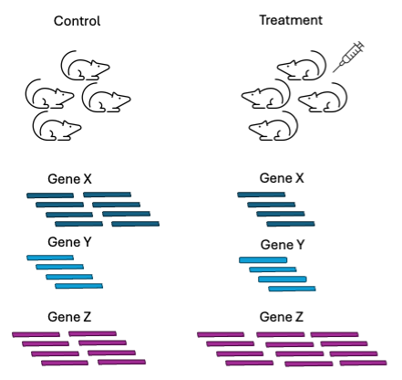

## Introduction

The first step of planning an RNAseq experiment is asking yourself whether RNAseq will answer the intended research question and whether you need to do it. Sequencing experiments are not cheap and a a lot of time and money by ensuring that the sequencing experiment performed is suited to answering the research question at hand. 

Now consider: if the intent is to study the expression of a small number of genes, RT-PCR might be more appropriate and cheaper. If you intend to study the changes in expression accross all genes in your organism of interest, then RNAseq is suitable for the experiment. Then - what type of RNAseq - there are many different protocols that can be performed.

The questions below are a few that might help in selecting a suitable protocol:

- do you intend to study transcriptomic changes in individual cells or the tissue level? (single versus bulk RNAseq)
- do you want to characterise isoforms/study alternative splicing? (short versus long read sequencing)
- will you pull down transcripts with a poly A tail (poly-A selection) or deplete ribosomal genes (ribo depletion)
- single end or paired end sequencing?


The 'typical' RNAseq experiment is short read bulk RNAseq to examine the changes in gene expression levels between different experimental conditions. This workshop has been designed with this understanding that this is the type of analysis that you intend to perform but it is not the only type of RNAseq experiment that can be performed.


## Experimental design

The simplest experimental setup for an RNAseq experiment would be 2 conditions of interest: a control condition and an experimental condition. By comparing the gene expression levels in the experimental condition against the expression levels in the control condition, we can determine which genes are responding to the experimental condition. The experimental condition could be a drug treatment, knocking out a gene of interest, over expressing a gene of interest, a different type of diet, etc.


```{r, echo=FALSE, fig.align="center"}

```

Fundamentals of research -> Factor , Confounding factor, Variable to measure, Controls, Batch, Techinical replicates and not biological, Pooling samples, 


## Sequencing methods

Sequencing Decision. Transcriptomics for Bulk RNAseq. Short reads. Coverage.


## Batches and replicates (technical/biological)


Batch, Techinical replicates and not biological, Pooling samples, Randomization, Noise. Clonal (cell-lines, bacteria, inbred animalls) or not clonal organisms, Does my tissue has different cell types -> Cell sorting or single cell

