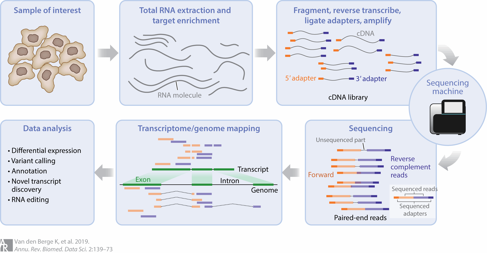
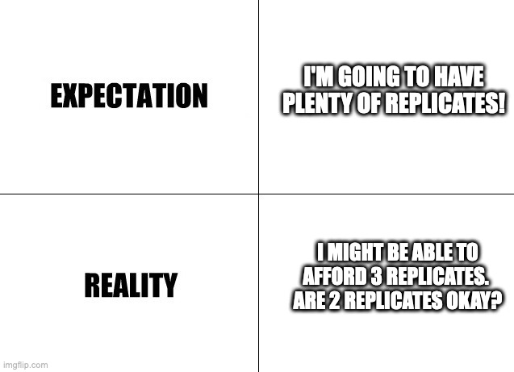
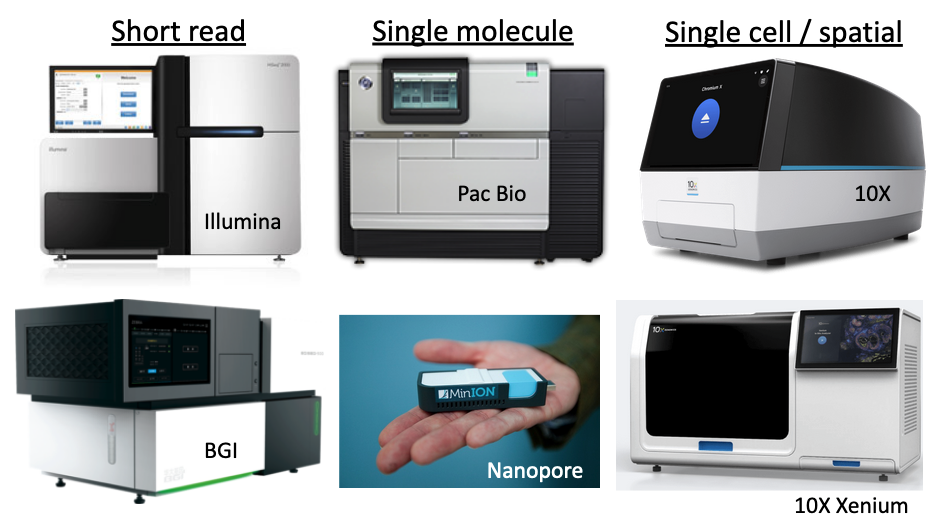
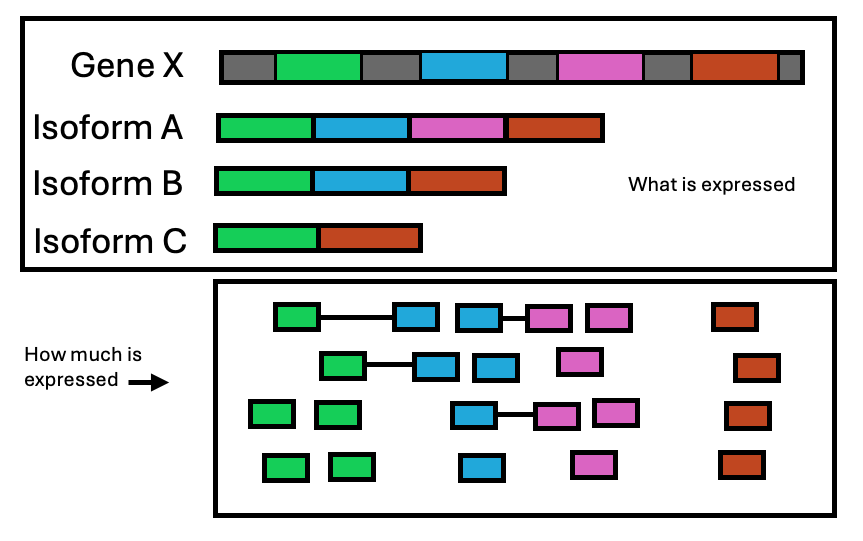
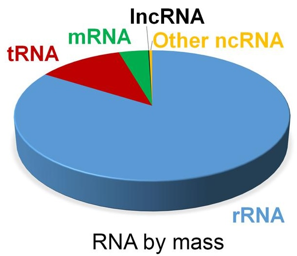
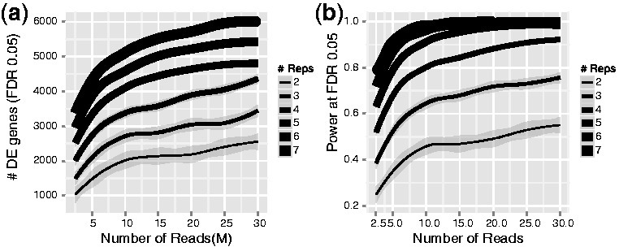
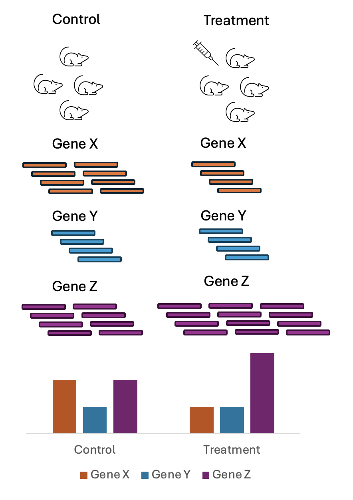
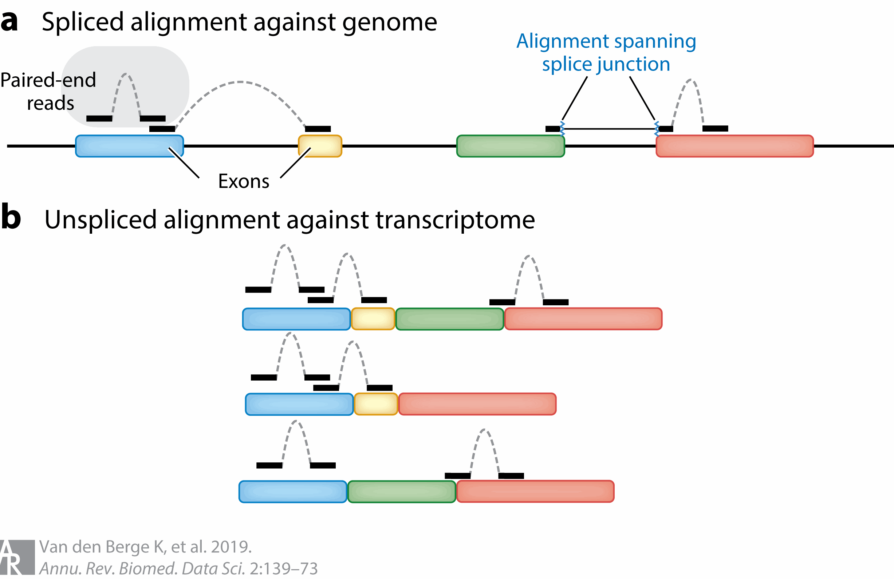

# Planning an RNAseq Experiment


Broadly speaking, RNAseq is a next generation sequencing technique for profiling all or selected target RNA molecules in a given biological system. It typically involves isolating RNA, converting to cDNA, ligating adapter sequences to the cDNA then amplifying by PCR to construct a library that can be used for sequencing. A diverse ecosystem of protocols and technology exist that can be used to generate RNAseq data, which can be used in a wide variety of applications. 

```{r, echo=FALSE, out.width="100%", fig.cap="Overview of the steps in an RNAseq experiment. At each of these steps, there are choices that are made that can influence the final output of the experiment."}

```

Image source: [RNA Sequencing Data: Hitchhiker's Guide to Expression Analysis, 2019](https://www.annualreviews.org/content/journals/10.1146/annurev-biodatasci-072018-021255)


The first step of planning an RNAseq experiment is asking whether RNAseq will answer the intended research question and whether it should be performed. Sequencing experiments are not cheap and a lot of time and money can be saved by ensuring that the sequencing experiment performed is suited to answering the research question at hand. There is a huge diversity in what RNA-seq can achieve due to the number of different protocols that have been developed and published. Therefore having a clear experimental goal will help in selecting an appropriate protocol that will best answer the research question as well as a good experimental design that will allow you to get the statistical power to answer that question.

There are some main aspects to planning an RNAseq experiment:

1. What is the research goal?
2. What is the budget for the proposed experiment?
3. What sequencing technology will be used - can the selected protocol answer the research question
4. What is the experimental design - will the number of collected samples have enough statistical power to answer the research question? Are there confounding factors that might obscure the effect of biology that we want to study?
5. What sort of analysis can be performed with the data that has been generated from the experiment? Are there already established analytical workflows or are you going to need to do some ad hoc analysis?

Having a clear research goal guides subsequent choices in terms of the type of RNAseq performed and the number of samples. The second most important thing is your budget - as this will dictate which technology you use and the number of samples you can collect. The ideal protocol for answering your research question might be prohibitively expensive - so you may opt for a different protocol. The ideal experimental design may require more samples than you can either afford to collect or are able to collect due to multitude of factors including ethical approval or sample rarity. It is very common for RNAseq experiments to be limited in the number of biological replicates collected due to the cost. 

```{r, out.width="100%", echo=FALSE, fig.cap="While the basic principles of experimental design are always strongly encouraged, the principle of replication unfortunately is often discarded in the face of sequencing costs"}

```

There is no single RNAseq technology that is optimised for answering every research question - instead they may have different advantages, disadvantages and biases that can make one protocol better suited for a particular task over another.

```{r, echo=FALSE, out.width="90%", eval=TRUE, fig.cap="There are many flavours of next generation sequencing machines that are available, with different chemistries and different sequencing methods."}

```

There are many choices to be made in designing an experiment and it is easy to feel overwhelmed by these choices. Consulting with relevant experts such as sequencing providers and bioinformaticians prior to carrying out the experiment can aid in this process. It is also allows you to anticipate potential complexities that may arise in the analysis of the data and mitigate them. It might take several iterations and consultations to settle on a design that will achieve the most of your research outcomes. It's also important to have an idea of how the generated data can then be analysed - will you be able to analyse it yourself or will you need to get someone else to do it?

RNAseq data can be used for a variety of purposes. Broadly speaking, it can be used in 2 different ways:

- qualitatively: what is expressed? (e.g genes, isoforms, specific exons, intron retention, etc). RNAseq provides *annotation* information
- quantatively: how much is expressed? Usually we want to know if the abundance of a gene has changed in response to a variable. RNAseq provides *expression* information.

This capability for simultaneous discovery and quantification at the whole transcriptome level is a key reason that cemented RNAseq as the technology of choice for studying RNA. Previous technologies such as microarrays used probes based on already known genes. 

```{r, fig.cap="", echo=FALSE, out.width="100%", fig.cap="RNAseq captures two layers of information: what is expressed and how much is expressed"}

```

The most common use is quantative analysis of gene expression changes to study gene regulation, though isoform level differential analysis can also be performed. RNAseq can be used for discovery, such as detection of novel transcripts, alternate splicing, exon skipping, intron retention or fusion genes. In organisms without a reference genome, RNAseq data can be used for de novo transcriptome assembly. 


The most common type of RNAseq experiment is a short read bulk experiment for the purpose of identifying differentially expressed genes in a given organism. This workshop has been designed with this understanding that this is the type of analysis that most researchers intend to perform but it is not the only application of RNAseq. This chapter will give an overview of the types of RNAseq protocols available to illustrate the field but the rest of the workshop will predominantly focus on short read bulk RNAseq.


## RNAseq Sequencing Protocols

RNAseq protocols can be described in a number of different ways. They can be classified as to the length of the reads produced by the technology, e.g either short or long reads. They can categorised by RNA captured for sequencing, e.g all available genes or if only a subset of target genes are used. More recently, with the development of single cell technology, they can now also be classified as the type of biological material they work with, ie is it at the single cell level or at a bulk tissue level. 

These descriptions of RNAseq are not mutually exclusive and are in fact used in combination with each other. 

<style type="text/css">
.tg  {border-collapse:collapse;border-spacing:0;}
.tg td{border-color:black;border-style:solid;border-width:1px;font-family:Arial, sans-serif;font-size:14px;
  overflow:hidden;padding:10px 5px;word-break:normal;}
.tg th{border-color:black;border-style:solid;border-width:1px;font-family:Arial, sans-serif;font-size:14px;
  font-weight:normal;overflow:hidden;padding:10px 5px;word-break:normal;}
.tg .tg-4erg{border-color:inherit;font-style:italic;font-weight:bold;text-align:left;vertical-align:top}
.tg .tg-0pky{border-color:inherit;text-align:left;vertical-align:top}
</style>
<table class="tg"><thead>
  <tr>
    <th class="tg-4erg">Biological material<br></th>
    <th class="tg-0pky">Entire tissue: Bulk RNAseq</th>
    <th class="tg-0pky">Individual cells: Single cell RNAseq</th>
    <th class="tg-0pky"></th>
  </tr></thead>
<tbody>
  <tr>
    <td class="tg-4erg">RNA tissue source<br></td>
    <td class="tg-0pky">Fresh</td>
    <td class="tg-0pky">Frozen</td>
    <td class="tg-0pky">FFPE (Formalin-fixed, paraffin-embedded)</td>
  </tr>
  <tr>
    <td class="tg-4erg">RNA species sequenced</td>
    <td class="tg-0pky">All RNA species captured: total RNAseq</td>
    <td class="tg-0pky">mRNA only: mRNAseq</td>
    <td class="tg-0pky">small RNA: small RNAseq</td>
  </tr>
  <tr>
    <td class="tg-4erg">RNA isolation method</td>
    <td class="tg-0pky">Ribosomal depletion</td>
    <td class="tg-0pky">PolyA pulldown</td>
    <td class="tg-0pky">Size selection</td>
  </tr>
  <tr>
    <td class="tg-4erg">Read length</td>
    <td class="tg-0pky">50-300 bases: short read sequencing</td>
    <td class="tg-0pky">10-100kb: long read sequencing</td>
    <td class="tg-0pky">100-300kb: ultra long read sequencing</td>
  </tr>
  <tr>
    <td class="tg-4erg">Library Strandedness</td>
    <td class="tg-0pky">Original strand information not preserved: nonstranded library</td>
    <td class="tg-0pky">Original strand information preserved: Stranded library</td>
    <td class="tg-0pky"></td>
  </tr>
  <tr>
    <td class="tg-4erg">Which end of the fragment is sequenced<br></td>
    <td class="tg-0pky">1 end: Single end sequencing</td>
    <td class="tg-0pky">Both ends: Paired end sequencing</td>
    <td class="tg-0pky"></td>
  </tr>
  <tr>
    <td class="tg-4erg">Commercial platforms</td>
    <td class="tg-0pky">Illumina, BGI, PacBio, Oxford Nanopore, 10x, Nanostring, etc</td>
    <td class="tg-0pky"></td>
    <td class="tg-0pky"></td>
  </tr>
</tbody></table>

### Bulk & Single RNA Sequencing

When working with bulk tissue samples, the expression profiles of individual cells is lost. A specific cell type might express high levels for a particular gene while another cell type might have low expression for that gene. With bulk sequencing, that signal is lost and instead an average profile of that gene is captured instead across the tissue. To retain information about the individual cells, single cell sequencing protocols have been developed and become quite popular. 

```{r, out.width="100%", echo=FALSE}
knitr::include_graphics("https://www.lexogen.com/wp-content/uploads/2024/01/Difference-between-scRNA-Seq-and-bulk-RNA-Seq.png")
```

Image source: [Classical Single-Cell RNA Sequencing: a comprehensive overview](https://www.lexogen.com/classical-single-cell-rna-sequencing-a-comprehensive-overview/)

There are trade-offs between bulk and single cell sequencing. Bulk RNAseq is cheaper and suited for projects where global expression changes is what the researcher is interested in and the heterogeneity of the tissue sample isn't a concern or of interest to the researcher. Bulk RNAseq analysis tends to be less complicated and easier to perform. Fewer genes are detected in a single cell RNAseq experiment and the data is lot more variable. If you are working with sorted cell populations, there may not be much heterogeneity in the sample, in which case single cell RNAseq might be a very expensive way to go about answering your question. 

```{r, out.width="100%", echo=FALSE}
knitr::include_graphics("https://www.azenta.com/sites/default/files/web-media-library/blog/quick-start-guide-rna-seq-data-analysis/fig_7_deseq3.png")
```

Image source: [A Quick Start Guide to RNA-Seq Data Analysis](https://www.azenta.com/blog/quick-start-guide-rna-seq-data-analysis)

Single cell RNAseq is suited for projects where tissue heterogeneity is of interest. It's also ideal for stdying rare cell types, as the signal from such cells would be lost in a bulk tissue. It can be used for charaterising cell states, identifying cell markers and studying cell lineage development and differentiation. 

```{r, out.width="100%", echo=FALSE}
knitr::include_graphics("https://lizard.bio/hs-fs/hubfs/scs_blog1_table-1.png?width=2065&height=1260&name=scs_blog1_table-1.png")
```

Image source: [Single cell vs bulk sequencing](https://lizard.bio/knowledge-hub/single-cell-vs-bulk-sequencing)

### RNA Isolation Methods

```{r, echo=FALSE, out.width="100%", fig.cap="Different RNAseq isolation methods"}
knitr::include_graphics("https://www.ncbi.nlm.nih.gov/pmc/articles/PMC4863231/bin/nihms768779f1.jpg")
```

Image source: [RNA Sequencing and Analysis (2015)](https://www.ncbi.nlm.nih.gov/pmc/articles/PMC4863231/)

After RNA is initially extracted from a tissue, the RNA molecules are a mix of ribosomal RNA (rRNA), non-coding RNAs as well as messenger RNA (mRNA). The majority of RNA molecules are rRNA which are typically not of interest - a choice is then made on which RNA species are to be sequenced.

```{r, echo=FALSE, out.width="50%", fig.align = "center", fig.cap="Estimate of RNA levels in a typical mammalian cell"}

```

Image source: [Non-coding RNA: what is functional and what is junk? 2015](https://www.frontiersin.org/journals/genetics/articles/10.3389/fgene.2015.00002/full)

There are a few common methods to isolate RNA:

- Ribosomal depletion: this method removes rRNA, leaving the mRNA, precursor messenger RNA (pre-mRNA) and non-coding RNAs. This is used for whole transcriptome sequencing or total RNA sequencing: sequencing of all RNA molecules (rRNA exluded) and is useful studying for non-coding RNAs in addition to mRNA.

- PolyA pulldown: this targets only RNA with a polyA tail - enriching for mRNAs. This is used for mRNA sequencing and is used when only the coding RNAs are of interest.

- Size selection: this is typically used to enrich for small RNAs and therefore used for small RNAseq. These protocols are used when the goal is to study small RNAs, though some recent studies have suggested better performance from total RNAsequencing over small RNA enrichment protocols.

### Targeted RNAsequencing

Not every gene needs to be assayed in an RNAseq experiment. Targeted RNAseq allows researchers to focus on a subset of genes of interest. This can be done either with enrichment or amplicon methods and can be used with low quality samples. 

### Short & Long Read Sequencing

```{r, echo=FALSE, fig.align="center", fig.cap="Alternative splicing and RNA technologies", out.width="95%"}
knitr::include_graphics("https://www.ncbi.nlm.nih.gov/pmc/articles/PMC10043755/bin/fgene-14-997383-g002.jpg")
```

Image source: [Deshpande D, et al, RNA-seq data science: From raw data to effective interpretation. Frontier Genetics. 2023](https://www.ncbi.nlm.nih.gov/pmc/articles/PMC10043755/)

Short read sequencing typically refers to protocols that fragment RNA into smaller pieces before converting to cDNA and sequencing. These are typically highly accurate and cost effective methods with well developed analysis workflows and pipelines. This type of data is commonly used for gene expression studies.

Long read sequencing typically refers to technology that produce reads with length ranging from 10-100kb or 100-300kb (ultra long read). Long read sequencing can capture the full length of mRNA transcripts, which is useful when examining changes in isoforms or when performing de novo transcriptome assembly. Capturing the full length of a read also that the PCR amplification can be skipped, reducing the coverage biases introduced by PCR. Long read sequencing has had lower read accuracy, high read length variability and lower throughput than short read methods but the technology has been improving over the past decade.

### Sequencing Depth & Coverage

```{r, echo=FALSE, fig.align="center", fig.cap="Sequencing Depth and Coverage", out.width="90%"}
knitr::include_graphics("https://3billion.io/img/news/depth-and-coverage_2023-08-25-051528_evsk.webp")
```

[Image source](https://3billion.io/blog/sequencing-depth-vs-coverage)

These two terms are usually used interchangeably when describing the number of reads aligning to a reference genome but they do refer to slightly different concepts.

Sequencing coverage refers to how much of the known genome has been sequenced. Do the sequenced reads align across all of the genome or only parts of it. Low coverage might suggest poor quality data as typically, the aim is to sequence the entire genome but some targeted protocols might only sequence a selected number of regions/genes. 

The depth of an experiment is the number of times any given position in the genome is sequenced. For example if at nucleotide A, it has been sequenced 15 times, then nucleotide A has a depth of 15x. If nucleotide B has been sequenced 40 times, then it has 40x depth. This can be extended to the average depth across the genome - a sample sequenced to have an average 30 reads at across the genome can be referred to have depth of 30x. However, two sequenced samples of 30x depth might not be the same quality - the first might have a uniform distribution of reads across the genome while the second might have high depth in some locations while having gaps in other locations.


A common dilemna researchers are often faced with is a choice as to whether to sequence more deeply or sequence more samples. More biological replicates will provide better estimates of variance and more precise measures of gene expression than sequencing to a greater depth. It is generally advised to sequence more samples rather than sequence deeply if the option is there as early studies showed that more replicates provided more statistical power to identify differentially expressed genes over sequencing to a greater depth.

```{r, echo=FALSE, fig.align="center", fig.cap="Biological replicates provide more statistical power to detect differential genes than sequencing depth", out.width="90%"}

```

Image source: [Liu Y et al, RNA-seq differential expression studies: more sequence or more replication? Bioinformatics. 2014](https://www.ncbi.nlm.nih.gov/pmc/articles/PMC3904521/)

However, higher sequencing depth is necessary for detecting lowly expressed differentially expressed (DE) genes and for conducting isoform-level differential expression analysis. 

## RNAseq Uses

```{r, echo=FALSE, out.width="100%"}
knitr::include_graphics("https://www.helixio.fr/uploads/kcfinder/images/PAGE%20WORKFLOW6-1.jpg")
```

Image source: [RNA-seq](https://www.helixio.fr/page/rna-seq-1)


The most common use for RNAseq is to identify differentially expressed genes in a tissue of interest for a given organism. There are other applications RNA-seq that we will briefly discuss, this list is not an exhaustive one.

- Differential expression analysis: DGE, DTE, DTU
- Novel transcript/isoform discovery: identify new transcripts/isoforms that are not annotated in a reference
- De novo transcriptome assembly: if a reference genome for an organism is not available, the information from RNAseq reads can be assembled into contigs to form a transcriptome for protein coding genes
- Detect alternate splicing/differential isoform usage, detect changes in isoform abundance
- Gene fusion detection
- Multiomic integration: combine transcriptomic data with other 'omic data such as DNA sequencing or epigenetic information

### Differential Expression Analysis

The most common type of analysis performed with RNAseq data is differential gene expression (DGE) analysis. This type of analysis looks at the difference in abundance for genes between 2 or more conditions. The conditions should have a suitable control condition that provides a baseline measurement that another condition can be compared against. 

```{r, echo=FALSE, fig.align="center", fig.cap ="With a bulk RNAseq experiment, we usually want to examine changes in transcript abundance in an organism. We do this by comparing the gene expression levels in an experimental condition against the gene expression levels in a control condition"}

```

After identifying differentially expressed genes, it is common to perform some type of pathway enrichment analysis or gene set enrichment to find molecular pathways or biologically processes that these genes are involved with. This can allow the researcher to identify trends that might be hard to notice when looking at individual genes.

```{r, out.width="100%", fig.cap="Dotplots of the results from overrepresentation anaylsis (ORA) and gene set enrichment analysis (GSEA)"}
knitr::include_graphics("https://yulab-smu.top/biomedical-knowledge-mining-book/biomedicalKnowledge_files/figure-html/Dotplotcap-1.png")
```

Image source: [Biomedical Knowledge Mining using GOSemSim and clusterProfiler, ](https://yulab-smu.top/biomedical-knowledge-mining-book/enrichplot.html)


While DGE is the most common type of analysis performed on RNAseq data, it is not the only type of differential test that can be performed with RNAseq data. DGE analysis ignores what is happening at the isoform level and looks at global gene abundance changes only. Instead, an RNAseq dataset can be analysed to look at changes at the transcript level, to see if the change in conditions is also affecting multiple isoforms for a gene differently. 

```{r, echo=FALSE, fig.align="center", fig.cap ="In a DGE analysis, this gene might be ignored for having no change in expression when actually a switch is occuring amongst the isoforms that are being produced"}
knitr::include_graphics("images/experimental_design/fig_dif_splice_usage.png")
```

Additionally, we can look at whether transcript levels are changing between two conditions, regardless of the gene of origin. This is known as differential transcript expression. 

```{r, echo=FALSE, fig.align="center", fig.cap="The types of differential expression analysis", out.width="100%"}
knitr::include_graphics("https://f1000research.s3.amazonaws.com/manuscripts/19594/95bdb2a3-7459-4d64-9569-ad69d8910d35_figure1.gif")
```

Image source: [Froussios K, et al, Relative Abundance of Transcripts (RATs): Identifying differential isoform abundance from RNA-seq. F1000Research. 2019](https://www.ncbi.nlm.nih.gov/pmc/articles/PMC10043755/)

If interested in transcript changes, the complexity of the analyses can be determined by the choice of short or long read sequencing. While short read sequencing can be used for both, there is additional complexity when used for transcript level analysis as many reads will map ambigiously for transcripts. There are methods that have been developed for probabilistically assigning reads to transcripts.

```{r, echo=FALSE, out.width="100%"}

```

Image source: [RNA Sequencing Data: Hitchhiker's Guide to Expression Analysis, 2019](https://www.annualreviews.org/content/journals/10.1146/annurev-biodatasci-072018-021255)

Long read sequencing is ideal for isoform/transcript level analyses as there is less or no ambiguity to which isofrom a read comes from, if the entire transcript has been sequenced. 


### Novel Transcript/Isoform Discovery

Most RNAseq datasets are used for quantative analysis - the data is aligned to a pre-existing reference genome and pre-existing annotations. In well annotated organisms or tissues, there usually isn't much concern that some genes might be going undetected and therefore ignored in the subsequent analysis. However, non-model organisms or tissues that have been less studied, the annotations can be incomplete or non-existent. In such cases, the RNAseq data can be leveraged to simultaneously provide information on the gene annotation as well the quantative changes in expression. 

It is possible to leverage the sequences of the reads to assemble into transcripts (or if using long read sequencing, to sequence the full transcript and no assembly is then required). This can enable discovery of new genes/transcripts that are not known in a reference database.

```{r, echo=FALSE, out.width="100%"}
knitr::include_graphics("https://www.pacb.com/wp-content/uploads/img_isoform_discovery-1.svg")
```

Image source: [RNA sequencing, PacBio](https://www.pacb.com/products-and-services/applications/rna-sequencing/)

### Transcriptome Assembly

When a reference genome is either unavailable or not desired, it is possible to take RNAseq reads and assemble them into a transcriptome of the assayed genes. The assembly can be done in 2 ways, there are reference based methods and de novo methods. Reference based methods use the reference of either the organism or a closely related species. 

De novo assembly methods are reference free - this is useful when studying non-model organisms as often they lack well annotated reference genomes. In such situations, RNAseq data has a dual purpose - the reference is built from the sequences of the reads and then the reads are counted against the transcriptome for differential analysis.  

Long read sequencing is better suited to building high quality transcriptomes than short read sequencing as the longer read length retains more information and context about the original RNA molecule. A commonly used analogy when describing assembly is to imagine the genome as a puzzle that needs to be put back together. The smaller the pieces, the more difficult the puzzle. A puzzle made of larger pieces is much easier to put back together and reconstruct the original RNA sequence. 

```{r, echo=FALSE, out.width="100%"}
knitr::include_graphics("https://oup.silverchair-cdn.com/oup/backfile/Content_public/Journal/bib/23/2/10.1093_bib_bbab563/1/m_bbab563f3.jpeg?Expires=1729202148&Signature=FMhHgcKT3vS5SP1phAnOU3R9ayIzXS6DDCdTPOK7WQdpOPRSxFEqbIla6ISWV7pKDaINiPZBEdcpmjCn75qGFCIGTLasuKU~DD5Po69XlEH8Os~9UgmXbPMhGddL7cXxdw3skQ~dial4rI4A8mu388ZJlRPDbmr6EURBKAdm-lGpG~xxLJzN9hUmqB2FDNtOt6bY6TGvVRNOlGXTz24HveHp~feY4nhtpb9BpUEKBZgpChqMpQEw8mQAkmx-BcXBon8pynzZ7ud6cBjKMZ7W3T1Cip0OGSrJE2Bn~af~uY-Lv68PJ3319cnUelEs05Mnsr34ntJtnllPjVRUkDo2Bw__&Key-Pair-Id=APKAIE5G5CRDK6RD3PGA")
```

Image source: [A simple guide to de novo transcriptome assembly and annotation (2022)](https://academic.oup.com/bib/article/23/2/bbab563/6514404)


### Gene Fusion Detection

RNAseq can have clinical applications. One such application is the detection of fusion genes - these can arise due to chromosomal rearrangements combining the coding regions of two genes. These genes can produce aberrant proteins and lead to cancer development if the fused genes are oncogenes or tumor suppresor genes. Therefore, detection of fusion genes can be an important diagnostic tool in clinical settings as well as for cancer research.

```{r, echo=FALSE, out.width="100%"}
knitr::include_graphics("https://media.springernature.com/lw685/springer-static/image/art%3A10.1038%2Fs41598-017-07070-6/MediaObjects/41598_2017_7070_Fig2_HTML.jpg?as=webp")
```

Image source: [GFusion: an Effective Algorithm to Identify Fusion Genes from Cancer RNA-Seq Data, 2017](https://www.nature.com/articles/s41598-017-07070-6)


### 'Omics Integration

RNAseq data can be combined with other types of genome wide to provide deeper insights into gene regulation and molecular function. Combining with epigenetic data such as ChIPseq and ATACseq can be used to examine gene regulatory networks in a tissue of interest. There are tools that can take chromatin data and trancriptomic data to classify transcription factor activity as either activating and repressive on target genes. DNA methylation and histone modifications can also be correlated with gene expression data .

```{r, out.width="100%", fig.cap="Overview of the general setup of computational tools to infer transcription factor activity (TFA)"}
knitr::include_graphics("https://analyticalsciencejournals.onlinelibrary.wiley.com/cms/asset/a6a72698-33cf-451f-8056-dc632e6b23b5/pmic13741-fig-0002-m.png")
```

Image source: [Computational tools for inferring transcription factor activity, 2023](https://analyticalsciencejournals.onlinelibrary.wiley.com/doi/10.1002/pmic.202200462)

RNAseq data combined with DNA sequencing data enables the link between genotype and gene expression to be studied. Genetic variation has been shown to affect the expression of genes. Identification of single nucleotide polymorphism (SNPs) or structural variants (SV) from the genomic data can be used with the RNAseq data to identify expression quantitative trait loci (eQTLs) - genetic loci that explain variation in mRNA levels. 

Multiomic integration analyses tend to be complex and are rarely straightforward. Depending on the type of data being integrated, little or not correlation might be found between the two data types. Proteomic data for example generally has low correlation with RNAseq data.

### Discussion: Design A Bulk RNAseq Experiment {- .challenge}

You want to examine the impact of several different growth conditions in a specific bacterial strain and your interest is mostly in changes to gene expression. A side goal of your project is to look at small RNA changes. Assuming you have no limitations on your budget, what are some considerations you'd have in designing a potential RNAseq experiment for this project?


### Before you begin an experiment: some questions to consider…

The questions below are a few that might help in planning an experiment:

- do you want to assay changes in gene expression? 
- Do you want to identify novel transcripts?
- do you intend to study transcriptomic changes in individual cells or the tissue level? (single versus bulk RNAseq)
- do you want to characterise isoforms/study alternative splicing? (short versus long read sequencing)
- will you pull down transcripts with a poly A tail (poly-A selection) or deplete ribosomal genes (ribo depletion)? Does your organism produce mRNA with a polyA tail?
- single end or paired end sequencing?
- does your organism of interest have an annotated reference genome or will you need to assemble a transcriptome?
- are you going to align against the genome or transcriptome?
- how many different conditions are you testing? How many replicates do you have for each condition? Do you have a control condition?
- how complex is the experiment? Will you be able to collect all the samples you need in one experiment or are you going to have to do multiple batches?
- how inbred is your organism? If the organism of interest is not inbred, what level of genetic variation exists between your individuals?
- what is your budget? How many samples can you afford to sequence?
- does the data have already established analysis workflows or are you going to have to do it from scratch?
