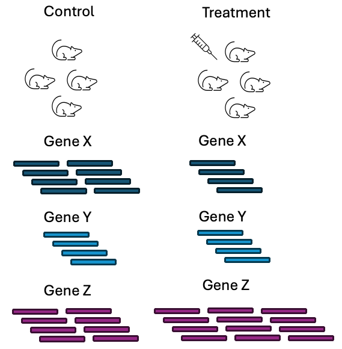
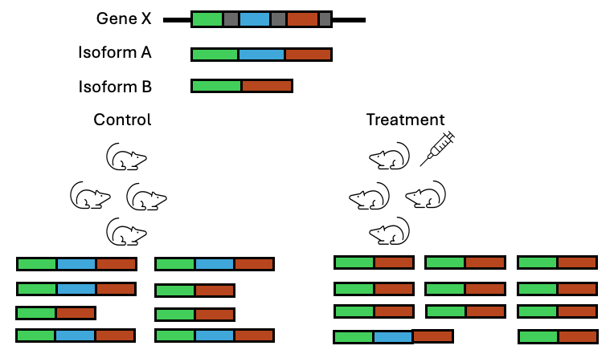

# Planning an RNAseq Experiment

> Useful links: https://genomebiology.biomedcentral.com/articles/10.1186/s13059-016-0881-8#Sec2
>
> https://www.annualreviews.org/content/journals/10.1146/annurev-biodatasci-072018-021255

## Introduction

The first step of planning an RNAseq experiment is asking whether RNAseq will answer the intended research question and whether it should be performed. Sequencing experiments are not cheap and a lot of time and money can be saved by ensuring that the sequencing experiment performed is suited to answering the research question at hand. There is a huge diversity in what RNA-seq can achieve due to the number of different protocols that have been  developed and published. Therefore having a clear experimental goal will help in selecting an appropriate protocol that will best answer the research question as well as a good experimental design that will allow you to get the statistical power to answer that question.

There are three main aspects to planning an RNAseq experiment:
- the choice of sequencing technology/protocol - can the selected protocol answer the research question
- the experimental design - will the number of collected samples have enough statistical power to answer the research question? Are there confounding factors that might obscure the effect of biology that we want to study?
- What is the budget for the proposed experiment

The first two aspects are limited and linked by cost. The ideal protocol for answering your research question might be prohibitively expensive - so you may opt for a different protocol. The ideal experimental design may require more samples than you can either afford to collect or are able to collect due to multitude of factors including ethical approval or sample rarity.

There are many choices to be made in designing an experiment and it is easy to feel overwhelmed by these choices. Consulting with relevant experts such as sequencing providers and bioinformaticians prior to performing the experiment can aid in this process. It is also allows you to anticipate potential complexities that may arise in the analysis of the data and mitigate them.

The most common type of RNAseq experiment is a short read bulk experiment for the purpose of identifying differentially expressed genes in a given organisms. This workshop has been designed with this understanding that this is the type of analysis that most researchers intend to perform but it is not the only application of RNAseq. This chapter will give an overview of the types of RNAseq protocols available but the rest of the workshop will focus on short read bulk RNAseq.

## Before you begin: questions to consider…

The questions below are a few that might help in designing an experiment:

- do you want to assay changes in gene expression? Or do you want to identify novel transcripts?
- do you intend to study transcriptomic changes in individual cells or the tissue level? (single versus bulk RNAseq)
- do you want to characterise isoforms/study alternative splicing? (short versus long read sequencing)
- will you pull down transcripts with a poly A tail (poly-A selection) or deplete ribosomal genes (ribo depletion)? Does your organism produce mRNA with a polyA tail?
- single end or paired end sequencing?
- does your organism of interest have an annotated reference genome or will you need to assemble a transcriptome?
- how many different conditions are you testing? How many replicates do you have for each condition? Do you have a control condition?
- how complex is the experiment? Will you be able to collect all the samples you need in one experiment or are you going to have to do multiple batches?
- how inbred is your organism? If the organism of interest is not inbred, what level of genetic variation exists between your individuals?
- what is your budget? How many samples can you afford to sequence?  

## RNAseq Sequencing Protocols

> Sequencing Decision. Transcriptomics for Bulk RNAseq. Short reads. Coverage.

RNAseq protocols can be categorised in a number of different ways. Typically, they are classified as to the type of reads produced by the technology, e.g either short or long reads. More recently, with the development of single cell technology, they can now also be classified as the type of biological material they work with, ie is it at the single cell level or at a bulk tissue level.

They can also be combined together, e.g the most common type of single cell RNAseq experiments tend to be short read single cell RNAseq but long read RNAseq protocols are also available.


### Short Read Sequencing

Short read sequencing typically refers to protocols that produce reads with lengths


> What is it
>
> Summary of how it works
>
> Advantage
>
> Disadvantages


### Long Read Sequencing

> What is it
>
> Summary of how it works
>
> Advantage
>
> Disadvantages

Long read sequencing typically refers to technology that produce reads with length ranging from 10-100kb or 100-300kb. Long read sequencing can capture the full length of mRNA transcripts, which 


Long read sequencing can have lower accuracy than short read methods. 

```{r, echo=FALSE, fig.align="center", fig.cap="Overview of RNAseq with short read/long read technologies", out.width="95%"}
knitr::include_graphics("https://www.ncbi.nlm.nih.gov/pmc/articles/PMC10043755/bin/fgene-14-997383-g002.jpg")
```

Image taken from: [Deshpande D, et al, RNA-seq data science: From raw data to effective interpretation. Frontier Genetics. 2023](https://www.ncbi.nlm.nih.gov/pmc/articles/PMC10043755/)


### Bulk RNA Sequencing

Bulk RNAseq 

> What is it
>
> Summary of how it works
>
> Advantage
>
> Disadvantages


### Single Cell Sequencing

> What is it
>
> Summary of how it works
>
> Advantage
>
> Disadvantages

### Whole Transcriptomic / Total RNAseq

### Targeted RNAseq


### Sequencing Depth & Coverage

```{r, echo=FALSE, fig.align="center", fig.cap="Sequencing Depth and Coverage", out.width="90%"}
knitr::include_graphics("https://3billion.io/img/news/depth-and-coverage_2023-08-25-051528_evsk.webp")
```

[Image source](https://3billion.io/blog/sequencing-depth-vs-coverage)

These two terms are usually used interchangeably when describing the number of reads aligning to a reference genome but they do refer to slightly different concepts.

The depth of an experiment is the number of times any given position in the genome is sequenced. For example if at nucleotide A, it has been sequenced 15 times, then nucleotide A has a depth of 15x. If nucleotide B has been sequenced 40 times, then it has 40x depth. This can be extended to the average depth across the genome - a sample sequenced to have an average 30 reads at every position in the genome can be referred to have depth of 30x. However, two sequenced samples of 30x depth might not be the same quality - the first might have a uniform distribution of reads across the genome while the second might have high depth in some locations while having gaps in other locations.

Sequencing coverage refers to how much of the known genome has been sequenced. Typically, the aim is to sequence the entire genome but some targeted protocols might only sequence a selected number of regions/genes. 

A common dilemna researchers are often faced with is a choice as to whether to sequence more deeply or sequence more samples. More biological replicates will provide better estimates of variance and more precise measures of gene expression than sequencing to a greater depth. It is generally advised to sequence more samples rather than sequence deeply if the option is there as early studies showed that more replicates provided more statistical power to identify differentially expressed genes over sequencing to a greater depth.

```{r, echo=FALSE, fig.align="center", fig.cap="Biological replicates provide more statistical power to detect differential genes than sequencing depth", out.width="90%"}
knitr::include_graphics("images/experimental_design/liu_y_bioinformatics_2014.jpg")
```

Image taken from: [Liu Y et al, RNA-seq differential expression studies: more sequence or more replication? Bioinformatics. 2014](https://www.ncbi.nlm.nih.gov/pmc/articles/PMC3904521/)

However, higher sequencing depth is necessary for detecting lowly expressed differentially expressed (DE) genes and for conducting isoform-level differential expression analysis.  

> Competition for sequencing: genes with high amounts of transcripts are more likely to get sequenced than genes with low amounts of transcripts. So a gene that we haven't detected could be lowly expressed or not expressed but hard to determine if we have low coverage (very relevant for single cell).


## RNAseq Applications

The most common use for RNAseq is to identify differentially expressed genes in a tissue of interest for a given organism. There are other applications RNA-seq that we will briefly discuss, this list is not an exhaustive one.

- Differential expression analysis: DGE, DTE, DTU
- Novel transcript/isoform discovery: identify new transcripts/isoforms that are not annotated in a reference
- De novo transcriptome assembly: if a reference genome for an organism is not available, the information from RNAseq reads can be assembled into contigs to form a transcriptome
- Detect alternate splicing/differential isoform usage: detect changes in isoform abundance
- Gene fusion detection: Gene fusions can occur as a result of chromosomal re-arrangments, resulting in the exchange of coding or regulatory sequences between genes. This can be a cause of cancer and therefore identification of fusion genes has important implications for human health.
- Epigenetic integration: combine transcriptomic and epigenetic information

### Differential Expression Analysis

The most common type of analysis performed with RNAseq data is differential gene expression (DGE) analysis. This analysis looks at the difference in abundance for genes between 2 or more conditions. 


While DGE is the most common type of analysis performed on RNAseq data, it is not the only type of differential test that can be performed with RNAseq data.

We can also look at the changes in individual transcript expression. 

```{r, echo=FALSE, fig.align="center", fig.cap="The different types of differential expression analysis", out.width="100%"}
knitr::include_graphics("https://f1000research.s3.amazonaws.com/manuscripts/19594/95bdb2a3-7459-4d64-9569-ad69d8910d35_figure1.gif")
```

Image taken from: [Froussios K, et al, Relative Abundance of Transcripts (RATs): Identifying differential isoform abundance from RNA-seq. F1000Research. 2019](https://www.ncbi.nlm.nih.gov/pmc/articles/PMC10043755/)

> DGE explainer
>
> DTE explainer
>
> DTU explainer


### Novel Transcript/Isoform Discovery

> What is it
>
> Why would you want to do it
> 
> What protocols are better suited it

### De Novo Transcriptome Assembly

> What is it
>
> Why would you want to do it
>
> What protocols are better suited it: long read sequencing

### Gene Fusion Detection

> What is it
>
> Why would you want to do it
>
> What protocols are better suited it: long read sequencing

### Epigenetic Integration

> Refer to https://genomebiology.biomedcentral.com/articles/10.1186/s13059-016-0881-8#Sec20
>
> What is it
> 
> Why would you want to do it
> 
> How would you do it

## Experimental Factors1

> What is a control, what is the treatment/experimental factor
>
> Should probably move Nikita's batch & replicate content under here but haven't shifted it yet to hopefully avoid merge clashes 
>
> Fundamentals of research -> Factor , Confounding factor, Variable to measure, Controls, Batch, Techinical replicates and not biological, Pooling samples, 

## Designing a Bulk RNAseq Experiment

> Knowing what you want to study will determine the protocol
>
> This should probably be the last section
>
> This section should have an example where there is a research question and then how you'd design an RNAseq experiment to answer that question
>
> Have an exercise here that builds on the previous sections to get participants to design their own experiment based on what they are interested in

It is important to have a clear idea of what the experimental goal is as this will guide the experimental design in terms of choice of sequencing protocol, technology and the number of replicates. 

The simplest experimental setup for an RNAseq experiment would be 2 conditions of interest: a control condition and an experimental condition. By comparing the gene expression levels in the experimental condition against the expression levels in the control condition, we can determine which genes are responding to the experimental condition. The experimental condition could be a drug treatment, knocking out a gene of interest, over expressing a gene of interest, a different type of diet, etc. The control condition is our baseline measurement - we compare the gene expression levels in our experimental condition to the gene expression levels in the control condition. 

> Maybe move these figures around
```{r, echo=FALSE, fig.align="center", fig.cap ="With a bulk RNAseq experiment, we usually want to examine changes in transcript abundance in an organism. We do this by comparing the gene expression levels in an experimental condition against the gene expression levels in a control condition"}

```

> This figure can probably be moved to the DTU section
```{r, echo=FALSE, fig.align="center", out.width="80%"}

```

### Pooling Samples

> What is a pooled sample
>
> Why might we use a pooled sample (bulk RNAseq)
>
> If we've pooled a sample - does a pooled sample count as multiple biological samples or do we still need replicates 

