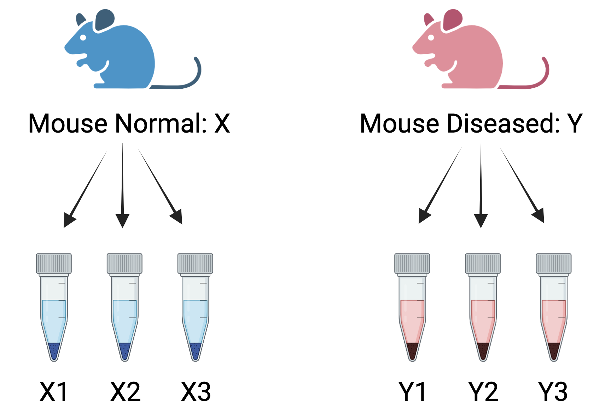
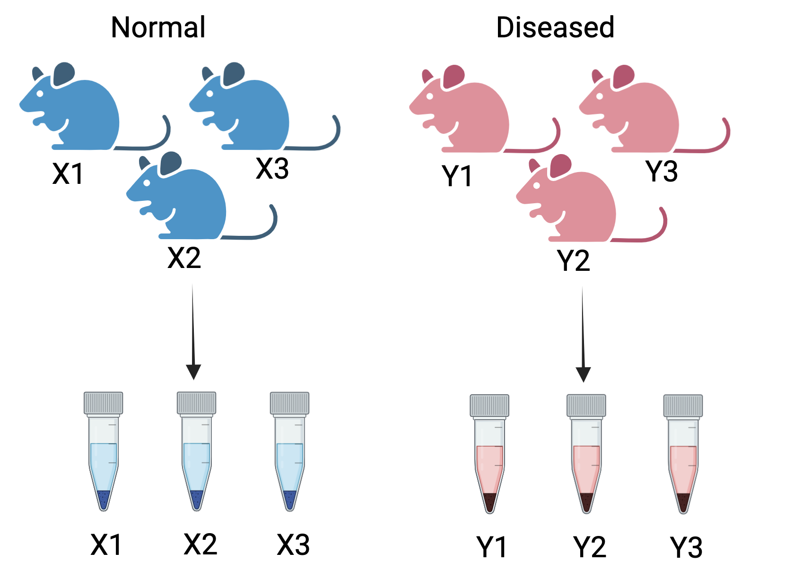
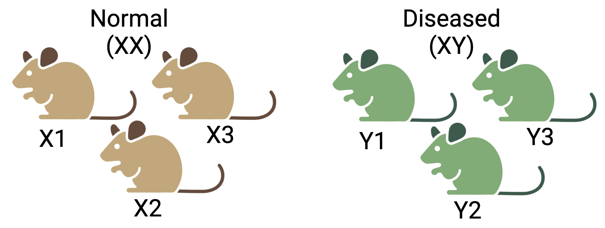

# Experimental Factors

RNA-Seq is a powerful tool for capturing high-throughput gene expression. It captures the expression of thousands of genes in different samples across multiple conditions. A general approach to analysing RNA-seq data is to fit a linear model to each gene. The gene expression measurement for each gene has a mix of biological signal and unwanted noise. The methodology must be carefully thought of to design a well-balanced experiment for a robust statistical analysis. After you have made decisions on the type of sequencing (long-read or short-read) and the type of RNA-Seq (full-length/targeted/bulk/single-cell), the next step is to consider other factors that can influence your experiment.
  
1. Select an appropriate source of samples: cell lines, animal models, patients, etc.

2. Sequencing depth - the total number of reads mapped to the reference genome. How much sequencing depth is required for the experiment?

3. Balancing the variation in the experiment: Understand technical and biological replicates and determine the number replicates needed for the experiment?

5. Batch effects can add unwanted variation in the experiment. 

6. Confounding factors: Sex, age, litter etc. 

## Source of samples
The primary goal of RNA-seq analysis is to identify differentially expressed genes between distinct groups or conditions. The source of samples can vary widely, ranging from cells cultured _in vitro_, whole tissues, sorted cells, homogeneous cell lines, or cells derived from a tissue or organ, either from a single patient or multiple patients. The choice of sample source introduces both wanted and unwanted variations in the data, which must be carefully addressed to ensure accurate analysis.

For example, when assessing the effect of a treatment on cells from three different human liver cell lines, the biological differences between the cell lines may overshadow the treatment effect, leading to confounded results. Therefore, before performing differential expression analysis, it is crucial to account for and remove unwanted variations, such as those arising from the cell lines, to focus on the true biological differences caused by the treatment.

## Sample Replicates (technical/biological)

A well-designed RNA-Seq experiment should always include replicates. Replicates are crucial as they enhance the statistical power of the analysis, allowing for more accurate and reliable detection of true biological differences. Consistent results across multiple replicates provide confidence that the observed findings are genuine and not due to random chance. Therefore, incorporating replicates in your experiment is essential to ensure the robustness and reproducibility of the results, ultimately leading to more credible and meaningful biological insights.
  
  1. Incorrect way of including replicates in your study - **Technical replicates** are repeated measurements taken from the same biological source to accurately **assess technical variation in an experiment**.

```{r, echo=FALSE, out.width="430px", out.height="300px", fig.align="center", fig.cap ="Wrong way to create replicates: Three measurements taken from the same mouse for two conditions- normal and diseased. These are called technical replicates. These assess technical variation in an experiment.", fig.height= 0.1, fig.width=0.8}

```

For example, consider a simple RNA-Seq experiment comparing two conditions: normal and diseased. In this scenario, a single normal mouse provides three measurements—mouseX_normal_1, mouseX_normal_2, and mouseX_normal_3. Similarly, a single diseased mouse provides three measurements—mouseY_diseased_1, mouseY_diseased_2, and mouseY_diseased_3. This results in the following samplesheet:
  
  |      sample       | condition | mouse | technical replicates |
  |:-----------------:|:---------:|:-----:|:--------------------:|
  |  mouseX_normal_1  |  normal   |   X   |          1           |
  |  mouseX_normal_2  |  normal   |   X   |          2           |
  |  mouseX_normal_3  |  normal   |   X   |          3           |
  | mouseY_diseased_1 | diseased  |   Y   |          1           |
  | mouseY_diseased_2 | diseased  |   Y   |          2           |
  | mouseY_diseased_3 | diseased  |   Y   |          3           |
  
  The samples mouseX_normal_1, mouseX_normal_2, and mouseX_normal_3 serve as technical replicates for the normal condition, while mouseY_diseased_1, mouseY_diseased_2, and mouseY_diseased_3 are technical replicates for the diseased condition.

2. Correct way of including replicates in your study - **Biological replicates** involve using biologically separate samples to **capture the biological variation between samples**. The biologically separate samples can include different organisms or tissues from different mice, different cell populations grown separately but originating from the same cell-line, sampling tumor samples from same tumor, etc.

```{r, echo=FALSE,  out.width="430px", out.height="300px", fig.align="center", fig.cap ="Correct way to create replicates: A measurement taken from the three different mice for two conditions - normal and diseased. These are called biological replicates. These capture the biological variation between samples"}

```

In the previous RNA-Seq experiment, if we increase the number of mice to three for each healthy and diseased state, we obtain the following samplesheet:
  
| sample | condition | replicates |
|:----:|:-----:|:-----:|
|  mouseX1_normal  |  normal   |  X1  |   
|  mouseX2_normal  |  normal   |  X2  |   
|  mouseX3_normal  |  normal   |  X3  |   
| mouseY1_diseased | diseased  |  Y1  |   
| mouseY2_diseased | diseased  |  Y2  |   
| mouseY3_diseased | diseased  |  Y3  |   

In this experiment, X1, X2, and X3 are the biological replicates for the normal condition, Y1, Y2, and are the biological replicates for the diseased condition.

During the era of microarrays, technical replicates were crucial to account for the variability arising from the technology itself. However, with the advent of current RNA-Seq technologies, technical variation has significantly diminished, rendering technical replicates less necessary. In contrast, biological replicates remain indispensable for differential expression analysis. Increasing the number of biological replicates enhances the accuracy of biological variation estimates and the precision of mean expression level estimates. This, in turn, leads to better data modeling and the identification of more differentially expressed genes. The emphasis, therefore, is on maximizing biological replicates to capture the true variability in biological systems.

## Sample pooling
Although it is ideal to have multiple replicates for each condition with a high sequencing depth, there can be factors like factors like budget constraints, limited input RNA or substantial within-group biological variability can significantly impact the outcome of RNA-seq experiments.

One could cut the cost by opting for a lower average sequencing depth combined with multiple replicates may be adequate for a standard RNA-seq experiment. But a higher sequencing depth is essential for more precise measurements of gene expression, especially when detecting lowly expressed genes or conducting isoform-level differential expression analysis. In such cases, it is also important to increase the number of biological replicates to effectively capture within-group biological variability.
In these situations, sample pooling becomes a viable strategy.

Pooling of RNA samples involves mixing RNA molecules extracted from independent biological samples within the same population—such as a specific experimental or biological condition, or the same tissue—before library preparation. This approach reduces the number of replicates required and, consequently, lowers the overall cost of the experiment. The library created from pooled samples represents a composite of biological samples, capturing sufficient biological variation while requiring fewer replicates.

This method offers two main advantages: it reduces the cost of sequencing and increases the statistical power for differential gene expression (DGE) analysis, enabling researchers to draw more meaningful conclusions even under resource constraints.

## Batches and their effects

In an RNA-Seq experiment, samples are often processed in batches or groups, and batch effects can arise from various sources throughout the experimental workflow. These effects may stem from differences in sequencing platforms, timing, reagents, experimental conditions, or even variations in how different researchers handle the samples. Batch effects pose a significant challenge in RNA-Seq data analysis, as they can obscure true biological differences and lead to misleading interpretations.

For instance, when visualizing data with a multidimensional scaling (MDS) plot, samples might unexpectedly group together due to these batch effects. Imagine an experiment with multiple samples from three cell lines, comparing two conditions—control and treated. Ideally, the samples should form two clusters based on the conditions, but instead, they form three clusters according to their original cell lines. This deviation is a clear example of a batch effect, where the unintended influence of cell lines overshadows the treatment differences.

To address this issue, it is crucial to thoroughly investigate the data, collect detailed information about the experimental design, and account for batch effects before performing differential expression analysis. Proper adjustment ensures more accurate and reliable biological interpretations, enabling meaningful insights from the RNA-Seq data.

## Confounding factors

A confounded RNA-Seq experiment is one in which the distinct effects of two different sources of variation in the data cannot be separated.

For instance, sex is known to significantly influence gene expression. If all the control mice in an experiment were female and all the treatment mice were male, the treatment effect would be confounded by sex. In this scenario, it would be impossible to distinguish the treatment effect from the effect of sex. Consider another scenario, if all the control mice are from cage A and all the treatment mice for cage B, the treatment effects are confounded by the cage. The living conditions in the two cages may vary which is indistinguishable from the treatment effects.

```{r, echo=FALSE, fig.align="center", fig.cap ="Confounding effects in RNASeq experiments: Three mice are selected each for the two conditions- normal and diseased. But the normal group consist of only female (XX) mice and vice versa. It will be difficult to determine if the true difference between two groups is due to the condition or the sex.", out.width="500px", out.height="200px"}

```

To avoid confounding, it is important to ensure the sample source/animals in each condition are all the same sex, age, litter, and batch, if possible. If this is not entirely possible, then make sure to split the animals equally between different conditions. Also ensure the samples are collected at the same time or randomise samples if they can’t be processed all at one time. It's best to discuss he experimental design with a bioinformatcian before conducting the experiment.


## Summary
As a general rule for a standard RNA-Seq experiment, at least two biological replicates should be included, though it is ideal to have three or more replicates to increase statistical power. A sequencing depth of 10 to 20 million reads per sample is typically sufficient for standard gene expression analysis.

Careful experimental design is critical, with sufficient replicates and randomization of samples to ensure the capture of both within-group and between-group variations while minimizing technical noise. Incorporating these considerations into the experimental design matrix is essential for ensuring robust differential expression (DE) analysis, which will be further explored in the following sections.


```{r, echo=FALSE, fig.align="center", fig.cap ="Summary: Factors affecting the outcome of an RNA-Seq experiment ([source](https://www.amazon.com/Experimental-Design-Laboratory-Biologists-Reproducibility/dp/1107424887)).", out.width="700px", out.height="200px"}
knitr::include_graphics("images/experimental_design/exp-factors.png")
```


## Challenge - Design a RNA Seq experiment. {- .challenge}
The project goal is to study the expression profiles of basal stem-cell (B) and luminal cells (L) in the mammary gland of virgin, pregnant and lactating mice. The data has already been mapped against the GRCm39 genome assembly.

1. How many groups are there in this experiment? Design an experiment to compare the different groups. 

* Mm_Virgin_A
* Mm_Virgin_B
* Mm_Virgin_C
* Mm_preg_A
* Mm_preg_B
* Mm_preg_C
* Mm_lact_A
* Mm_lact_B
* Mm_lact_C

2. The samples were handled in groups of A, B and C. Create a sample sheet for the experimental design including all relevant factors that might affect the outcome.


