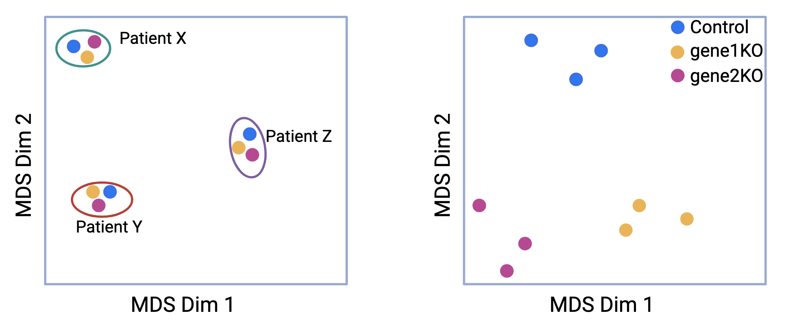

# Experimental Design

RNA-Seq is a powerful tool for capturing high-throughput gene expression. It captures the expression of thousands of genes in different samples across multiple conditions. A general approach to analysing RNA-seq data is to fit a linear model to each gene. The gene expression measurement for each gene has a mix of biological signal and unwanted noise. The methodology must be carefully thought of to design a well-balanced experiment for a robust statistical analysis. After you have made decisions on the type of sequencing (long-read or short-read) and the type of RNA-Seq (full-length/targeted/bulk/single-cell), the next step is to consider other factors that can influence your experiment.
  
1. Select an appropriate source of samples: cell lines, animal models, patients, etc.

2. Sequencing depth - the total number of reads mapped to the reference genome. How much sequencing depth is required for the experiment?

3. Balancing the variation in the experiment: Understand technical and biological replicates and determine the number replicates needed for the experiment?

5. Batch effects can add unwanted variation in the experiment. 

6. Confounding factors: Sex, age, litter etc. 

## Source of samples
The primary goal of RNA-seq analysis is to identify differentially expressed genes between distinct groups or conditions. The source of samples can vary widely, ranging from cells cultured _in vitro_, whole tissues, sorted cells, homogeneous cell lines, or cells derived from a tissue or organ, either from a single patient or multiple patients. The choice of sample source introduces both wanted and unwanted variations in the data, which must be carefully addressed to ensure accurate analysis.

For example, when assessing the effect of a treatment on cells from three different human liver cell lines, the biological differences between the cell lines may overshadow the treatment effect, leading to confounded results. Therefore, before performing differential expression analysis, it is crucial to account for and remove unwanted variations, such as those arising from the cell lines, to focus on the true biological differences caused by the treatment.

## Sample Replicates (technical/biological)

A well-designed RNA-Seq experiment should always include replicates. Replicates are crucial as they enhance the statistical power of the analysis, allowing for more accurate and reliable detection of true biological differences. Consistent results across multiple replicates provide confidence that the observed findings are genuine and not due to random chance. Therefore, incorporating replicates in your experiment is essential to ensure the robustness and reproducibility of the results, ultimately leading to more credible and meaningful biological insights.


1. **Biological replicates** - "Correct way" of including replicates in your study - These are independent samples that are taken from different individuals, organisms, or cells under the same experimental conditions to **capture the biological variation between samples**. The biologically separate samples can include different individuals in a population (e.g., 10 healthy individuals and 10 individuals with a disease), different cell cultures of the same cell line, tissue samples from different animals (e.g., liver tissue of multiple knockout mice and wild-type mice), tumor biopsies of multiple patients in each group (each patient serves as a biological replicate), etc.

```{r, echo=FALSE,  out.width="430px", out.height="300px", fig.align="center", fig.cap ="Correct way to create replicates: A measurement taken from the three different mice for two conditions - normal and diseased. These are called biological replicates. These capture the biological variation between samples"}
knitr::include_graphics("images/experimental_design/biological-reps.png")
```

Consider a simple RNA-Seq experiment comparing two conditions: normal and diseased. The samples are collected from three different mice for each healthy and diseased state. We obtain the following sample sheet:
  
| sample | condition | replicates |
|:----:|:-----:|:-----:|
|  mouseX1_normal  |  normal   |  X1  |   
|  mouseX2_normal  |  normal   |  X2  |   
|  mouseX3_normal  |  normal   |  X3  |   
| mouseY1_diseased | diseased  |  Y1  |   
| mouseY2_diseased | diseased  |  Y2  |   
| mouseY3_diseased | diseased  |  Y3  |   

In this experiment, X1, X2, and X3 represent the biological replicates for the normal condition, while Y1, Y2, and Y3 represent the biological replicates for the diseased condition. Including multiple animals accounts for natural biological variability, enhancing the robustness of statistical analysis. This approach ensures that the results are reliable, generalizable, and not driven by outliers or random chance. 

2. "Incorrect way" of including replicates in your study - **Technical replicates** are repeated measurements taken from the same biological sample to accurately **assess technical variation in an experiment**. These replicates are used to control for errors in the experimental process, such as library preparation, sequencing, and sample handling. Examples of technical replicates are: constructing multiple RNA Libraries from the same sample, sequencing the same RNA library multiple times on different sequencing lanes or platforms, etc.

```{r, echo=FALSE, out.width="430px", out.height="300px", fig.align="center", fig.cap ="Wrong way to create replicates: Three measurements taken from the same mouse for two conditions- normal and diseased. These are called technical replicates. These assess technical variation in an experiment.", fig.height= 0.1, fig.width=0.8}
knitr::include_graphics("images/experimental_design/technical_reps.png")
```

Consider the above RNA-Seq experiment comparing two conditions: normal and diseased. If only a single normal mouse is used to generate three measurements (mouseX_normal_1, mouseX_normal_2, mouseX_normal_3) and similarly, a single diseased mouse generates three measurements (mouseY_diseased_1, mouseY_diseased_2, mouseY_diseased_3), these measurements would be considered **technical replicates** rather than biological replicates.This results in the following samplesheet:
  
  |      sample       | condition | mouse | technical replicates |
  |:-----------------:|:---------:|:-----:|:--------------------:|
  |  mouseX_normal_1  |  normal   |   X   |          1           |
  |  mouseX_normal_2  |  normal   |   X   |          2           |
  |  mouseX_normal_3  |  normal   |   X   |          3           |
  | mouseY_diseased_1 | diseased  |   Y   |          1           |
  | mouseY_diseased_2 | diseased  |   Y   |          2           |
  | mouseY_diseased_3 | diseased  |   Y   |          3           |
  
Technical replicates help assess the consistency of the sequencing process and reduce technical noise. However, they do not account for biological variability, which is crucial for ensuring the generalizability of the results. Without biological replicates (i.e., measurements from multiple individual mice within each condition), the experiment lacks the ability to capture natural biological variation, and any differential expression detected may be specific to those individual mice rather than representative of broader trends across the population. Increasing the number of biological replicates enhances the accuracy of biological variation estimates and the precision of mean expression level estimates. This, in turn, leads to better data modeling and the identification of more differentially expressed genes. The emphasis, therefore, is on maximizing biological replicates to capture the true variability in biological systems.


## {width=30px} Sample pooling   {width=30px} {- .caution} 

Sample pooling in RNA-Seq is commonly used by experimental biologists to reduce costs and increase throughput, particularly when RNA input is low. While pooling offers practical benefits, it also introduces potential pitfalls that can negatively affect data quality and the conclusions drawn from the experiment. Some of the key challenges include:

* Loss of Individual Sample Resolution - If cell barcodes are absent or compromised, making it impossible to distinguish between individual contributions.
* Increased Variability and Reduced Sensitivity - Pooling RNA from heterogeneous sources can mask biological differences and increase variability, reducing the sensitivity needed to detect subtle changes in gene expression.
* Unequal Sample Representation - If unequal amounts of RNA are pooled from each sample, it can result in disproportionate representation, potentially skewing the data and leading to misleading interpretations.
* Batch Effects - If different pools of samples are processed, prepared, or sequenced in separate batches, batch effects can arise, confounding the biological signal and complicating data analysis. It is impossible to correct for batch effect if the barcodes are absent or compromised.
* Data normalization - Samples with varying RNA quality, quantities, or levels of degradation may contribute unevenly to the pool, complicating normalization and affecting downstream analysis.

**We strongly advise discussing your pooling strategy with a bioinformatician before proceeding, as these challenges can significantly impact the success of your experiment and its analysis.**

## Batches and their effects

In an RNA-Seq experiment, samples are often processed in batches or groups, and batch effects can arise from various sources throughout the experimental workflow. These effects may stem from differences in sequencing platforms, timing, reagents, experimental conditions, or even variations in how different researchers handle the samples. Batch effects pose a significant challenge in RNA-Seq data analysis, as they can obscure true biological differences and lead to misleading interpretations.

For example, when visualizing RNA-seq data using a multidimensional scaling (MDS) plot, batch effects can cause unexpected grouping of samples. Imagine an experiment designed to assess the effects of gene 1 and gene 2 knockouts compared to a control. Samples are collected from three patients, X, Y, and Z. Ideally, the samples should form distinct clusters based on the experimental conditions (knockout versus control). However, in the first panel of the MDS plot, the samples instead cluster into three groups, corresponding to the patients they were derived from, not the experimental conditions.

This scenario illustrates a typical batch effect, where the biological differences between the patients overshadow the intended experimental treatment differences. Such a confounding effect complicates the interpretation of the results. After correcting for patient-specific variability (i.e., removing the batch effect), the samples re-cluster according to the experimental conditions, allowing for accurate comparisons between the knockout and control groups. This adjustment helps to ensure that the observed differences reflect the treatment effects rather than unintended batch influences.

```{r, echo=FALSE, fig.align="center", fig.cap ="Batch effects: Due to genetic differences in three differentt patients arising due to different patient genetics: Samples are taken from three different patients- X, Y and Z. The gene expression is compared between three conditions- control, gene 1 knockdown and gene 2 knockdown. The samples initially cluster based on sample origin which is clearly a batch effect. After removing the patient diversity, the samples can be seen to cluster based on experimental conditions which can now be compared.", out.width="600px", out.height="250px"}

```


Thus, it is crucial to thoroughly investigate the data, collect detailed information about the experimental design, and account for batch effects before performing differential expression analysis. Proper adjustment ensures more accurate and reliable biological interpretations, enabling meaningful insights from the RNA-Seq data.

## Confounding factors

A confounded RNA-Seq experiment is one in which the distinct effects of two different sources of variation in the data cannot be separated.

For instance, sex is known to significantly influence gene expression. If all the control mice in an experiment were female and all the treatment mice were male, the treatment effect would be confounded by sex. In this scenario, it would be impossible to distinguish the treatment effect from the effect of sex. Consider another scenario, if all the control mice are from cage A and all the treatment mice for cage B, the treatment effects are confounded by the cage. The living conditions in the two cages may vary which is indistinguishable from the treatment effects.

```{r, echo=FALSE, fig.align="center", fig.cap ="Confounding effects in RNASeq experiments: Three mice are selected each for the two conditions- normal and diseased. But the normal group consist of only female (XX) mice and vice versa. It will be difficult to determine if the true difference between two groups is due to the condition or the sex.", out.width="500px", out.height="200px"}
knitr::include_graphics("images/experimental_design/confounding.png")
```

To avoid confounding, it is important to ensure the sample source/animals in each condition are all the same sex, age, litter, and batch, if possible. If this is not entirely possible, then make sure to split the animals equally between different conditions. Also ensure the samples are collected at the same time or randomise samples if they can’t be processed all at one time. It's best to discuss the experimental design with a bioinformatician before conducting the experiment.


## Summary

As a general rule for a standard RNA-Seq experiment, at least three biological replicates should be included, though it is ideal to have more to increase statistical power. A sequencing depth of 10 to 20 million reads per sample is typically sufficient for a standard gene expression analysis.

Careful experimental design is critical, with sufficient replicates and randomization of samples to ensure the capture of both within-group and between-group variations while minimizing technical noise. Incorporating these considerations into the experimental design matrix is essential for ensuring robust differential expression (DE) analysis, which will be further explored in the following sections.


```{r, echo=FALSE, fig.align="center", fig.cap ="Summary: Factors affecting the outcome of an RNA-Seq experiment ([source](https://www.amazon.com/Experimental-Design-Laboratory-Biologists-Reproducibility/dp/1107424887)).", out.width="700px", out.height="200px"}
knitr::include_graphics("images/experimental_design/exp-factors.png")
```


## Challenge - Design a RNA Seq experiment. {- .challenge}
The project goal is to study the expression profiles of basal stem-cell (B) and luminal cells (L) in the mammary gland of virgin (vir), pregnant (preg) and lactating mice (lact). The data has already been mapped against the GRCm39 genome assembly.

1. The samples are as follows: 
      * Mm_cgX_vir_B1
      * Mm_cgX_vir_B2
      * Mm_cgY_vir_B3
      * Mm_cgX_vir_L1
      * Mm_cgX_vir_L2
      * Mm_cgY_vir_L3
      * Mm_cgX_preg_B1
      * Mm_cgX_preg_B2
      * Mm_cgY_preg_B3
      * Mm_cgX_preg_L1
      * Mm_cgX_preg_L2
      * Mm_cgY_preg_L3
      * Mm_cgX_lact_B1
      * Mm_cgX_lact_B2
      * Mm_cgY_lact_B3
      * Mm_cgX_lact_L1
      * Mm_cgX_lact_L2
      * Mm_cgY_lact_L3
      
- How many biological replicates are there in this experiment?

- How many experimental groups are there?

- The mice in the experiment were held in two separate cages(Mm_cgX, Mm_cgY). What are the potential issues?


2. Create a sample sheet for the experimental design including all relevant factors that might affect the outcome.


