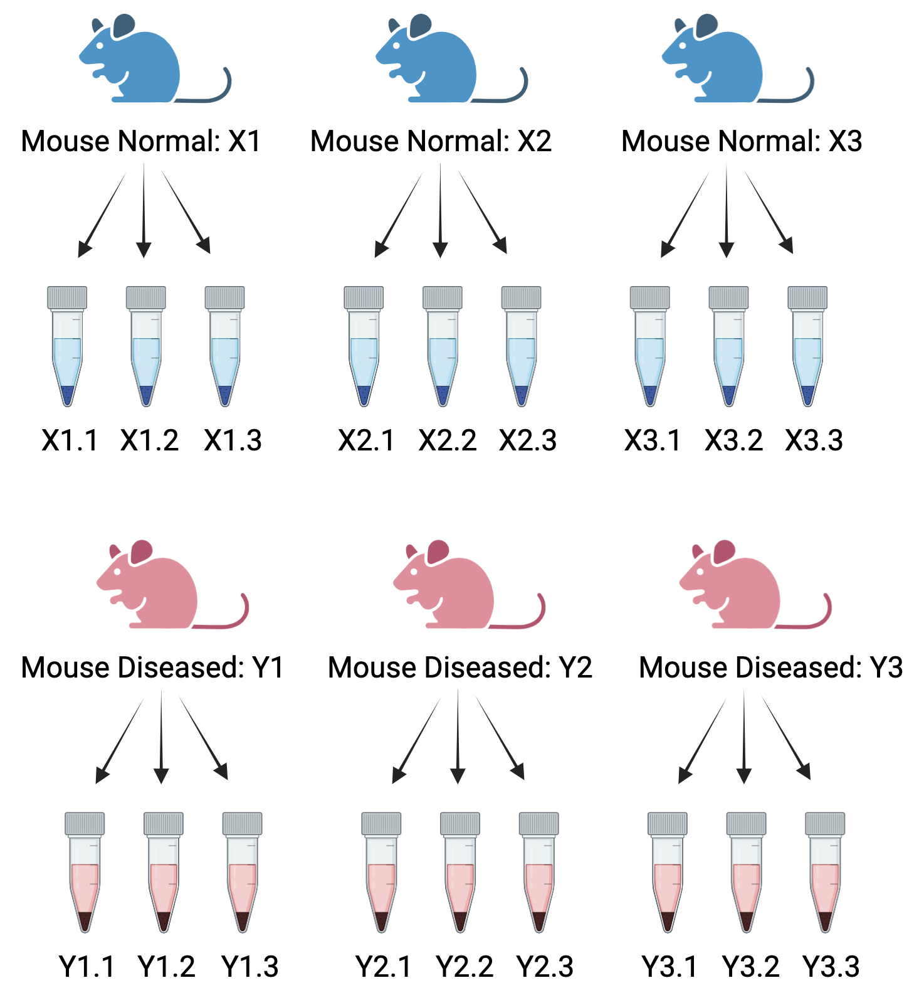

# Experimental Factors

RNA-Seq is a powerful tool for capturing high-throughput gene expression. It captures the expression of thousands of genes in different samples for multiple conditions. A general approach to analysing RNA-seq data is to fit a linear model o each gene. The gene expression measurement for each gene has a mix of biological signal and unwanted noise. The methodology must be carefully though of to design a well-balanced experiment to perform a robust statistical analysis. After you have made decisions on the type of sequencing (long-read or short-read) and the type of RNA-Seq (full length/targeted/bulk/single-cell), there are other factors that can influence your experiment and need to be considered:
  
1. Select an appropriate source of samples: cell lines, animal models, patients, etc.

2. Sequencind depth

4. How much sequencing depth is required for the experiment?

4. Balancing the variation in the experiment: Understand technical and biological replicates. How many replicates are needed?

5. Batch effects can add unwanted variation in the experiment. 

6. Confounding factors: Sex, age, litter etc. 


### Pooling Samples

RNA sample pooling is done by mixing RNA molecules extracted from independent biological samples from the same population before library preparation.The library prepared then represents a pool of biological samples resulting in a smaller number of replicates, and hence lower cost of sequencing while increasing the statistical power for differential gene expression (DGE) analysis [@takele2020utility].

## Sequencing methods

Sequencing Decision. Transcriptomics for Bulk RNAseq. Short reads. Coverage.

### Short Read Sequencing

### Long Read Sequencing

### Coverage

A common query is to what depth should a sequence experiment be performed.

Researchers are often faced with a choice as to whether to sequence more deeply or sequence more samples. More biological replicates will provide better estimates of variance and more precise measures of gene expression than sequencing to a greater depth. It is generally advised to sequence more samples rather than sequence deeply if the option is there.

```{r, echo=FALSE, fig.align="center", fig.cap="Biological replicates provide more statistical power to detect differential genes than sequencing depth"}
knitr::include_graphics("images/experimental_design/liu_y_bioinformatics_2014.jpg")
```

Image taken from: [Liu Y et al, RNA-seq differential expression studies: more sequence or more replication? Bioinformatics. 2014](https://www.ncbi.nlm.nih.gov/pmc/articles/PMC3904521/)

However, higher sequencing depth is necessary for detecting lowly expressed differentially expressed (DE) genes and for conducting isoform-level differential expression analysis.

## Batches and replicates (technical/biological)

There are two types of replicates in an experiment:
  
  1.  Technical replicates are repeated measurements taken from the same biological source to accurately **assess technical variation in an experiment**.

```{r, echo=FALSE, out.width="430px", out.height="300px", fig.align="center", fig.cap ="Technical replicates: A single mouse sample, three replicates per condiion.", fig.height= 0.1, fig.width=0.8}
knitr::include_graphics("images/experimental_design/technical_reps.png")
```

For example, consider a simple RNA-Seq experiment comparing two conditions: normal and diseased. In this scenario, a single normal mouse provides three measurements—mouseX_normal_1, mouseX_normal_2, and mouseX_normal_3. Similarly, a single diseased mouse provides three measurements—mouseY_diseased_1, mouseY_diseased_2, and mouseY_diseased_3. This results in the following samplesheet:
  
  |      sample       | condition | mouse | technical replicates |
  |:-----------------:|:---------:|:-----:|:--------------------:|
  |  mouseX_normal_1  |  normal   |   X   |          1           |
  |  mouseX_normal_2  |  normal   |   X   |          2           |
  |  mouseX_normal_3  |  normal   |   X   |          3           |
  | mouseY_diseased_1 | diseased  |   Y   |          1           |
  | mouseY_diseased_2 | diseased  |   Y   |          2           |
  | mouseY_diseased_3 | diseased  |   Y   |          3           |
  
  The samples mouseX_normal_1, mouseX_normal_2, and mouseX_normal_3 serve as technical replicates for the normal condition, while mouseY_diseased_1, mouseY_diseased_2, and mouseY_diseased_3 are technical replicates for the diseased condition.

2.  Biological replicates involve using biologically separate samples to **capture the biological variation between samples**. The biologically separate samples can include different organisms or tissues from different mice, different cell populations grown separately but originating from the same cell-line, sampling tumor samples from same tumor, etc.

```{r, echo=FALSE, out.width="500px", out.height= "600px", fig.align="center", fig.cap ="Biological and Technical replicates: Three mice sample (biological reps), three replicates (technical) per condition."}

```

In the previous RNA-Seq experiment, if we increase the number of mice to three for each healthy and diseased state, we obtain the following samplesheet:
  
  |       sample       | condition | mouse (biological replicates) | technical replicates |
  |:-----------------:|:----------------:|:-----------------:|:----------------:|
  |  mouseX1_normal_1  |  normal   |              X1               |          1           |
  |  mouseX1_normal_2  |  normal   |              X1               |          2           |
  |  mouseX1_normal_3  |  normal   |              X1               |          3           |
  |  mouseX2_normal_1  |  normal   |              X2               |          1           |
  |  mouseX2_normal_2  |  normal   |              X2               |          2           |
  |  mouseX2_normal_3  |  normal   |              X2               |          3           |
  |  mouseX3_normal_1  |  normal   |              X3               |          1           |
  |  mouseX3_normal_2  |  normal   |              X3               |          2           |
  |  mouseX3_normal_3  |  normal   |              X3               |          3           |
  | mouseY1_diseased_1 | diseased  |              Y1               |          1           |
  | mouseY1_diseased_2 | diseased  |              Y1               |          2           |
  | mouseY1_diseased_3 | diseased  |              Y1               |          3           |
  | mouseY2_diseased_1 | diseased  |              Y2               |          1           |
  | mouseY2_diseased_2 | diseased  |              Y2               |          2           |
  | mouseY2_diseased_3 | diseased  |              Y2               |          3           |
  | mouseY3_diseased_1 | diseased  |              Y3               |          1           |
  | mouseY3_diseased_2 | diseased  |              Y3               |          2           |
  | mouseY3_diseased_3 | diseased  |              Y3               |          3           |
  
  In this experiment, X1, X2, and X3 serve as biological replicates for the normal condition, while Y1, Y2, and Y3 serve as biological replicates for the diseased condition. For each biological replicate, we have three technical replicates for both conditions.

In the era of microarrays, technical replicates were essential. However, with the advent of current RNA-Seq technologies, technical variation is minimal compared to biological variation, making technical replicates less necessary.

Conversely, biological replicates are indispensable for differential expression analysis. Increasing the number of biological replicates enhances the accuracy of biological variation estimates and the precision of mean expression level estimates. This, in turn, leads to better data modeling and the identification of more differentially expressed genes.

## Confounding factors

A confounded RNA-Seq experiment is one in which the distinct effects of two different sources of variation in the data cannot be separated.

For instance, sex is known to significantly influence gene expression. If all the control mice in an experiment were female and all the treatment mice were male, the treatment effect would be confounded by sex. In this scenario, it would be impossible to distinguish the treatment effect from the effect of sex. Consider another scenario, if all the control mice are from cage A and all the treatment mice for cage B, the treatment effects are confounded by the cage. The living conditions in the two cages may vary which is indistinguishable from the treatment effects.

```{r, echo=FALSE, fig.align="center", fig.cap ="Confounding effects in RNASeq experiments: Three female mice in the contol group and three male mice in the treatment group.", out.width="500px", out.height="200px"}
knitr::include_graphics("images/experimental_design/confounding.png")
```

To avoid confounding, it is important to ensure the sample source/animals in each condition are all the same sex, age, litter, and batch, if possible. If this is not entirely possible, then make sure to split the animals equally between different conditions. Also ensure the samples are collected at the same time or randomise samples if they can’t be processed all at one time. It's best to discuss he experimental design with a bioinformatcian before conducting the experiment.

As a general rule for a standard RNA-Seq experiment, the number of biological replicates should at the very least be 2, but its ideal to have 3 or more replicates, and a sequencing depth of 10M to 20M reads per sample is usually enough.

As shown in Liu, Zhou, and White (2013)

-   gene-level differential expression
-   Isoform-level differential expression
-   Other types of RNA analyses (intron retention, small RNA-Seq, etc.)

Batch, Techinical replicates and not biological, Pooling samples, Randomization, Noise. Clonal (cell-lines, bacteria, inbred animalls) or not clonal organisms, Does my tissue has different cell types -\> Cell sorting or single cell
