# Library Preparation  

This section of the workshop will cover important aspects of RNA collection and library construction that can impact your RNA-seq experimental results.

Your source material and library construction method can have a big impact on your final results. We will cover some best practices for RNA extraction and library construction, including some of the most common methods and their advantages and disadvantages, how they work, and why.

This workshop will only cover general guidelines - There is a huge number of kits, methods, and optimisations available to choose from, and we could never cover them all! 

## Before you start   

Before you start, think about - and don’t underestimate - batch effects. You want differences between your samples to be genuine biological variation, not systematic technical effects introduced during sample collection and library construction. Sometimes, effects caused by batching during experimental procedures can overwhelm the sometimes subtle biological expression variations in your sample. Plan your tissue/cell collection, RNA extraction, library construction and sequencing experimental workflow in advance and think about where batch effects can happen before starting the experiment.

Try to standardise everything: including processing dates, reagent batches, equipment, plasticware, and even have the same staff staff available to preparing the samples. Buy sufficient reagents and consumables in advance so that you’re using the same batches of everything, from start to finish.

Sometimes it’s impossible to completely avoid batching - for example projects including very large numbers of samples, long time-course experiments, or methods that have a lot of upstream processing (flow cytometry, dissections, etc). In these cases, try to distribute your replicates across batches.

For example don’t process controls all in one day (or one ‘bench sitting/session’), then condition 1 on another day/session, then condition 2, etc. Try to split groups and replicates across batches.


```{r, echo=FALSE, out.width="530px", fig.align="center", fig.cap ="Batch effect caused by processing replicates together. Variation between replicates may be caused by differences in preparation methods. Spreading replicates across batches helps to mitigate the effects at analysis time.", fig.height= 0.1, fig.width=0.4}
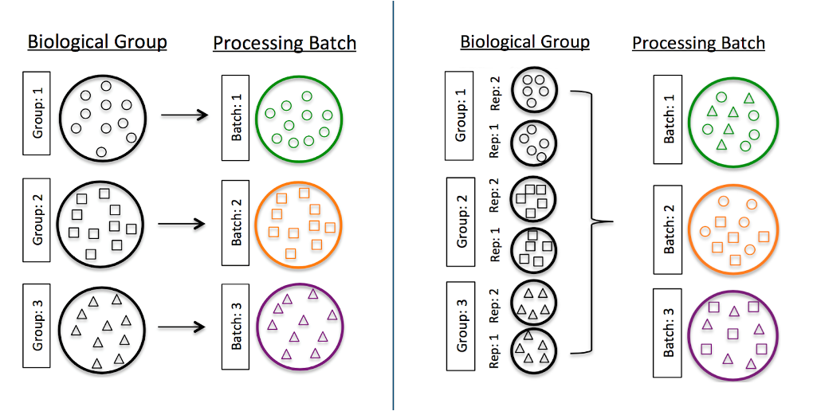
```


If you’re processing samples via a core facility, platform or service provider, they will be accustomed to this type of experiment, and will manage batch effects during library prep and sequencing (for example, by processing all samples in a project at the same time with the same kit by the same staff member or liquid handling system, and pooling libraries for sequencing rather than sequencing individual libraries).

Discuss your plans and requirements with your sequencing provider, and ask them for any notes about how the samples were processed and sequenced. Let them know your plans and requirements carefully.

If you’re continuing an experiment that is already partially complete (for example, adding conditions or replicates), let your sequencing provider know! They may have multiple machine and chemistry types, or they may even have changed equipment and/or chemistry... Methods, kits, and chemistry sometimes change as quickly as month-to-month!

Try to recognise, then control, prevent, and avoid, batches as much as possible. Where you can’t avoid batching, take notes, so that you can correct for batch effects during analysis.

MGBP staff are here to talk to you about your project before you start - both on the wet lab side (MGBP Genomics Node) and bioinformatics/data analysis side (MGBP Bioinformatics Node). 

## RNA Purification

The RNA-seq component of an experiment starts physically with the collection of RNA from cells. To maintain it in-tact until we can sequence it, we need to separate it from all other cellular components. We’ll discuss some important aspects of the process that can affect your results.

Unfortunately, there’s no single method that is best for all projects - differences between organism types (eukaryotes, prokaryotes, fungi, plants, mammals, etc) to tissue structure within a single individual (soft tissues vs bone, connective tissue, lipid-rich tissue, to individual cell types within the same tissue, may all have different methodologies. Find a method that works for your sample types - read the literature, talk to MGBP staff, and talk to manufacturers… and importantly, do some trial runs.

## Beware of RNase

Maintaining RNA integrity, or ‘intactness’ is critical. To maintain sample integrity, collect samples from the very start considering RNase contamination. Unfortunately, RNAse is ubiquitous - on your hands, the benchtops, on the dust in the air. Compounding matters, it’s also a very robust and difficult to inactivate enzyme… Even autoclaving will not completely inactivate it! 

Consider everything that will touch the sample from the point of collection, and decontaminate: For example, gloves, pipettes, dissecting equipment, tissue handling equipment, microtome surfaces and blades for section cutting, storage containers, etc., and decontaminate them where possible using a commercial cleaning product designed for the purpose: RNase away (Thermo), RNaseZap (Thermo), RNase X (Biotium), RNase Erase (MPBio), etc. This process is as simple as wiping down surfaces, or submerging tools and rising with RNase-free water.


```{r, echo=FALSE, out.width="530px", fig.align="center", fig.cap ="Yes, the RNaseAWAY really does come in a 500mL atomiser!", fig.height= 0.1, fig.width=0.4}
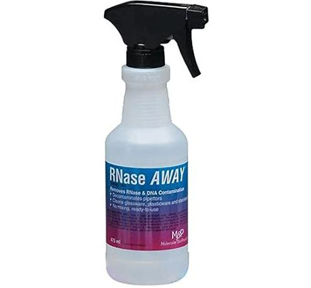
```

### {width=20px} Caution:  {width=20px} {- .caution} 
 Many Rnase cleaning solutions also contain DNases - your colleagues will not thank you for using a DNase atomiser in the lab!   

### {-}

Use as many commercially prepared certified RNase free consumables as you can. They’re readily available, but more expensive. You can decontaminate them yourself (using, for example, dimethyl- or diethylpyrocarbonate), but it’s easier, safer and more reliable to buy certified RNase free. 

Lastly, use as much new consumables, and newly opened reagents, as possible. You don’t know whether they have been previously contaminated, and RNase isn’t a concern for labs working on DNA or protein!

## Work quickly and preserve your samples

Ideally, we’d snap our fingers and have instant purified RNA… but often lots of work (and time) occurs between tissue/cell collection and the completion of RNA extraction.


```{r, echo=FALSE, out.width="530px", fig.align="center", fig.cap ="A PhD student and a Professor (in unspecified order) preparing instant and perfect RNA preps from tissues.", fig.height= 0.1, fig.width=0.4}
knitr::include_graphics("images/library_prep/Picture3.png")
```

Cells respond and change their gene expression continuously, including after collection until they are lysed, frozen, or fixed. When the cells are lysed (and even frozen), RNA degradation commences immediately. Most RNases are endogenous to your samples, so process them as soon as possible: proceed directly to RNA extraction, fixation, or snap freezing. 

In general, we recommend proceeding directly from fresh tissue/cells to RNA extraction by adding lysis buffer.

If it’s not possible to process your samples immediately, there are products available for stabilisation of your tissue sample. This is particularly useful if you need to collect samples that will be shipped to a remote location, because they can be stored at room temperature. Examples include RNAlater (Thermo), RNAprotect (Qiagen), NucleoProtect (Machery-Nagel), MACS Tissue Storage Solution (Miltenyi), TRIzol (Thermo), and others. 

### {width=20px} Caution:  {width=20px} {- .caution} 
Do not use these options if you’re planning single-cell or spatial! Those experiments have very specific tissue/cell handling requirements

### {-}

## RNA Preparation Methods

There are too many different methods to cover in this workshop, because different methods work better for different sample types. Instead, we’ll cover some important general principles.

We generally recommend purchasing an RNA extraction kit, if one is available for your sample type - they are easy to use, they supply all the materials needed to complete the procedure, they are guaranteed to be RNase-free, and they are pre-optimised. Lastly, they come with comprehensive instructions and free technical support. 

Most modern commercial RNA preparation kits will work for most mammalian cell types. 
Kits are often designed for specific tissue types (i.e. QIAgen produces kits specifically for plants, blood, lipid tissues, bone marrow, fibrous tissue, etc). If you are unable to find a kit type named for your specific organism and/or tissue, then we strongly recommend speaking to manufacturer’s and vendor’s technical representative/Field Application Scientists. They will have experience with a huge number of different sample types, and they can recommend which of their kits will perform best when adapted to your sample type. 


```{r, echo=FALSE, out.width="530px", fig.align="center", fig.cap ="A few examples of QIAGEN’s range of RNA extraction kits.", fig.height= 0.1, fig.width=0.4}
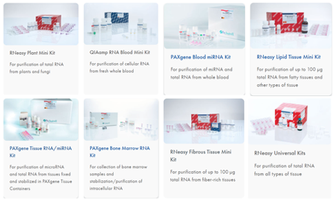
```

Furthermore, manufacturers have technical notes on how to modify or optimise kits for non-target tissue types. Similarly, information may also be found in the scientific literature. If you are working with an unusual tissue type, it is worth checking to see if there are any published optimisations. 

In general, we recommend kits that include a column (spin, vacuum, or gravity) based clean-up, especially if you have used a preservation or collection method involving organic solvents (such as phenol/chloroform). They work well to remove organic solvents such as phenol (which can seriously compromise down-stream workflows) and is often carried over from solution-based methods. They also help to facilitate quick and easy DNase treatment.

### Importance of DNase treatment

Often, samples that arrive at the facility are heavily contaminated with DNA, which can co-purify with RNA (depending on the purification method, sometimes up to 10%). It can be difficult to discriminate between DNA and RNA when using, for example, spectrophotometric methods (i.e. Nanodrop). This can cause an overestimation of the total mass of DNA that is used in the the library construction stage, leading to low diversity libraries, low total library mass, which can trigger the decision to overamplify the libraries (discussed later in this module), or result in insufficient material for sequencing.

All RNA preparations for RNA-seq should undergo a DNase treatment. This is especially important for certain cell/tissue sample types which contain more DNA than RNA, for degraded samples where small fragments of DNA are more likely to be co-recovered with RNA (including mechanically sheared samples), and for FFPE samples where molecules can be cross-linked. 

The effect of DNA in your samples on your final data may be very little, or very severe, depending on how you choose to convert your RNA into DNA for sequencing (see section "Library Construction", below): Genomic DNA sequence can directly and heavily contaminate the sequence data if libraries are produced from total RNA (i.e. without poly-A selection, discussed in subsequent sections), compromising the ability to detect transcriptional differences.

Thre are two main methods for DNase treatment:

On-column treatment: DNase treatment can be applied during RNA purification using spin columns, which are quick and easy because it occurs as part of the extraction workflow. It is often included as part of the purification kit. However, it can sometimes be less efficient than a dedicated post-extraction treatment (see below). For most samples, we recommend purchasing an RNA isolation kit that includes an on-column DNase treatment.

Post-extraction treatment: Alternatively, DNase treatment can be applied as an enzymatic reaction after RNA extraction and purification. This is often more efficient than on-column treatment, making it useful for very heavily DNA contaminated samples, or samples that have already undergone unsuccessful on-column treatment. However, it requires a separate reaction set-up, incubation, and re-purification of the RNA. These additional steps increase the risk sample degradation during processing, and sample loss due to recovery inefficiencies. 

Don’t forget to inactivate and clean up your samples after DNase treatment! All samples are converted into DNA on the sequencer, and any DNase carried into the library construction steps will seriously compromise the efficiency, or cause library failure!

### How much DNA is acceptable? 

DNA contamination is not as critical for poly-A libraries (since most DNA is lost during a specific poly-A collection step), but it is crucial for FFPE samples (where moleulces are cross linked and co-purify), bacterial transcriptomics, and other samples that are not poly-A selected (discussed in "Library Construction"). There’s no definitive answer, but it’s generally recommended that the RNA preparation should contain significantly less than 10% DNA after treatment (this is the amount that is often co-purified during a successful RNA purification). Generally, as little as possible is best! There will be a trade-off between residual DNA, and RNA loss and/or degradation with additional subsequent DNase treatments.

## Storage of RNA

Once you have isolated your RNA, you will need to store it for a period of time before proceeding to library construction. We recommend certified RNase-free low nucleic acid binding tubes to avoid loss by adsorbtion to the tube surface (such as Eppendorf DNA LoBind Tubes), particularly for low-yield samples.

### {width=20px} Caution:  {width=20px} {- .caution}
Eppendorf Protein LoBind tubes are also available, and are stocked at the Monash stores. These are not the same as nucleic acid "low binding" tubes.   

### {-}  

Your RNA should be stored in a pH buffered, divalent cation-sequestering solution such as certified RNase-free TE, or a commercial RNA storage solution. You should not use ultrapure or even RNase-free water: RNA naturally auto-hydrolyses (degrades) in alkaline solutions and in the presence of divalent cations. 

### {width=20px} Caution:  {width=20px} {- .caution}
Do NOT tissue/cell storage solution, or pre-extraction RNA stabilisation solution for RNA storage! They will seriously compromise library construction 


### {-}  

Your samples should always be stored frozen - generally, -20°C is acceptable for short-term storage, but -80°C for longer term storage. You shouldn’t aim to store your RNA long term (i.e. try to produce it close to the time that you’re going to use it. 

Think in advance about how and when you’re likely to use your RNA, so that you can avoid freeze-thaw cycles on your samples. It is useful to aliquot into usable volumes/masses if necessary. For example, don’t prepare your RNA, then freeze it, then thaw it for concentration measurement, then freeze, then thaw for integrity measurement, then freezer, then deliver to your sequencing provider (who will thaw it again to work on it).

Pure samples in RNase-free consumables and solutions should remain intact in a suitable buffer at low temperatures for relatively long periods of time (at least many months).

## RNA QC

## What is a "good" RNA preparation?

There are three main factors that count towards a "good quality" RNA preparation for RNA-seq: Integrity, purity, and total mass.
Integrity/"intactness": you can build a library from almost any RNA, but using degraded RNA is more time-consuming, more expensive, and less reliable. You will see a loss of rare transcripts, and a loss of coverage further from the 3’ poly-A region, depending on the methods you use for library construction. You should always try to preserve the integrity of your samples as much as possible. However, this isn’t possible for all sample types such as FFPE samples, and some ‘difficult’ organisms/tissues which never yield good quality RNA.
Purity: The library construction process is a series of enzymatic reactions that can easily be disturbed by substances from cells or from the RNA extraction process (cell debris, detergents, denaturing agents, organic solvents, salts, EDTA, etc.) Impurities can also affect accurate quantitation, and degrade the integrity of your samples over time. Your sample should also be relatively free of DNA.
Total mass: The total mass that you isolate is important for sensitivity - samples can be processed into a sequencing library starting even from a single cell or picogram quantities of RNA, but rare transcripts are likely to be lost during the library construction process, and your final library will be less diverse.

## Measuring integrity

Ideally, your samples will be measured using an automated microcapillary or microfluidic electrophoresis instrument, such as the Agilent Bioanalyzer, Agilent Fragment Analyzer, Agilent TapeStation, Perkin Elmer /Revvity LabChip. These instruments are rapid and consume a very small amount of your sample (as little as picogram quantities in one microlitre). They perform out an automated electrophoretic separation and detection of RNA molecules based on size as they pass through a gel. The RNA is fluorescently stained and emitted light is detected as RNA passes a sensor, producing a trace of fluorescence intensity (proportional to RNA concentration) vs time (proportional to size).


```{r, echo=FALSE, out.width="530px", fig.align="center", fig.cap ="Agilent Bioanalyzer, Caliper/PE/Revvity LabChip, Agilent Fragment Analyzer, Agilent TapeStations.", fig.height= 0.1, fig.width=0.4}
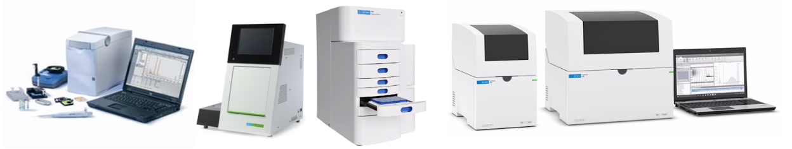
```

[ Distribute Bioanalyzer chips ]

Good quality RNA has intact ribosomal RNA peaks, and not much accumulated low molecular weight degraded material <200bp.


```{r, echo=FALSE, out.width="530px", fig.align="center", fig.cap ="Examples traces of RNA of different levels of degradation, scoring from 2 to 10.", fig.height= 0.1, fig.width=0.4}
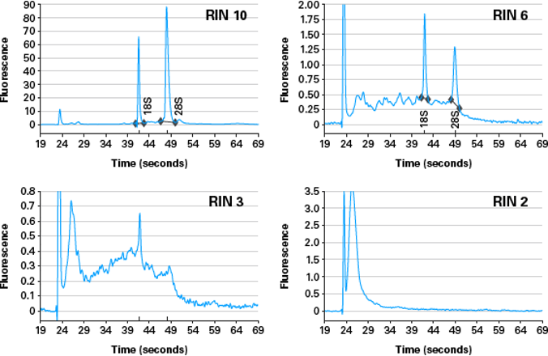
```

To simplify the interpretation, all RNA QC instruments produce a comprehensive report of sample statistics.

```{r, echo=FALSE, out.width="530px", fig.align="center", fig.cap ="Example bioanalyzer report showing virtual gel image, reaction conditions, per-run and per-sample traces of fluorescence vs time, and most importantly, the score out of 10.", fig.height= 0.1, fig.width=0.4}
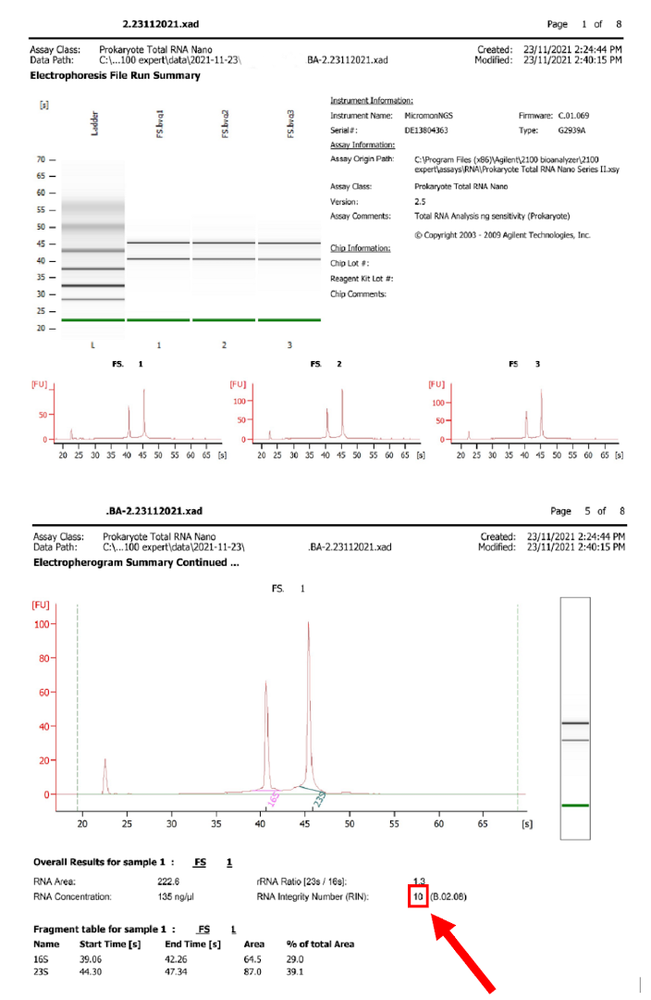
```

Probably the most important statistic calculated is the integrity score. The information from the traces is processed by an algorithm to produce a score out of 10, and because the score is calculated the same way for all samples, it can be directly compared between samples. This score is referred to as "RIN"/"RQN"/"RQS" depending on the instrument vendor, and has become an ‘industry standard’ metric for RNA quality.

What is a ‘good’ score? There is no hard-and-fast rule, but we generally advise that RNA that scores 8 or higher will produce a good quality, diverse, sequencing library.

This technique does require specialised hardware: If you don’t have access to these specialised instruments, you can submit your samples to the MGBP for analysis. We provide RNA QC as a service. You can also run a standard agarose gel, but it’s more difficult to maintain RNase-free equipment, it’s more time-consuming, it requires a large amount of RNA, it’s less accurate and not quantitative.

## Measuring purity

Spectrophotometry is a fast, simple, and cost-effective way to estimate the purity of your samples. RNA absorbs light in a well characterised way due to its molecular shape, with absorbance peaks and troughs at specific wavelengths. 


```{r, echo=FALSE, out.width="530px", fig.align="center", fig.cap ="The absorbance spectrum of pure RNA.",, fig.height= 0.1, fig.width=0.4}
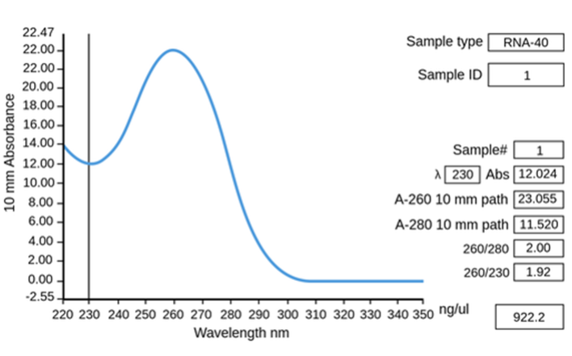
```

Other compounds also absorb light across the spectrum, and these overlap with the RNA absorbance peaks and troughs. 

(ref:foo9) Absorbance of an assortment of substances commonly found in nucleic acid preparations. Image source  [bmglabtech](https://www.bmglabtech.com/en/application-notes/dna-purity-ratio-fast-and-easy-absorbance-based-evaluation-of-nucleic-acid-quality)
```{r, echo=FALSE, out.width="530px", fig.align="center", fig.cap ='(ref:foo9)', fig.height= 0.1, fig.width=0.4}
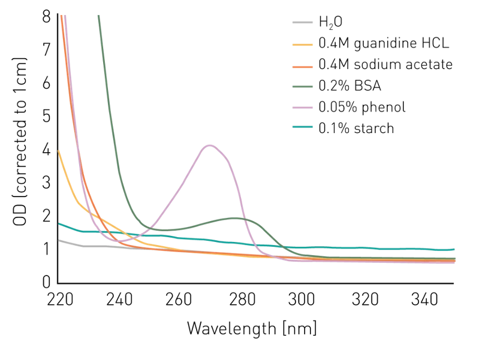
```

Therefore, contaminating substances in your sample can alter the absorbance spectrum in predictable ways.

(ref:foo10) Effect of various common contaminants on the absorbance spectrum of DNA/RNA. Imagen source [bmglabtech](https://www.bmglabtech.com/en/application-notes/dna-purity-ratio-fast-and-easy-absorbance-based-evaluation-of-nucleic-acid-quality)
```{r, echo=FALSE, out.width="530px", fig.align="center", fig.cap ="(ref:foo10)", fig.height= 0.1, fig.width=0.4}
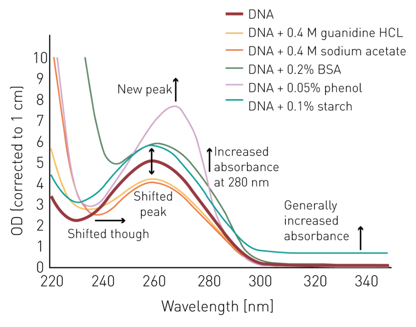
```

The general metrics for nucleic acid purity are values calculated from the ratios of particular absorbance minima and maxima. 

For pure RNA:
A260:A280 = 1.8 - 2.0
A260:A230 = 2.0 - 2.2

Look at the general shape of the curve and examine the absorbance ratios before deciding whether to continue with your samples. 

If they deviate from the expected shape and values, then you can look further into the possible causes. There are many resources are available online to help you try to identify the contaminants. For example: [thermofisher brochures](https://tools.thermofisher.com/content/sfs/brochures/TN52646-E-0215M-NucleicAcid.pdf)

If you find that your RNA metrics deviate from what is expected for pure RNA, you will need to use a generic RNA clean-up kit. These are generally column based, similar to the extraction kit (but without the lysis components).

### {width=20px} Caution:  {width=20px} {- .caution}
 Bear in mind that spectrophotometry doesn’t give any integrity information! Even very highly degraded RNA (almost to nucleotide level) can provide an absorbance spectrum that looks "good", including absorbance ratios. 

### {-}
 
## Measuring total mass
Spectrophotometry is also a common method for measuring nucleic acid concentration, but it isn’t recommended. RNA concentration by spectrophotometry is based on the observation that an absorbance of 1.0 at 260nm of pure RNA = 40ng/uL.

```{r, echo=FALSE, out.width="530px", fig.align="center", fig.cap ="The absorbance spectrum of pure RNA.", fig.height= 0.1, fig.width=0.4}
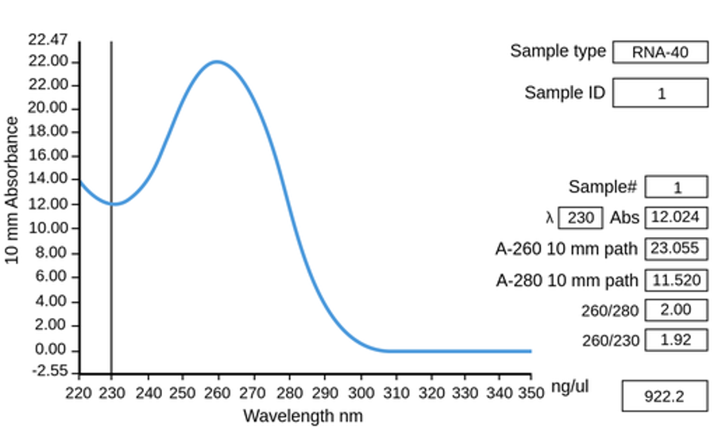
```

However, you’ll never produce a completely pure sample, and almost anything else in your RNA preparation will increase absorbance to some degree (see above section, ‘Purity’). Consequently, spectrophotometry almost always overestimates the total mass. A common culprit causing often dramatic overestimation of concentration is DNA (see "Importance of DNase treatment"), which is relatively difficult to discriminate by spectrophotometry.

In contrast, fluorimetry uses RNA specific nucleic acid binding dyes that fluoresce only when bound to their target molecule. They are largely unaffected by other substances in your sample, including DNA 

(ref:foo12) RNA specific dye is largely unaffected by DNA present at the same mass. Imagen source [biotium](https://biotium.com/product/accublue-broad-range-rna-quantitation-kit/)

```{r, echo=FALSE, out.width="530px", fig.align="center", fig.cap ="(ref:foo12)", fig.height= 0.1, fig.width=0.4}
knitr::include_graphics("images/library_prep/Picture12.png")
```

They can be purchased in commercial kit format (such as Invitrogen QuantIT) that are inexpensive and easy to use. The samples can be measured with a dedicated nucleic acid measurement device like the Thermo Qubit/Flex, Promega Quantus, DeNovix DS-11fx, or a benchtop fluorescence plate reader. 

How much RNA is needed?  

For abundant samples, the amount of RNA that you need for library construction depends on the library construction kit you plan to use. For projects where source material is limited, the library construction kit you choose will depend on the amount of RNA available to you. The kits will clearly specify the amount of material you need to use as input, and this typically ranges from a few cells or picograms, up to a few hundred nanograms. 

However, you will also need to factor in an allowance for QC: For the recommendations outlined here (spectrophotometric purity measurement, fluorimetric total mass measurement, fluorimetric DNA contamination measurement, microfluidic integrity measurement) you will need around 10 microlitres and about 20ng of additional material.

## Measuring DNA contamination

We discussed previously ("Importance of DNase treatment" and "Measuring total mass") that DNA is often co-purified with RNA, sometimes at levels up to 10% of nucleic acid total mass. Fluorimetry can also be used to measure DNA contamination of your RNA samples, using a DNA-specific dye.

### {width=20px} Caution:  {width=20px} {- .caution}
you should dilute, heat, and rapidly cool your samples to denature them, because high-concentration RNA will often form double-stranded RNA… and it will measure as DNA!)

### {-}


## Library Construction

## What is library construction 

Library construction is the process of converting your target RNA molecules into a format that the sequencing instrument can ‘read’. Your purified RNA is the starting material, and a dsDNA sequencing library is the output. 

Generally, we recommend purchasing a commercially prepared kit if there is one available that is suitable for your organism and tissue/cell type - they are convenient, pre-optimised, and batch tracked. However, there are also many (many!) community-developed methods. 

(ref:foo13) Image source [ngs-library-prep](https://www.illumina.com/content/dam/illumina-marketing/documents/applications/ngs-library-prep/for-all-you-seq-rna.pdf)
```{r, echo=FALSE, out.width="530px", fig.align="center", fig.cap = "There are many, many, different library preparation methods!. This is Illumina For all you seq - RNA poster. Each line of each column represents a summary of single library prep type... And this is from 2015. (ref:foo13)", fig.height= 0.1, fig.width=0.4}
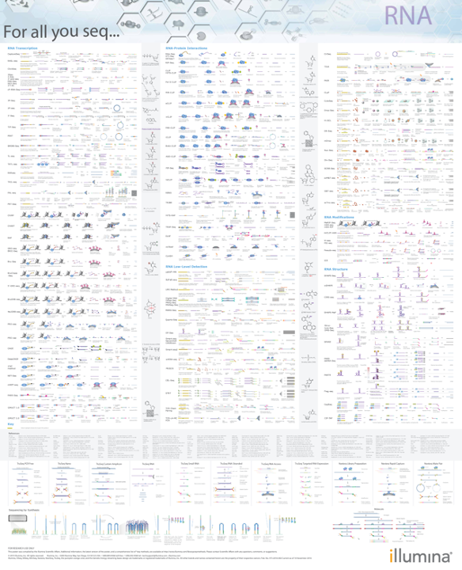
```

When choosing a library construction kit without any prior knowledge, we recommend talking to your local core facility, and talking to the major vendors (Illumina, NEB, Revvity, Qiagen, Thermo, IDT, Twist, Takara, Agilent, Roche, Lexogen etc).

Key points to consider:
Which sequencer will you be using? Usually Illumina, but kits also exist for other sequencer types.
Are you working with prokaryotic or eukaryotic samples? Some kits only work with polyadenylated transcripts.
Do you need to study more than just poly-A mRNA (such as lncRNA, small/microRNA, etc)?
How much sample is available? How much RNA can you recover? Some kits have high and ulra-low input requirements.
Do you need to know which genome strand was transcribed? Some kits preserve this information, but some don’t!
Do you need to sequence full transcripts (i.e. for isoform detection)? Some kits only identify stranscripts by their 3’ end.

You should also consider the lab hardware requirements for the kits, and the time input required. Some kits have much longer workflows than others, and some require specialist equipment.

There are literally hundreds of kits to choose from. In general, the manufacturer’s spend a lot of time and R&D budget on optimisation. Consequently, most commercial kits work well, as long a they’re designed for your particular experimental design, organism, and tissue/cell type.

This section covers a some common methods, and the central aspects that form the core of many commercial kits community developed protocols. 

## Why is a library needed?

Next-Generation Sequencing (NGS) instruments usually carry out the sequencing of millions of library molecules in parallel by immobilising them to a solid surface, where they carry out an optical detection of the stepwise addition of fluorescent nucleotides in a polymerase based DNA synthesis reaction (e.g. Illumina’s "Sequencing By Synthesis"). Therefore, they need the template molecules in a particular molecular "format" that is compatible with this chemistry.

Note: A detailed description of how short-read sequencing works is beyond the scope of this workshop. More information can be found here, you you can talk to MGBP staff for more information.
https://sapac.illumina.com/science/technology/next-generation-sequencing/sequencing-technology.html

## Parts of a (typical short-read) library
Most short read libraries consist of a set of core features: Insert, adapters, flowcell binding regions, primer binding sites, indexes, and (sometimes) unique molecular identifiers.

(ref:foo14) Imagen source [idtdna](https://sg.idtdna.com/pages/products/next-generation-sequencing/workflow/xgen-ngs-library-preparation/ngs-adapters-indexing-primer)
```{r, echo=FALSE, out.width="530px", fig.align="center", fig.cap = "Illumina adapter format showing flowcell binding regions (black), index/barcode sequences (light blue and purple), unique molecular identifiers (orange and green), and insert between T and A bases (blue-grey, centre). (ref:foo14)", fig.height= 0.1, fig.width=0.4}

```

### Insert

The segment of RNA that will be sequenced. Note that this isn’t an entire transcript - Most sequencing instruments aren’t capable of either capturing, or sequencing, fragments longer than about 1.5kb (or smaller than 100b). Furthermore, the sequencer isn’t capable of producing reliable sequence data longer than about 300b. Consequently, the insert needs to be a randomly sheared fragment of the original template (see section "Fragmentation"). 

### Adapters

These are specifically designed pieces of DNA (typically about 60-200b long) and they are added to each end of the molecules to be sequenced. These are usually referred to by Illumina’s naming convention of "P5" and "P7", which are on opposite ends of the molecule. 

### Flow cell binding regions

These are a part of the adapter (indicated by black adapter tips in the figure above). They are defined sequences that are complementary to an oligo lawn on the flowcell surface. This facilitates the permanent covalent immobilisation of the library to a solid surface, where the instrument can read the sequence.

[HAND OUT FLOWCELLS]

### Primer binding sites

Like Sanger sequencing and PCR, this provides a starting point for a polymerase to commence addition of fluorescently labelled nucleotides, one base at a time, which are ‘read’ by the sequencer to determine the sequence. There is a primer binding site at each end of the library (one each on the P5 and P7 adapter), so the library inserts can be read in each direction. This produces a "paired read" dataset.


```{r, echo=FALSE, out.width="530px", fig.align="center", fig.cap ="",, fig.height= 0.1, fig.width=0.4}
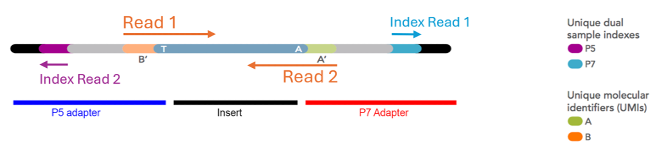
```

### Indexes

These are short stretches of defined DNA sequence. They are per-library ‘barcodes’ identify each sequencing read (or read pair) as belonging to a particular sequencing library, and hence sample. 

The flowcell used to immobilise molecules for sequencing is capable of capturing a defined, but always very large, number of molecules. It is usually divided into a set of smaller physical sections called ‘lanes’ 

* Look at the flowcells passed around recently and you will be able to see the individual lanes *

Each lane will provide more sequence reads than is needed by a single library, so libraries are mixed, or "multiplexed", together before sequencing. This decreases sequencing cost per library, because the fixed flowcell sequencing cost is distributed over multiple samples.  


```{r, echo=FALSE, out.width="530px", fig.align="center", fig.cap ="Various types of flowcells, showing total yield (in number of reads) and the smallest possible physical division of sequence yield. Even the smallest number of reads provided by most modern sequencing instruments requires sample pooling, via barcoding and multiplexing, to achieve maximal utility vs cost.", fig.height= 0.1, fig.width=0.4}
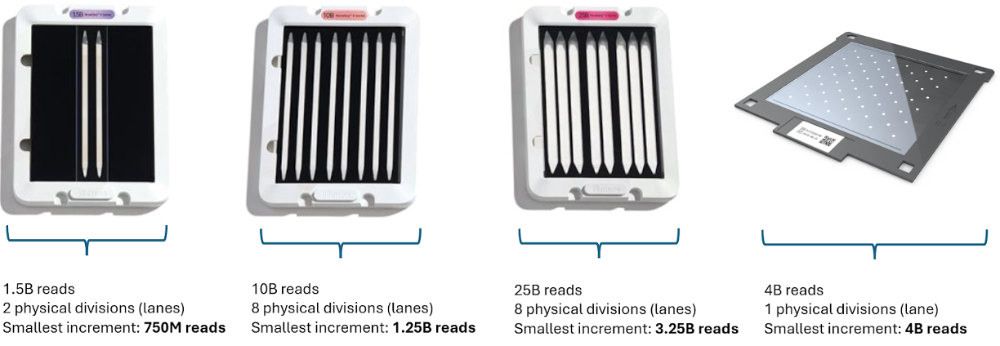
```


The index sequences are predesigned and the sequences are provided. They is supplied as a reagent in the library construction kit, and one index is selected per sample during library construction. The sequencing instrument sequences the index DNA in the same way that it sequences the insert (and it has it’s own primer binding site), but this sequence information is used to identify the library to which the molecule being sequenced belongs. 

### {width=20px} Caution:  {width=20px} {- .caution}
Some library preparation kits don’t come with indexes, and they need to be purchased separately! 

### {-}

They are named in accordance with the adapter end naming scheme: "I5" and "I7" to correspond with "P5" and "P7". An index can be included at one or both ends of the molecule, so the I7 always exists, but I5 is optional. These are called single-indexed libraries (I7), or dual-indexed libraries (I7 + I5). 

Dual-indexing is now the most common method, used in most kits. Because dual index sets are added separately and at opposite ends of the library molecule, they can be combinatorial dual indexes (CDI), or unique dual indexes (UDI). Combinatorial indexing re-uses indexes on each end, create non-unique single end barcodes, but unique combinations of barcodes when examining both I5 and I7 together. In contrast, unique dual indexing uses a different index pair for each library, so the indexes are unique even when examining just the I5 or just the I7.


```{r, echo=FALSE, out.width="530px", fig.align="center", fig.cap ="CDIs are smaller sets of single indexes, used in various combinations to produce a larger set of unique index combinations, but non-unique per end. UDIs are unique on both ends.", fig.height= 0.1, fig.width=0.4}
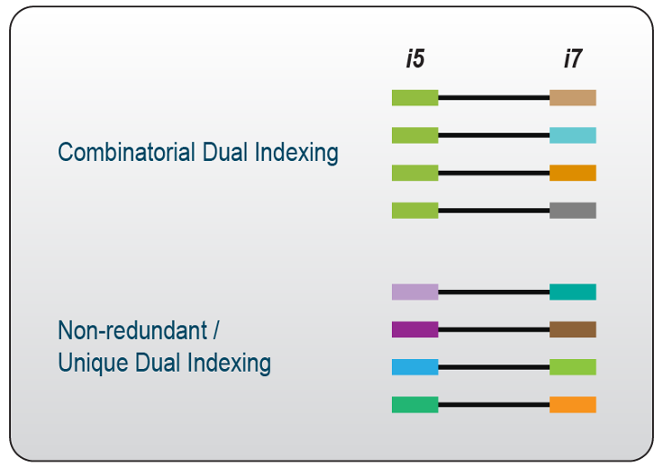
```

If a kit is available in UDI format, then there is no reason to use any other format. Importantly, using CDIs side-steps critical ‘bug’ within the chemistry of all modern (post-2015) Illumina machines called "index hopping": During the on-instrument pre-sequencing chemistry of library attachment to the flowcell,  the chemistry can accidentally ‘swap’ a small proportion of template molecules so that they contain the adapter from another sample. This obviously has consequences during data analysis and interpretation. By using unique dual indexes, ‘swapped’ indexes can be detected, because the I5-I7 index combinations per read will differ from the expected configuration. 

### Unique Molecular Identifiers (UMIs)

These are essentially ‘per-transcript’ or ‘per-molecule’ barcodes which are made up of a short string of random bases, providing a large pool of different sequences. They are optional, and most library construction kits do not include them (but they are becoming more common).

You should include UMIs if you have the option. All RNA-seq library construction methods include some form of molecular amplification, generally by PCR. In counting applications like RNA-seq, it’s useful to be able to distinguish which molecules are simply PCR duplicates - any molecules with the same UMI sequence are highly likely to have been derived from PCR amplification. This is particularly important in ultra-low input RNA-seq or rare variant detection where more PCR cycles have been used to increase the total mass of library material to enable QC and sequencing.

## Library construction steps

### Removal of rRNA, tRNA, and other ‘unwanted’ RNA.

Most total RNA samples are composed of >80% ribosomal RNA (rRNA), >10% transfer RNA (tRNA) which is not useful for most gene expression studies, but will produce sequence data if left in the sample. Therefore, most experiments include at least one step to enrich for meaningful molecules in the final library.

The most common methods are either positive or negative selection: 
Poly-A capture retains the poly-A mRNA and discards everything else.
Ribosomal RNA depletion discards rRNA and tRNA, and retains everything else.

Note: It’s also possible to remove specific targetted sequences, or to enrich only for specific target sequences. These methods are beyond the scope of this workshop. If you’re interested, please talk to us afterwards!

Poly-A selection (positive selection)

This method binds poly-A containing RNA (mostly messenger RNA) and discards all other RNA species, and it is the most common approach to enrichment for eukaryotic samples. To achieve the selection, the RNA sample is exposed to solid-phase magnetic beads coated in poly-T oligos. The poly-A tail binds to these beads, and leaves all other molecules in solution. The beads are recovered, washed, and the retained RNA eluted for library construction.


```{r, echo=FALSE, out.width="530px", fig.align="center", fig.cap ="Poly-A selection mechanism using oligo-dT coated magnetic beads. poly-A mRNA is captured onto the oligo-dT beads, the beads are recovered, washed, and only poly-A mRNA is eluted.", fig.height= 0.1, fig.width=0.4}
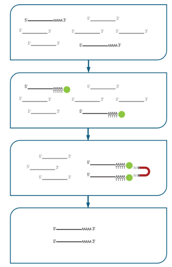
```

Because all other RNA species are discarded, this method is obviously only applicable for studies where only poly-A mRNA is important! You will not be able to study immature transcripts, lncRNA, processed sm/microRNA, or any eukaryotic transcripts, etc.

Because the poly-A tract is required for capture, this method requires highly intact RNA. This is one of the reasons that we recommend RIN8+ as a quality metric for proceeding to library construction (RIN is an RNA integrity metric scored out of 10. See the ‘RNA QC’ section, below). Samples that are degraded will be recovered to some degree, but sequenced only in the region adjacent to the poly-A tail. This usually produces a more significant bias towards the 3' end of transcripts as the sample RIN score decreases.

Poly-A selection is generally more effective than ribosomal depletion. We recommend this method if you have RNA that meets all the previous requirements.

Ribodepletion (negative selection)

This method removes unwanted RNA and retains all that remains. There are many methods for achieving this goal, and a number of the most popular methods are listed below:

Pull-down: This is one of the most common methods for ribosomal depletion. The sample is denatured, hybridised to probes specific for the target rRNA/tRNA. The probes are biotinylated, so that they can be captured using solid-phase streptavidin-coated magnetic solid-phase beads. This is effective, but only if the probes are complimentary to your organism’s rRNA sequence. You should check with the vendor to ensure that your sample is compatible with the probe-sets in the kit. This method usually doesn’t work well with low-input samples. Example kits: Thermo RiboMinus, original Illumina RiboZero, siTOOLS riboPOOL. 

(ref:foo19) Pull-down of rRNA (and other unwanted transcripts). Single-stranded DNA probes with biotin tags are added to the denatured RNA and allowed to hybridise. Magnetic beads coated in biotin-binding streptavidin are added to capture the probes and their hybridised targets, and are recovered and discarded. Remaining material is depleted of rRNA. Image source [illumina](https://knowledge.illumina.com/library-preparation/rna-library-prep/library-preparation-rna-library-prep-reference_material-list/000005899)

```{r, echo=FALSE, out.width="530px", fig.align="center", fig.cap ="(ref:foo19)", fig.height= 0.1, fig.width=0.4}
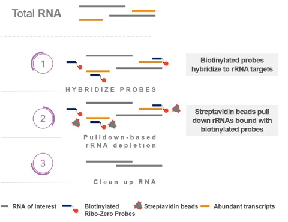
```

RNase H: This method uses enzymatic destruction of unwanted RNA. RNase H is an enzyme that selectively degrades RNA when present as a DNA-RNA hybrid. The sample denatured and mixed with ssDNA probes which are specific to depletion targets, and any remaining undigested RNA is carried forward. It works for relatively low input samples, as long as the probes are complementary - You should check with the vendor to ensure that your sample is compatible with the probe-sets in the kit. Example kits: New England Biolabs NEBNext, Illumina RiboZero Plus.

(ref:foo20) RNase H enzymatic depletion of rRNA (and other unwanted targets). 1) Specific ssDNA probs are added to the purified RNA and allowed to hybridise. 2) RNase H digests DNA:RNA hybrids. 3) DNA probes are removed with DNase I, leaving behind enriched mRNA.Imagen source [Library preparation](https://knowledge.illumina.com/library-preparation/rna-library-prep/library-preparation-rna-library-prep-reference_material-list/000005899)

```{r, echo=FALSE, out.width="530px", fig.align="center", fig.cap ="(ref:foo20)", fig.height= 0.1, fig.width=0.4}
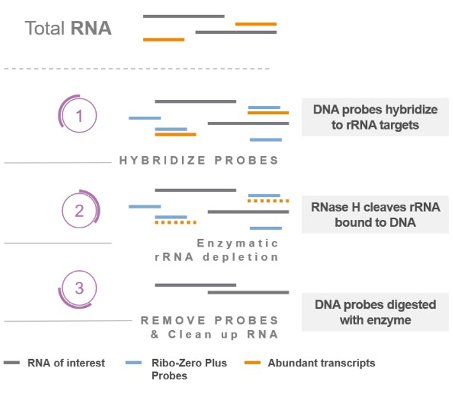
```

Targeted amplification/NSR priming: Uses a set of random primers computationally depleted for those that bind rRNA or other unwanted transcripts ("not-so-random" or "NSR" primers). The depleted set is used for amplification of your sample, leaving rRNA unamplified. This works very well for ultra-low input samples, but is effective only if the depleted probes match your species’ rRNA. You should check with the vendor to ensure that your sample is compatible with the probe-sets in the kit.  For example, NuGen Ovation.

Abundance-based depletion: destroys all highly abundant transcripts. A total RNA library is constructed and converted to dsDNA, including unwanted transcripts. The two strands of each library molecule are denatured and slowly re-hybridised. Highly abundant molecules will form dsDNA more quickly than rarer ones, and a duplex-specific nuclease (DSN) digests dsDNA specifically. Because this is done after library construction, it works well for ultra-low input samples. It’s also sequence-independant, so it works for any species (unlike targeted methods, above). It can also reduce the sequencing requirement for samples that contain other very highly abundant transcripts that are not of interest. This is a double-edged sword: sequence independence means that any high abundance transcripts will be depleted, and sometimes the method must be optimised. 

(ref:foo21) Duplex-specific nuclease can be used to remove high abundance transcripts, and these are mostly rRNA and tRNA. Imagen source [lexicon](https://www.lexogen.com/rna-lexicon-rna-pretreatment-enrichment-or-depletion/)

```{r, echo=FALSE, out.width="530px", fig.align="center", fig.cap ="(ref:foo21)", fig.height= 0.1, fig.width=0.4}
knitr::include_graphics("images/library_prep/Picture21.png")
```


Some probe-based kits allow customisation of the probe-set, which means that you can also remove highly abundant transcripts that aren’t of interest, allowing you to decrease your sequencing requirement, or increase the sensitivity of your assay at the same sequencing depth. Customisation also allows the use of these kits for depletion of RNA in organisms for which there’s no pre-designed probe-set.

Generally, ribosomal depletion is preferred to poly-A selection for lower quality (more degraded) RNA samples, because they don’t require intact molecules to be captured by the poly-A tail. Furthermore, the capture or depletion probes generally have much shorter targets, which are less affected by fragmented (smaller) RNA.

Be aware that mature small/microRNA are not quantitatively recovered by most standard RNA-seq kits using either poly-A selection or ribodepletion. These molecules are very small - generally <100 nt, and often <25 nt. Special library construction measures need to be taken to preserve molecules this small (see later section on adapter and adapter dimer removal). They are specifically size-selected out! They can be sequenced, but they usually need a dedicated smRNA library to be constructed - a topic for another workshop (or, contact us to discuss further!)

### {width=20px} Caution:  {width=20px} {- .caution}
Not all RNA-seq kits include a depletion method. Some kits require you to purchase a depletion module seperately

### {-}

### Fragmentation  

Generally, short-read next-generation sequencing instruments (such as Illumina machines) aren’t capable of producing reliable data longer than about 300 bases, and aren’t capable of physically handling molecules longer than 1.5kb (for technical reasons beyond the scope of this workshop). 

```{r, echo=FALSE, out.width="530px", fig.align="center", fig.cap ="A typical 300b sequencing run generated on an Illumina instrument (Q-score on Y axis, base position on X axis). Beyond about 250b, the quality drops significantly.", fig.height= 0.1, fig.width=0.4}
knitr::include_graphics("images/library_prep/Picture22.png")
```

Consequently, we need to shear the RNA into shorter fragments. RNA shearing is achieved most commonly by chemical shearing using divalent cations and heat. Some kits convert RNA to DNA, and then shear, and this is usually carried out enzymatically.

Commercial kits generally provide a reagent-based shearing solution, and a set of optional conditions. The target size of the template material (RNA or cDNA) is tunable, and important: Too large (>1.5kb), and the molecules won’t efficiently attach to the sequencer, and the sequence yield and quality will be compromised. If the sheared size is too short (<100b), then you can ‘waste’ sequence by overlapping the reads as they both sequence towards the centre of the molecule (these parts will have been sequenced twice). Even worse, if the inserts are very short, then you may sequence through the insert and into the adapter (which will work perfectly well, but isn’t useful!) Consequently, it is recommended to target a fragment size of somewhat more than double the sequencer read length.


```{r, echo=FALSE, out.width="530px", fig.align="center", fig.cap ="The effect of short inserts: The read length remains the same, but too-short inserts generate at best overlapping reads (top), and at worst adapter read-through (bottom).", fig.height= 0.1, fig.width=0.4}
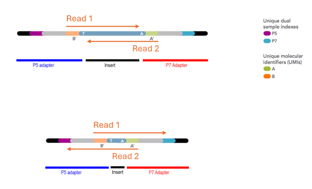
```

### Reverse transcription 

Short-read sequencing instruments can only sequence DNA. Consequently the RNA must be convert into DNA by reverse transcription, a process that uses an RNA-dependant DNA polymerase to produce cDNA. This enzyme starts DNA synthesis from a primer. Because the sequence of each transcript is different, either a pool of random primers is used (which can bind anywhere), or a primer binding to the poly-A tail (which is common across eukaryotic transcripts) is used. The reagents and conditions for the reverse transcription steps are usually provided and pre-optimised in the RNA-seq kit. However, conditions may need to be optimised if your template has an unusual GC content (mostly prokaryotic samples).

#### Strandedness
The reverse transcription step can also enable "strandedness", which allows you to differentiate the DNA strand from which the RNA was transcribed. If we process RNA directly to double-stranded cDNA by reverse transcription, then it will be impossible to determine the genomic DNA strand from which a transcript was produced, because both cDNA strands produce library molecules that will be sequenced. The strand information is lost during library construction.


(ref:foo24) Two transcripts produced from from opposite strands sequenced using a non-directional library preparation kit can’t be distinguished. Imagen source [azenta](https://www.azenta.com/blog/stranded-versus-non-stranded-rna-seq)

```{r, echo=FALSE, out.width="530px", fig.align="center", fig.cap ="(ref:foo24)", fig.height= 0.1, fig.width=0.4}
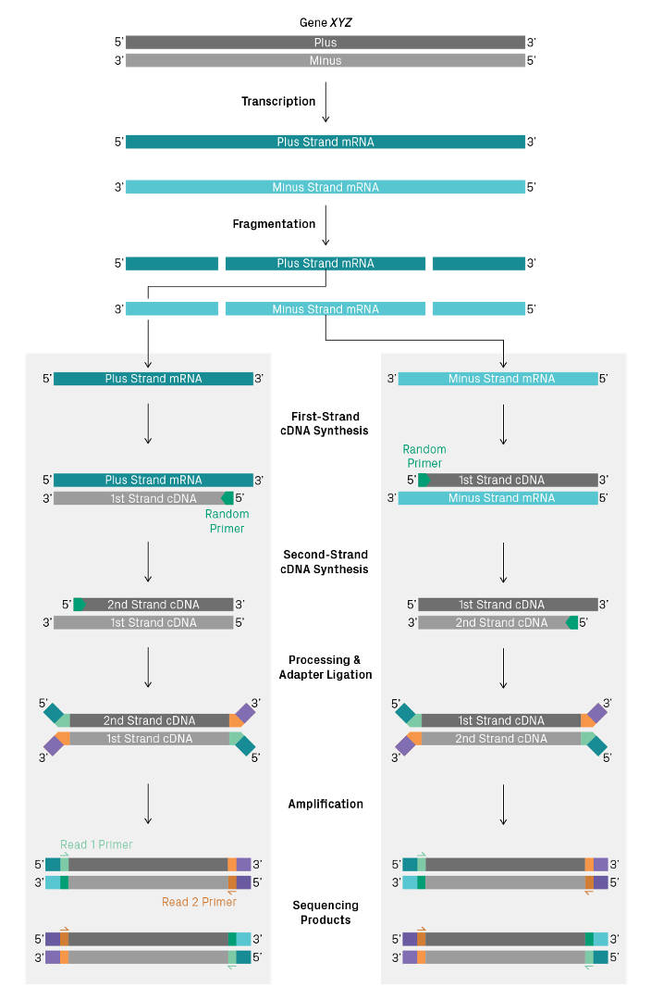
```

Some library construction kits can retain the strand information. The most common methods use a method called "UTP marking" of either the first or second strand. When U bases are provided to the strand synthesis reaction instead of T bases, U replaces T in the synthesised cDNA. Strands containing U instead of T can then be excluded from further processing either by using polymerases that are UTP sensitive, or by destroying the UTP containing strand using a uracil specific digestion enzyme. 


```{r, echo=FALSE, out.width="530px", fig.align="center", fig.cap ="", fig.height= 0.1, fig.width=0.4}
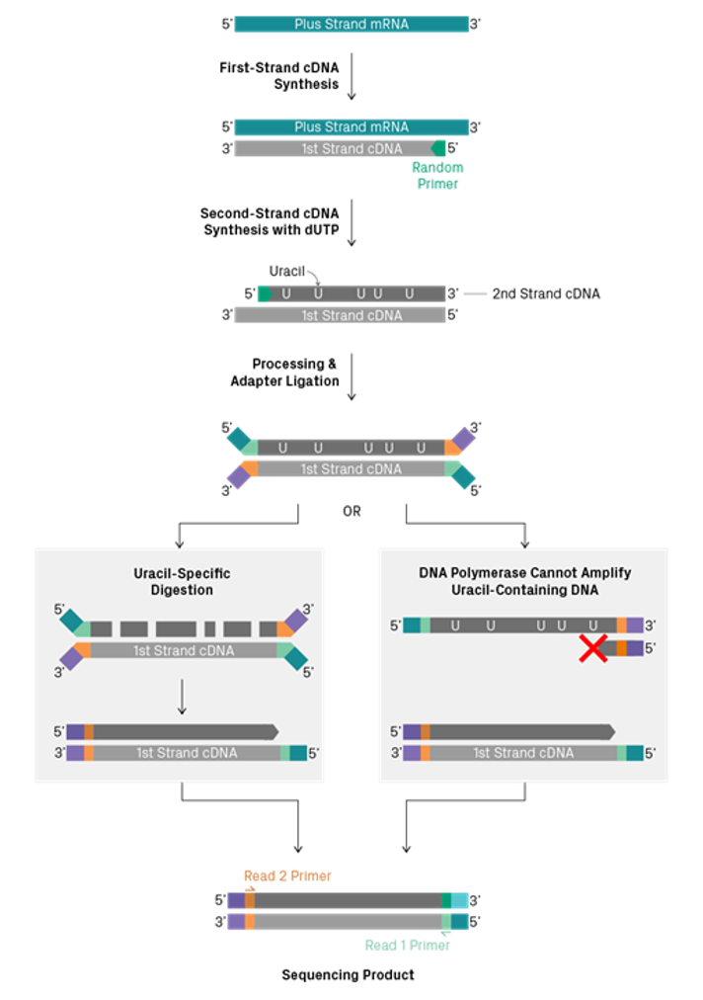
```

Other less common options for strand specificity include direct ligation of specific adapters to RNA before cDNA conversion (Thermo Collibri Stranded kits), and phosphorylated second-strand synthesis primers, so that only the second strand can be ligated to adapters (Qiagen QIAseq Stranded kits).

### {width=20px} Caution:  {width=20px} {- .caution}
Different kits retain different strands during synthesis. This will be described in the kit documentation, and this information can be used during analysis. Take note of it!

### {-}

### Adapter addition

Adapters are provided as a set of reagents in your library construction kit. Usually, they are ligated to the double-stranded cDNA product from reverse transcription. Other less frequently used methods include direct ligation to RNA, and the use of transposons to simultaneously shear and add adapters into cDNA. These methods are much less common in RNA-seq library preparation methods, and are beyond the scope of this workshop. 

### {width=20px} Caution:  {width=20px} {- .caution} 
Don’t cross contaminate your indexes! 

### {-}

Most RNA-seq library indexes/barcdes are added as part of the adapter (or during PCR amplification, shortly after adapter addition). These indexes are the only thing that allow to you to unambiguously identify the sample to which your transcript reads belong. If you can’t discriminate between samples, your experiment will be ruined. Handle the tubes of index/adapter carefully, replace caps carefully (some kits even come with disposable and spare caps!), and use filtered tips. One cross contamination will ruin every subsequent RNA-seq experiment from that kit!

### PCR Amplification 
Once adapters are added to the DNA-converted RNA fragments, they usually need to be amplified to produce enough material to meet the technical requirements of the sequencing instruments. PCR is used to increase the total mass of library.

In addition to increasing the total mass of material for sequencing, PCR is often also used to add indexes and UMIs. (Some library construction kits include the UMI and indexes directly in the adapters, and some kits add the indexes and UMIs by PCR). 


```{r, echo=FALSE, out.width="530px", fig.align="center", fig.cap ="Generic Illumina-format sequencing library structure. Adapters can be ‘stubby’, and completed by PCR, or they can be ‘full’, and include all parts of the adapter at ligation. The diagram above shows stubby adapters containing UMIs ligated to an insert, with indexes and flowcell binding regions added by PCR.",, fig.height= 0.1, fig.width=0.4}
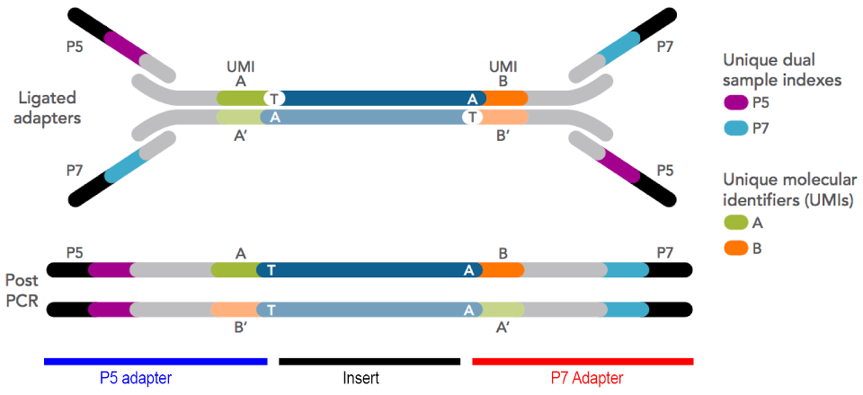
```

Regardless of your library construction process, less amplification is always better! In general, we recommend  that libraries are amplified using a number of PCR cycles to produce just enough material for QC and sequencing. This will require some optimisation. You can do this by testing the PCR using different numbers of cycles, or by using qPCR during amplification to monitor DNA mass per cycle. Starting with less RNA will always require more PCR cycles… If possible, start with enough RNA so that fewer PCR cycles are required. 

Using more cycles than needed can introduce a number of problems:

PCR duplicates: Highly amplified samples, particularly starting from ultra-low RNA input, will consist mostly of PCR duplicates. These are often removed from the data during analysis because they don’t provide useful information for transcript counting purposes.

Non-random amplification: PCR but isn’t perfectly efficient. This can lead to some molecules being amplified more than others. For example, smaller fragments and non-extreme G+C% fragments are likely to amplify more quickly and molecules with complex secondary structures may slower or more difficult to amplify. The stochastic nature of PCR means that very rare transcripts may be lost, or underrepresented, compared to higher abundance transcripts.

Chimaeric reads: PCR with molecules that all have similar sequences (such as sequencing adapters!) are sometimes prone producing chimaeric or hybrid molecules. This can be caused by incomplete extension (and partial extension products acting as primers for different templates), and template switching (where polymerase jumps between templates).

Polymerase-induced errors: All polymerases are imperfect, and have an inherent error rate. PCR accumulates these errors as copies are made of copies, rather than copies of original template. 

All of these error modes are exacerbated and often compounded by additional PCR cycles, and many are made worse as the PCR reaction reaches exhaustion.

### Size selection

Almost all library construction methods include a size selection step, either pre- or post-amplification. This is a critical step to remove unincorporated primers, adapters and adapter dimers, and to ensure that the size of the library molecules falls within the technical requirements of the sequencing instrument.

Often, during library construction, adapters are added in excess, and they can ligate directly to each other with no insert between them. These molecules form the smallest molecules in your library (other than unligated adapters), and they are also the most efficient at being sequenced! A small amount of adapter contamination can lead to a large proportion of reads that are only adapter sequence, containing no useful information (but still consuming your sequencing budget!)

The retention of unincorporated adapters in the sequencing library is the main cause of ‘index hopping’ as described previously (see section "Indexes"), causing transcripts to be assigned to the wrong samples. Although these can be detected when using UDIs, you are still paying to sequence them! Careful size selection can remove the majority of unincorporated adapters.

Some library construction kits include chemical or structural steps to avoid adapter dimerisation, but the most common method is to simply size select at slightly larger than double the adapter length. Typically, this is around 100-200bp (and this is one of the major reasons that small/microRNA isn’t quantitatively recovered in standard RNA-seq libraries).

Size selection is typically carried out using magnetic beads (AxyPrep MagBeads, Beckman Ampure, SPRI beads) that are suspended in a precipitating buffer. Your sequencing library is mixed at defined ratio with the bead suspension, and the DNA is precipitated onto the surface of the bead. As the concentration of the precipitation buffer is decreased (relative to the volume of your library sample solution), smaller fragments are left in solution. In this way, the certain sizes of DNA can be induced to precipitate onto the bead. The magnetic beads are recovered, washed (removing all non-bound molecules), and the library eluted. 


```{r, echo=FALSE, out.width="530px", fig.align="center", fig.cap ="Size selection of DNA fragments using magnetic beads. As the ratio of beads+buffer decreases, smaller fragments are no longer precipitated. A ratio of 2X beads:sample will recover essentially all fragments. A ratio of 0.6X beads:sample will size select to about 300bp.", fig.height= 0.1, fig.width=0.4}
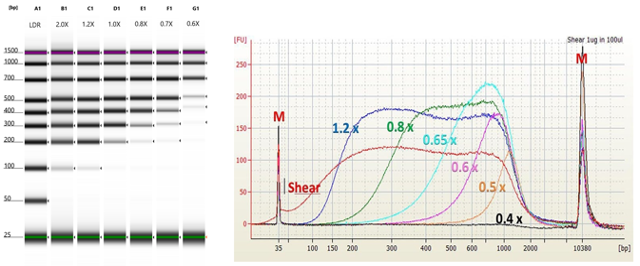
```

Generally, follow the guidelines in the kit documentation, but optimise to remove all material less than 100bp and greater than 1.5kb.

## Storage of NGS libraries

Due to the fact that the target molecules now double-stranded DNA, and you should have a reasonable total mass of material present, they are relatively stable during storage. They can be stored at -20°C for short term storage, or -80°C for long term storage. We always recommend low nucleic acid binding tubes such as Eppendorf DNA LoBind tubes, and minimising freeze-thaw cycles.

## Library QC

## Why do we perform QC?

The main goal of library QC is to:
Determine whether the library construction process was successful.
Calculate the required metrics to set up a sequencing run.

The sequencer (or sequencing facility) requires your sample to be provided as a solution containing a defined number of molecules (not a particular mass of molecules, since mass changes according to molecular size). The number of reads returned by the sequencer is directly proportional to the number of molecules loaded during run set-up. Some sequencers also depend on this concentration in order to produce good quality data - overloading or underloading the instrument can lead to complete run failure. Consequently, it is important that you accurately count the number of functional library molecules in your preparation, in order to obtain the highest yield and quality from the sequencing run.

## What do we need to measure?

You should examine your libraries, asking the following questions:

### Do you have enough DNA? 

Check your sequencing instrument specifications, and/or with your service provider. All service providers will have a specification sheet for pre-made libraries, and manufacturers will have a set of guidelines listing library input requirements for sequencing runs.

As previously discussed, fluorimetry (this time using dsDNA specific dyes) will identify the total mass of your sample. However, some of the library molecules may not be able to participate in the sequencing reaction (often referred to as ‘defective molecules’). These can be partially ligated (i.e. only one adapter) or molecules with the same adapter on both ends, etc. Although more expensive and time-consuming, qPCR analysis can be more informative, because it can be designed to use primers that span the end of the P5 adapter to the end of the P7 adapter, therefore only counting ‘intact’ molecules. Generally, we find that this is unnecessary, as long as your library contains a relatively tight and even size distribution. This is a good safety measure for libraries that are difficult to quantitate, or that have an unusual size distribution.

The total mass of your library can be used in conjunction with sizing information to calculate a the number of molecules present.

### Do you have too much DNA? 

In other words, have you overamplified your library? Most kit manufacturers will provide guidelines as to the approximate number of PCR cycles, and the expected yield, from a successful library preparation. If you have produced significantly more DNA than the suggestion, or even just significantly more DNA that you need to sequence, then you may have overamplified your library. Overamplified libraries will probably still produce excellent quality sequencing data, but may also contain more PCR artifacts (PCR duplicates, chimaeras, errors,  incomplete library molecules, etc). See "PCR Amplification" above.

### What is the size distribution?

Check the size distribution of your library molecules and ensure that you’ve size selected your samples appropriately. You cannot load molecules of a size outside the range specified by the instrument instructions without seriously compromising both the sequence yield and quality. Libraries that contain the majority of moleulces outside the acceptable size range may be size selected again, but you may lose too much total mass to load onto the sequencer. These libraries need to be repeated.

```{r, echo=FALSE, out.width="530px", fig.align="center", fig.cap ="An example of a good library - size distribution centred around 500bp, not much material above 1500b, not much material below 300bp. A small amount of adapter can be seen at the 60-80b range, but the proportion compared to the library is low.", fig.height= 0.1, fig.width=0.4}
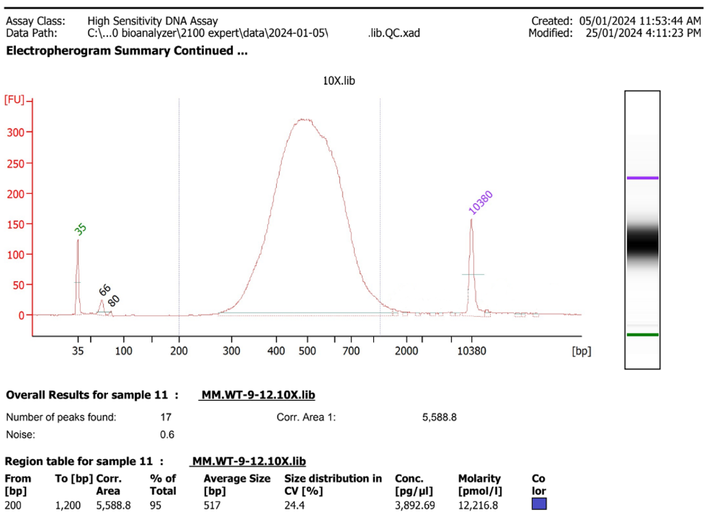
```

### Have you removed primers and adapter dimers? 

Primers, adapters and adapter dimers show as characteristic small peaks on the electropherogram traces.These generally form a tight peak at around 20-50b (primers and adapters), and 60-150bp (adapter dimers). These small molecules are preferentially sequenced by the sequencer hardware, so will very disproportionately consume sequencing yield. It’s generally recommended that your libraries contain less than 0.5% adapter dimers. As discussed previously, free (unligated) adapters can also contribute to index hopping. 

If you find that your library still contains adapters, you can repeat the size selection until they have been removed. 


```{r, echo=FALSE, out.width="530px", fig.align="center", fig.cap ="Adapter dimers present in very high concentration. This librar should not be sequenced without further size selection.", fig.height= 0.1, fig.width=0.4}
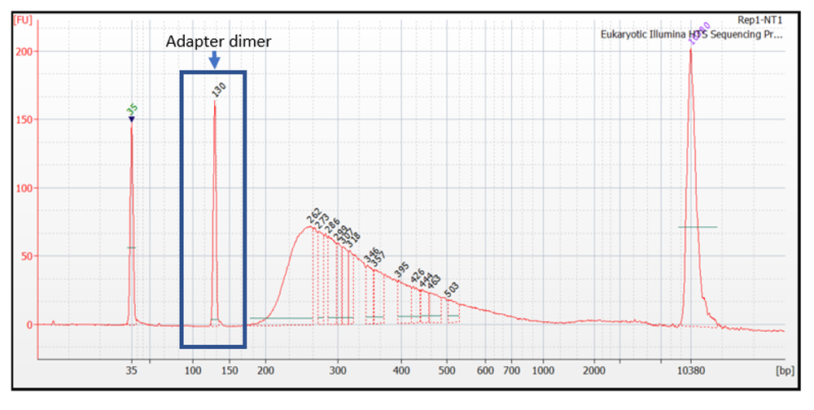
```


### Are your libraries consistent?

Do all the libraries look similar (or, as similar as you’d expect, thinking about sample type and collection conditions)? If you are processing libraries from similar amounts of material from similar organisms (i.e. most RNA-seq experiments), then you should expect very high correlation of size distribution and final total mass across samples. Lower or higher values don’t necessarily indicate failure, but you should record any deviations in your sample metadata. 

## Summary

Talk to us! The MGBP team are here to help, from planning to publication, and everything in between. 
Practice RNA purification if you haven’t done it before. RNA can be difficult, and it may not work well the first time!
Record lots of metadata!
Think about, avoid, and record any potential batch effects for the whole procedure - from before RNA collection to commencement of sequencing.
Work quickly to purify your RNA, and preserve your samples using a method suitable for your sample type and experimental design.
Purify your RNA thoroughly to preserve your RNA and remove contaminants (including DNA).
Measure your RNA integrity, purity and total mass carefully.
Choose a library preparation kit or method. Consider:
Which sequencer will you be using? 
Will the kit work with your sample type?
Are you working with prokaryotic or eukaryotic samples? 
What amount of material can you prepare? If you can only prepare low amounts (or individual cells), use a kit with UMIs.
Do you need to study more than just poly-A mRNA (such as lncRNA, small/microRNA, etc)?
Do you need to study transcript isoforms?
Examine workflow and equipment requirements in choosing a kit
Talk to the vendors, and talk to the MGBP team.

Talk to us… The MGBP team are here to help, from planning to publication, and everything in between.
