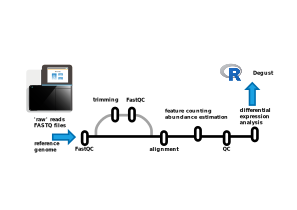
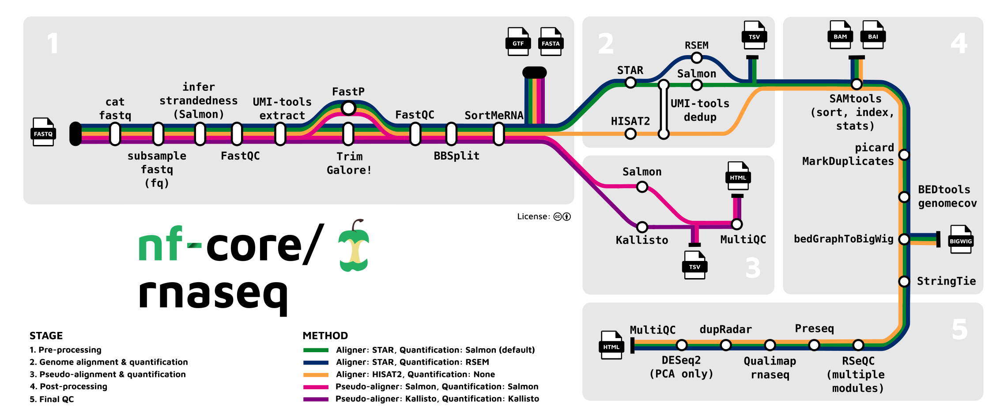

# Pipeline Overview

## High-level

An RNA-seq pipeline needs to identify which RNA transcript a sequencing read has originated from to quantify transcription of genes.

Once we know the origin of each read, we can use this to estimate the abundance of each transcript.

The minimal inputs to an RNA-seq processing pipeline are:

- a set of **raw reads** (typically in gzipped FASTQ format)
- a **reference genome sequence** (FASTA, gzipped) and **gene annotations** (GTF or GFF3, gzipped)

At the high-level, a pipeline aims to:

- align or 'map' the read to the genome (or transcriptome)
  - _(mRNA transcript, exon, intron, or somewhere else on the genome ?)_
- count reads associated with features to quantify (differential) abundance

Counts of the number of reads associated with each feature (_gene_) are used to 
estimate the relative abundance of transcripts, and find differences in gene expression between groups (== differential expression analysis).

Usually we quantify expression per gene (the sum of all transcripts arising from that gene).

## A simple pipeline

<a href="images/pipeline/simple_pipeline.svg" target="_blank">
{width="100%" fig-alt="Simple RNA-seq pipeline overview"}
</a>

## A more complex pipeline

[nf-core/rnaseq](https://nf-co.re/rnaseq)

<a href="images/pipeline/nf-core_rnaseq.png" target="_blank">
{width="100%"}
</a>

### Pipeline activity

#### **Challenge:** Create your own fantasy RNA-seq processing pipeline {- .challenge}

There are many different 'tools' that can be composed into an RNA-seq processing pipeline. 
Many do pretty much the same thing, each with trade-offs on speed, accuracy, memory, features etc.
 
Compose a set of tools in an order that might make an RNA-seq pipeline.

####  {-}

<iframe src="files/fantasy-rnaseq-pipeline-builder.html" width="660" height="750" frameborder="0" scrolling="no"></iframe>

