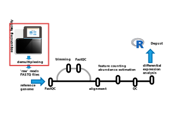

# Detour: demultiplexing {-}

{width="100%" fig-alt="Simple RNA-seq pipeline overview with demultiplexing step"}

----

***Before***  you get your FASTQs, the sequencing provider will have 'demultiplexed' the data output by the instrument.

Sequencing providers often pool many samples onto a single flowcell.

Before any sample mixing occurs, the DNA fragments for each sample are given an unique barcode or index.

Demultiplexing is the process of identifying index/barcode sequences in the sequenced fragments and assigning them to samples.

Each sample is identified by a short 'barcode' or 'index' incorporated into the fragment. 
A 'sample sheet' prepared by the sequencing facility maps barcodes to sample names.

For example, a common library layout might be:

```bash
                        R1>________________           I1>________
--P5_primer-- --i5_primer- ----insert------ -i7_primer-- --index- -P7_primer--
............. ............ AANGGGCGCAATGTGC ............ CCGCGGTT ............
                           TTNCCCGCGTTACACG
                           ________________<2Я
```

Which after demultiplexing become the R1, R2 (and I1) sequences:

```bash
----R1_read----- --i7_adapter---
AANGGGCGCAATGTGC ...............
```

and:

```bash
----R2_read----- --i5_primer- 
GCACATTGCGCCNCTT ............
```

and:

```bash
I1_read-
CCGCGGTT
```

These sequences are placed in files `sampleA_R1_001.fastq.gz` and `sampleA_R2_001.fastq.gz`, respectively, 
since, fragments with the `CCGCGGTT` index ("barcode") are known to be from `sampleA`.

The I1 read is only used intenally by the demultiplexing software and usually isn't saved into it's own file.
The barcode sequence is typically preserved in the FASTQ header of the R1/R2 files.

**Barcodes can have sequencing errors** - but are carefully chosen to prevent mis-assigning reads to the wrong sample.
The default is often to allow one mismatch in the barcode when demultiplexing, 
however the tolerable number of mismatches depends on the particular combination of barcodes used in the experiment 
and the total number of reads (size of the flowcell).

eg if a single mismatch would make a barcode ambiguous within the set used in the library, like:
```
CCGCGGTT vs.
ACGCGGTT
```
we would be unable to tolerate any mismatches (and with very large flowcells might still mis-assign a _tiny_ fraction of sequences). 
Index sequences are carefully chosen to have large ['Hamming distances'](https://en.wikipedia.org/wiki/Hamming_distance) to avoid this.

**Reads can contain adapter sequences** - notice that if the insert is short and the number of sequencing 
cycles is long enough, we read into the 'adapter' region. 
This is a region of artefact sequence added as part of the library preparation, not native sequence from your sample.

The adapter sequence(s) are known, so can be (computationally) removed.

Sometimes the sequencing providers will 'trim' adapters from the read as part of the demultiplexing process; 
often they won't, and adapters sequences may be present in the raw data.

> Sequencing runs usually have 'PhiX' phage DNA spiked-in as part of the internal calibration, and to increase sequence diversity 
> in the case of amplicon sequencing. 
> The demultiplexing software run by the sequencing facility removes these sequences from the output you receive.
