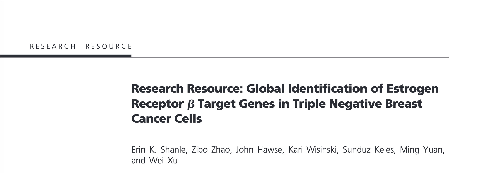
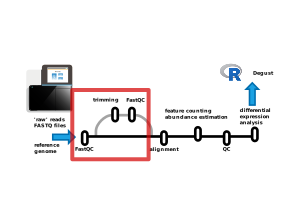
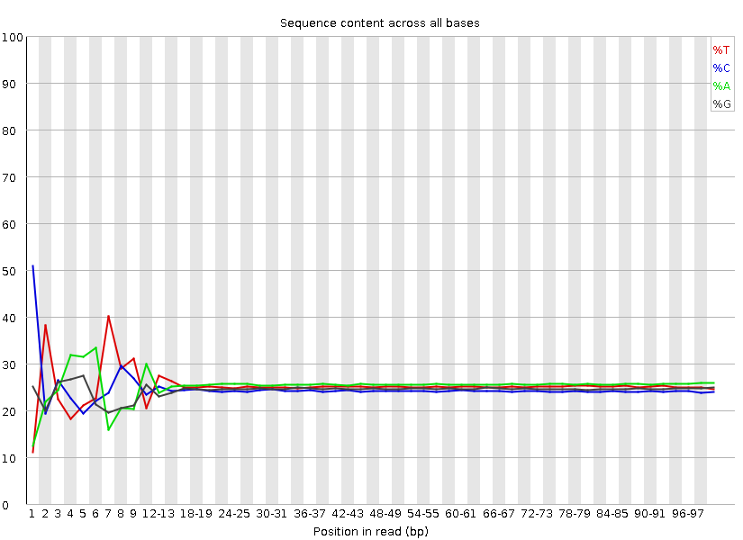

## An example dataset

For the following examples, we will use the results of an `nf-core/rnaseq` run on a published dataset from [Shanle et al, 2013](https://doi.org/10.1210/me.2013-1164). ([SRP062287](https://www.ncbi.nlm.nih.gov/Traces/study/?acc=SRP062287)).
This is a breast cancer cell line with (ERα/PR/HER2 negative) engineered to have doxycycline inducible ERβ expression. 
The cells were treated with various combinations of estrogen, doxycycline, and controls.

<a href="https://doi.org/10.1210/me.2013-1164" target="_blank">
{width="100%"}
</a>

We've already run this dataset through the nf-core/rnaseq pipeline - here is the output on <a href="https://laxy.io/#/job/3pLfQoLEuWeAnWh4H3Vvbv/?access_token=e0124ee9-c8ad-4164-b59f-ca2ae0ce4d2a" target="_blank">laxy.io</a>, which includes a the FastQC reports. 

## Raw read QC

Let's begin by looking at some metrics about the raw FASTQ reads. The most popular tool for this is [FastQC](https://www.bioinformatics.babraham.ac.uk/projects/fastqc/), 
which generates reports on read quality, length, and content (among other things).

{width="100%"}

> FastQC provides a set of pass 
>  / warn   / fail  
> status checks - these are notoriously sensitive, and even good quality datasets often have a warning or failure for one or 
> two of these checks. If you see a fail , don't panic - chances are your data is fine (or 'good enough') !

## Base call quality

Let's start by looking at the FastQC "Per base sequence quality" for a single sample (untrimmed): 
<a href="files/fastqc/SRP062287/untrimmed/SRR2155423_fastqc.html#M1" target="_blank">SRR2155423_fastqc.html</a>

#### **Challenge:** Examine the per-base quality metrics for sample SRR2155423 {- .challenge}

Look at the <a href="files/fastqc/SRP062287/untrimmed/SRR2155423_fastqc.html#M1" target="_blank">FastQC report for SRR2155423</a>:

- What is the trend in the "Per base sequence quality" ?
- Look at the "Per tile sequence quality plot" and the "Per base N content" - what might be going on here ?

####  {-}

Quality scores are generated by the sequencer, based the signal intensity and signal-to-noise of fluorescent clusters, as well as various other (secret-sauce, proprietary) measures relating to the cluster imaging.

These scores are represented as: `Q = -10 * log10(P)` where `P` is the probability of an incorrect base call.

- At Q30, we expect 1 in 1000 base calls to be incorrect.
- At Q40, we expect 1 in 10,000 base calls to be incorrect.
- Typically modern short read RNA-seq data will have qualities somewhere between Q30 and Q40.

## Trimming

There are two main goals when trimming for RNA-seq differential abundance studies:

  - Remove low quality base calls (usually at the 3' end of reads)
  - Remove non-native adapter sequences (also usually at the 3' end of reads)

The concern is that low quality regions and non-native adapter regions might 
impact the correct alignment of a read to the reference genome, and add another 
source of bias to the resulting expression level estimates.

_However ...._

The literature suggests trimming probably isn't nessecary for differential abundance studies, 
and quantification at the gene level is very similar between trimmed and untrimmed reads [(Liao & Shi, 2020)](https://doi.org/10.1093%2Fnargab%2Flqaa068). 
This is because aligners used for RNA-seq 'soft-clip' reads - discarding parts at the ends of reads that don't match the reference genome.

Most pipelines and protocols trim reads anyway - it's unlikely to hurt.

#### **Challenge:** QC pre- and post-trimming {- .challenge}

Look at pre- and post- trimming in the FastQC (and/or MultiQC) reports.

What happens to the "Per base sequence quality" (called "Sequence Quality Histogram" in MultiQC) ?

What happens to the adapter content and sequence length distribution ?

####  {-}

Here's our [example RNAseq run](https://laxy.io/#/job/1qUtszdMrQnXC4tawunu92/?access_token=7ad22813-fa68-4848-b93e-de30d53a35b3) without a trimming step. For this dataset, 
important QC metrics like the "% Aligned" to the reference genome are very close, but not identical between trimmed and untrimmed reads.

> Trimming _is_ beneficial if you are _de novo_ assembling RNA-seq reads (eg, for a non-model organism), or using RNA-seq for variant calling.

## Positional nucleotide content bias

FastQC reports "Per base sequence content".

{width="100%"}

It is quite common to see some sequence bias at the 5' end of reads in RNA-seq libraries.

*See:* https://sequencing.qcfail.com/articles/positional-sequence-bias-in-random-primed-libraries/

*Takeaway:* Random priming / fragmentation of reads isn't completely random, so this shows up in some bias at the start of sequences. 

- The 5' ends are still native sequence in this case, not any artefact sequence (eg not barcode, not adapter). 
- This is often seen in datasets and doesn't require any action. 
- If it ***was*** non-native sequence it wouldn't have a large impact on alignment, since the aligner will soft-clip 
  those regions and happily align the parts that match, ignoring the parts that don't.

> While `FastQC` is the most popular tool, others exist - `fastp` also provides similar QC reports.

## "Per sequence GC content"

Ideally the %GC distribution of reads will match the theorerical distribution - it may not if a sample has a strong sampling bias within the transcriptome
(eg 3' focused sequencing, very low read count, or samples with high duplication / overrepresented sequences)

## "Sequence Duplication" and "Overrepresented Sequences"

FastQC shows plots summarizing exact duplicate reads, and overrepresented sequences.

<a href="https://api.laxy.io/api/v1/job/3pLfQoLEuWeAnWh4H3Vvbv/files/output/results/fastqc/SRR2155413_fastqc.html?access_token=e0124ee9-c8ad-4164-b59f-ca2ae0ce4d2a#M8" target="_blank">SRR2155413 Sequence Duplication Levels</a>

> Look at the Sequence Duplication Level plot - what might the peak at >10 duplication level represent ?
> The red line represents the proportion that the same sequences would contribute after deduplication.

Our example dataset doesn't have any overrepresented sequences, but it's not uncommon to see ribosomal rRNAs, 
poly-A or poly-G, adapter sequences, or sequences prone to strong PCR amplification in this list.

## FastQC documentation

There's lots more detail about the FastQC analysis modules in the <a href="https://www.bioinformatics.babraham.ac.uk/projects/fastqc/Help/" target="_blank">FastQC documentation</a> 
and some more example reports of good and bad data on the <a href="https://www.bioinformatics.babraham.ac.uk/projects/fastqc/" target="_blank">FastQC site</a>.
