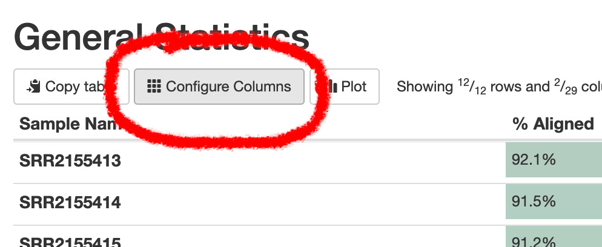

## An example dataset

For the following examples, we will use the results of an `nf-core/rnaseq` run on a published dataset from [Shanle et al, 2013](https://doi.org/10.1210/me.2013-1164). ([SRP062287](https://www.ncbi.nlm.nih.gov/Traces/study/?acc=SRP062287)).
This is an engineered triple-negative breast cancer cell line, treated with various combinations of estrogen, doxycycline, and controls.

<a href="https://doi.org/10.1210/me.2013-1164" target="_blank">
{width="100%"}
</a>

We've already run this dataset through the nf-core/rnaseq pipeline - here is the output on <a href="https://laxy.io/#/job/3pLfQoLEuWeAnWh4H3Vvbv/?access_token=e0124ee9-c8ad-4164-b59f-ca2ae0ce4d2a" target="_blank">laxy.io</a>, which includes a MultiQC report. 
There's also a copy of the <a href="files/multiqc/SRP062287/multiqc_report.html" target="_blank">same MultiQC report here</a>.

## Raw read QC

Let's begin by looking at some metrics about the raw FASTQ reads. The most popular tool for this is [FastQC](https://www.bioinformatics.babraham.ac.uk/projects/fastqc/), 
which generates reports on read quality, length, and content (among other things).

> FastQC provides a set of pass 
>  / warn   / fail  
> status checks - these are notoriously sensitive, and even good quality datasets often have a warning or failure for one or 
> two of these checks. If you see a fail , don't panic !

## Base call quality

Let's start by looking at the FastQC "Per base sequence quality" for a single sample (untrimmed): <a href="files/fastqc/SRP062287/untrimmed/SRR2155423_fastqc.html" target="_blank">SRR2155423_fastqc.html</a>

**TODO**: Insert "Per base sequence quality" for SRR2155423 directly in here ?

#### **Challenge:** Examine the per-base quality metrics for sample SRR2155423 {- .challenge}

Look at the <a href="files/fastqc/SRP062287/untrimmed/SRR2155423_fastqc.html" target="_blank">FastQC report for SRR2155423</a>:

- What is the trend in the "Per base sequence quality" ?
- Look at the "Per tile sequence quality plot" and the "Per base N content" - what might be going on here ?

####  {-}

Quality scores are generated by the sequencer, based the signal intensity and signal-to-noise of fluorescent clusters, as well as various other (secret-sauce, proprietary) measures relating to the cluster imaging.

These scores are represented as: `Q = -10 * log10(P)` where `P` is the probability of an incorrect base call.

- At Q30, we expect 1 in 1000 base calls to be incorrect.
- At Q40, we expect 1 in 10,000 base calls to be incorrect.
- Typically modern short read RNA-seq data will have qualities somewhere between Q30 and Q40.

## Trimming

There are two main goals when trimming for RNA-seq differential abundance studies:

  - Remove low quality base calls (usually at the 3' end of reads)
  - Remove non-native adapter sequences (also usually at the 3' end of reads)

The literature suggests trimming is **not** required for differential abundance studies at the gene level [(Liao & Shi, 2020)](https://doi.org/10.1093%2Fnargab%2Flqaa068) 
(and untrimmed reads potentially provide slightly _higher_ accuracy quantification of expression !). This is because aligners used for RNA-seq 'soft-clip' reads - 
discarding parts at the ends of reads that don't match the reference genome.

Despite this, most pipelines and protocols trim reads anyway.

> **TODO:** Look at pre and post trimming FastQC/MultiQC.

> Trimming _is_ beneficial if you are _de novo_ assembling RNA-seq reads (eg, for a non-model organism), or using RNA-seq for variant calling.

## Positional nucleotide content bias

FastQC reports "Per base sequence content".

{width="100%"}

It is quite common to see some sequence bias at the 5' end of reads in RNA-seq libraries.

*See:* https://sequencing.qcfail.com/articles/positional-sequence-bias-in-random-primed-libraries/

*Takeaway:* Random priming / fragmentation of reads isn't completely random, so this shows up in some bias at the start of sequences. 

- The 5' ends are still native sequence in this case, not any artefact sequence (eg not barcode, not adapter). 
- This is often seen in datasets and doesn't require any action. 
- If it ***was*** non-native sequence it wouldn't have a large impact on alignment, since the aligner will soft-clip 
  those regions and happily align the parts that match, ignoring the parts that don't.

> While `FastQC` is the most popular tool, others exist - `fastp` also provides similar QC reports.

## Mapping

> **TODO:** What aligners do, with a focus on STAR. Inputs (FASTQs), outputs (BAMs), multimappers, softclipping.

### Duplicate marking and sorting of alignment files

> **TODO:** Common tools are `samtools sort` and `picard MarkDuplicates`. Why ?

## MultiQC interpretation

[MultiQC](https://multiqc.info/) is a tool that help aggregate and visualize sequencing 
quality metrics from many tools into a single report. We will examine the report generated by
the `nf-core/rnaseq` pipeline using MultiQC, focusing on the parts that are most useful for understanding
your dataset.

> Here's a link to the report [on laxy.io](https://api.laxy.io/api/v1/job/3lQ6tw48pcFfOKyg1vTJry/files/output/results/multiqc/star_salmon/multiqc_report.html){target="_blank"} (and an alternative backup version [here](files/multiqc/SRP062287/multiqc_report.html){target="_blank"}).

We can use these QC metrics to identify:

- quality poor samples
- potential genomic DNA contamination
- ribosomal RNA contamination
- possible PCR derived duplication
- over-sequencing / under-sequencing
- reference genome mixups
- library prep anomalies, barcode mixups

By the time you see this QC, often there is very little that can be done to 'fix' a dataset or poor experimental design.
However, these quality issues do not nessecarily make a dataset unusable. It's useful to know what you are working with.
This might guide decisions around future experiments or resequencing, or occasionally provide justification for excluding some samples.

### MultiQC: General Statistics table

At the very top of the report is a table aggregating statistics across various tools. 
This is handy for seeing some key metrics all in one place.

There's a lot of columns here - you can use the "configure columns" button to show just a subset.

Let's skip interpreting this table to begin with, since most of the information is repeated in plots below. 

### MultiQC: Duplication statistics

[See this section](files/multiqc/SRP062287/multiqc_report.html#picard)

`picard MarkDuplicates` identifies and quantifies 'duplicate' mapped reads - if two reads have the same 5' start position and the same orientation (strand) (prior to soft-clipping), one of these reads is considered a duplicate.

These dupicates can be of two origins:

1. Reads from generated from different individual transcript molecules
2. Reads generated by PCR of a single fragment, which are derived from only one transcript molecule

Duplicate reads in category (1) are 'good', in that they represent the real transcript abundance. The 'deeper' you sequence (the larger the library), the more duplicates you'll get.
Duplicate reads in category (2) aren't desired, since they inflate and bias the real transcript abundance. 

#### UMIs and dupRadar

This is the purpose of Universal Molecular Idenifiers (UMIs) - semi-random sequences incorporated into fragments as early as possible in library prep, prior to many rounds of PCR.
They allow duplicated generated by PCR to be identified and accounted for.

_[dupRadar](https://doi.org/10.1186/s12859-016-1276-2) can help assess if an experiment is suffering from excessive PCR duplication, vs. 'over-sequencing'_
