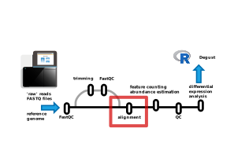

# Alignment / mapping  {-}

{width="100%" fig-alt="Simple RNA-seq pipeline overview: Alignment step"}

----

Short read aligners aim to find a matching region of sequence in a reference genome.

**Inputs:** 

- A FASTQ file (or an R1/R2 pair)
- A reference genome (in FASTA format)

**Outputs:** 

- A BAM file with aligned reads

We typically align to the **whole genome sequence** rather than just the **predicted transcriptome sequences** - this allows us to assess useful 
quality metrics, like the proportion of reads that map to exons vs other regions of the genome.

Popular alignment tools for RNA-seq in eurkaryotes such as STAR, HISAT2 or Subread are splice-aware - they will split 
a read across exon-intron boundries, matching to the mature transcript regions and introducing gaps for the introns.

**Some terminology:** 

*Multimapper:* a read that matches two or more genomic locations

*Soft-clipping:* a process where the aligner 'ignores' regions near the ends of reads if they don't match. 
It's 'soft' since the full read sequence is still retained in the BAM file, but for downstream analysis the 
clipped region is not considered when assessing overlap with exons / features.

> Fun fact: There's a newer 'successor' to the BAM format called CRAM which is more space efficient and stores the reference 
> genome inside the file. Many tools support CRAM, but not all.

### Duplicate marking and sorting of alignment files

Post-alignment, the BAM files are usually sorted by coordinate and duplicate reads are marked. 
`samtools sort` and `picard MarkDuplicates` are popular tools often used in pipelines for this purpose.

The sorting by genomic coordinate helps speed up some downstream processing and QC, such as feature counting, 
and viewing alignments in IGV.

*We will talk about duplicate reads at the alignment level later.*

## Alignment QC metrics with MultiQC

[MultiQC](https://multiqc.info/) is a tool that help aggregate and visualize sequencing 
quality metrics from many tools into a single report. We will examine the report generated by
the `nf-core/rnaseq` pipeline using MultiQC, focusing on the parts that are most useful for understanding
your dataset.

> Here's a link to [the MultiQC report](files/multiqc/SRP062287/multiqc_report.html){target="_blank"} (or the same [on laxy.io](https://api.laxy.io/api/v1/job/3pLfQoLEuWeAnWh4H3Vvbv/files/output/results/multiqc/star_salmon/multiqc_report.html?access_token=e0124ee9-c8ad-4164-b59f-ca2ae0ce4d2a){target="_blank"}).

We can use these QC metrics to identify:

- quality poor samples
- potential genomic DNA contamination
- ribosomal RNA contamination
- possible PCR derived duplication
- over-sequencing / under-sequencing
- reference genome mixups
- library prep anomalies, barcode mixups

By the time you see this QC, often there is very little that can be done to 'fix' a dataset or poor experimental design.
However, these quality issues do not nessecarily make a dataset unusable. It's useful to know what you are working with.
This might guide decisions around future experiments or resequencing, or occasionally provide justification for excluding some samples.

### MultiQC: General Statistics table

At the very top of the report is a table aggregating statistics across various tools. 
This is handy for seeing some key metrics all in one place.

There's a lot of columns here - you can use the "configure columns" button to show just a subset.

{width="60%" fig-alt="MultiQC configure columns"}

Let's skip interpreting this table to begin with, since most of the information is repeated in plots below. 

## Percent (%) aligned reads

▷ Use the sidebar to jump to the ["STAR" section of the report](files/multiqc/SRP062287/multiqc_report.html#star){target="_blank"}) - this shows the number and proportion of reads, and if they mapped uniquely or otherwise.

The overall number of reads per sample here will closely follow the total raw read numbers (eg [from FastQC](files/multiqc/SRP062287/multiqc_report.html#fastqc_sequence_counts){target="_blank"}).
Usually an attempt is made to load similar amounts of material for each sample onto the flowcell, but it's not possible to perfectly balance this loading, so library sizes will vary between samples.

▷ Change the plot to show percentages rather than raw numbers of mapped reads.

In this case we can see every sample has ~92 % **uniquely mapped** reads and is very consistent (this isn't always the case !).

There are several classes of read here:

- Uniquely mapped (unambigiously mapped to a single genomic location)
- Mapped to multiple loci (aka 'multi-mappers')
- Mapped to too many loci (also 'multi-mappers')
- Unmapped: too short (low quality reads, trimmed to oblivion)
- Unmapped: other (no match to the genome sequence)

For traditional feature counting to estimate gene expression, only the the **unambiguous, uniquely mapped** reads are used.

**What should you expect from your data ?**

These samples are from a clonal cell culture - in this case we expect a high mapping rate. In this case ~99 % of reads mapped to somewhere in the genome.
For samples of human or mouse tissue, you might expect anywhere between 60 - 95 % of reads to map. 
For FFPE preserved tissue samples the mapping rate can be highly variable depending on sample quality.

If the overall percentage of reads mapped is very low (<25% ?), there is chance you've chosen the wrong organism for your reference genome. 
[Here's an example](https://laxy.io/#/job/20nDhlhpb8xv53x3R2CACg/?access_token=29ddd348-0a55-4596-b6f9-060e5186236f) of attempting to use 
the mouse genome with our human cell line example dataset.

### MultiQC: Duplication statistics

▷ [See this section](files/multiqc/SRP062287/multiqc_report.html#picard)

`picard MarkDuplicates` identifies and quantifies 'duplicate' mapped reads - if two reads have the same 5' start position and the same orientation (strand) (prior to soft-clipping), one of these reads is considered a duplicate.
_(For paired end reads, both R1 and R2 5' start positions must match another pair)._

These duplicates can be of several origins:

1. Reads from generated from different individual transcript molecules
2. Reads generated by **PCR** of a single fragment, which are derived from only one transcript molecule
3. 'Optical duplicates' that originate from image analysis artefacts - where a single cluster on the flowcell is incorrectly interpreted as two (or more) clusters

Duplicate reads in category 1 (**biological**) are generally 'good', in that they represent the real transcript abundance. The deeper you sequence (the larger the library), the more duplicates you'll get since the chance of two reads happening to have the same start position increases.

Duplicate reads in category 2 (**PCR**) usually aren't desired, since they may bias the real transcript abundance, inflating counts for fragments that happen to amplify more efficiently.

Duplicate reads in category 3 (**optical**) seem to be rare in data on modern instruments, probably probably due to better image analysis and patterned flow cells. 

We can't _always_ know if a duplicate is biological (1), PCR-derived (2) or optical (3).

##### Optical duplicates

If the sequencing flowcell has tile coordinates (recorded in the FASTQ headers), it is possible to mark optical duplicates based on physical proximity. 
The instrument is likely to have dealt with this at the image analysis stage before we see the data.
_(Illumina instruments generally produce tile coordinates that `picard` and other tools can understand. MGI instruments ... 🤷 ?)_

##### PCR duplicates

These duplicate reads are derived from PCR amplification of the library, usually in the case of low input libraries where 
more PCR cycles are used to increase the library size. Because some fragments can amplify more efficiently than others, and due
to the PCR 'jackpot' effect, we can end up with some fragments with high duplication due to PCR. 
This can bias the estimated abundance of transcripts.

There are two main solutions to avoid excessive PCR duplicates are:

- Get more starting material so you don't need to artificially increase the library size via many PCR cycles
- Use Universal Molecular Identifiers (UMIs) in the library construction to allow PCR duplicates to be identified.

> For 3'-focused sequencing you are likely to see more duplicates that are not PCR or optical.

#### UMIs and dupRadar

The purpose of Universal Molecular Identifiers (UMIs) is to help account for PCR duplicates.

These are semi-random sequences incorporated into fragments as early as possible in library prep, prior to many rounds of PCR.
They allow duplicates of the same fragment generated by PCR to be identified by the unique random sequence, and hence accounted for.

_[dupRadar](https://doi.org/10.1186/s12859-016-1276-2) can help assess if an experiment is suffering from excessive PCR duplication, vs. 'over-sequencing'_

### Feature type metrics

- **What** types of genomic features are my reads mapping to ?

- **Where** are they mapping ?

#### Qualimap - read origin and gene coverage

▷ [See this section](files/multiqc/SRP062287/multiqc_report.html#qualimap)

#### Biotype counts & RSeqQC read distribution

▷ [RSeqQC read distribution](files/multiqc/SRP062287/multiqc_report.html#rseqc-read_distribution)

▷ [Biotype Counts](files/multiqc/SRP062287/multiqc_report.html#biotype_counts)

> The biotype counts in nf-core/rnaseq are calculated using `featureCounts` but aggregated at the biotype feature level, not the gene level.

▷ [Samtools mapping by XY and chromosome](files/multiqc/SRP062287/multiqc_report.html#samtools-idxstats-xy-counts)

#### Strandedness

▷ [RSeQC: Infer experiment](files/multiqc/SRP062287/multiqc_report.html#rseqc-infer_experiment)
