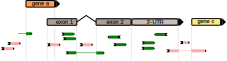

# Counting transcripts {-}

## featureCounts

`featureCounts` is a popular tool often used within RNA-seq pipelines (and as part of the `Rsubread` package in R). 
It provides summarization and quantification of mapped read.

```
aligned reads (BAM) ==> counts matrix (genes as rows, samples as columns)
```

When used for RNA-seq read counting, `featureCounts` calls a 'hit' if a read overlaps an exon in the gene by of 1 bp or more.
For paired end reads, typically the 'fragment' is only counted if both `R1` and `R2` reads map to the gene (`-B` option).

Counts are summarized at the gene level.

Sometimes a read will map to two or more genomic locations.
These 'multi-mappers' are ambiguous are not counted, since we cannot be certain of their origin.

> <a href="images/featureCounts_assignment.svg" target="_blank">{width="80%"}</a>
>
> Here's an example of how some reads from an unstranded library might align with a set of genes in the genome.
> Green reads are those that would be counted - the overlap an exon or UTR with no ambiguity.
> Red reads are those that would not be counted - the either do no overlap any exon or UTR, or are ambiguous in their assignment.

### Strandedness

Sequencing libraries can be **'stranded'** or **'unstranded'**, depending on the protocol used. 

In an 'unstranded' library both strands of the cDNA for a transcript are sequenced such that we will have reads for both the coding and non-coding strand, and can't differentiate between them.

For an 'unstranded' library, when two genes overlap on opposite strands, a read in that region cannot be unambigiously assigned.

In a 'stranded' library, the reads always come from the coding strand, resolving this ambiguity.

See <a href="https://journals.plos.org/ploscompbiol/article/figure?id=10.1371/journal.pcbi.1004393.g006">Figure 6, Griffith et al, 2015</a> for a nice example of read assignment for strand specific libraries.

#### **Question** {- .rationale}

In the our aligned reads example above, which red read(s) could be assigned if the library was 'stranded' instead of 'unstraded' ?

####  {-}

### Read counting challenge

#### **Challenge:** Count reads for gene X {- .challenge}

Use this <a href="https://igv.org/app/?sessionURL=https://bioinformatics.erc.monash.edu/home/andrewperry/rnaseq_workshop_2024/igv-webapp-session_SRR2155413_counting.json" target="_blank">IGV-Web session for sample SRR2155413</a>, find one of the genes below and count the reads that align to regions of the mature transcript(s).
(You can also use this [IGV desktop app session](https://bioinformatics.erc.monash.edu/home/andrewperry/rnaseq_workshop_2024/igv_session_SRR2155413_counting.xml), but you'll need the IGV Desktop app installed)

How do your manual counts compare with the value found in the `featureCounts` counts matrix ?

Use the search box at the top of the IGV viewer to find one of:

  - `GNRH1` (`ENSG00000147437`) - this is a short gene with only one intron - Answer: <span class="redacted">(SRR2155413 = 6 reads)</span>
  - `GHET1` (`ENSG00000281189`) - a lncRNA - Answer: <span class="redacted">(SRR2155413 = 7 reads)</span>
  - `INSL3` (`ENSG00000248099`) - Answer: <span class="redacted">(SRR2155413 = 5 reads) - most reads are mapped to the second intron and not counted. The counted reads are in exon3 and the 3' UTR.</span>

The locus search box will work with gene names and gene IDs as well as chromosomal coordinates.

_You can also search for your favorite gene - chances are there will be many mapped reads and many introns, making manual counting impractical and error prone_

####  {-}


## References genomes and annotations

A 'reference' genome is an polished, high quality genome assembly agreed upon by cooperating [international genome sequencing consortia](https://www.ncbi.nlm.nih.gov/grc).
For model organisms, these typically represent the best source of truth about the nucleotide sequence of a the genome, at the time of release.

The reference genome is provided as a set of nucleotide sequences, usually as (gzip compressed) FASTA format - files with extensions like `.fasta.gz`, `.fa.gz` or `.fna.gz`. 

### Reference genome identifiers

Assemblies usually have an 'assembly name' (eg `GRCh38.p14`) and an accession (eg `GCA_000001405.29`).

Each database/organization that releases a copy of the reference genome use their own file naming convention, 
but on their website they will cross-reference to the corresponding GenBank/RefSeq accession (eg `GCA_000001405.29`) 
- the accession is the unambigious identifier that should be used in publications.

For human and mouse, there are two (or three) major releases in use:

Human:

  - `GRCh37`  (aka `hg19`, released 2009)
  - `GRCh38` (`GCA_000001405` or `GCF_000001405`, aka `hg38`, released 2013)
  - `T2T-CHM13` (aka `hs1`, released 2022)

Mouse:

  - `GRCm38` (aka `mm10`, released 2012)
  - `GRCm39` (aka `mm39`, released 2020)

eg, The nucleotide sequence of the Ensembl human genome release `GRCh38.p14` is equivalent to the NCBI GenBank `GCA_000001405.29` release.

The chromosome names (`22` vs `chr22`) and sometimes the presence of organelle sequences (mitochondria, `MT` or `chrMT`) can vary between providers.

'Patch' releases within a major release `GRCh38`, like `GRCh38.p14`, don't change the genomic coordinates within the primary chromosomes, but they can add additional sequences.
These extra sequences may be unplaced contigs (chromosome unknown) or unlocalized contigs (chromosome known, but not exact location), 
alternative loci sequences that represent population variation (haplotypes, alternative alleles), common human viruses (eg EBV, Epstein-Barr virus)

Reference genome FASTA files often also come in 'soft-masked' (repeat/low complexity regions in lowercase), 'hard-masked' (repeat/low complexity regions as `N`s) and 'unmasked' (all uppercase) flavors.

You should use the 'soft-masked' or 'unmasked' version for RNA-seq mapping (aligners typically ignore the soft-masking). 
This allows noisy reads from repeat regions to align there rather than somewhere they shouldn't.

## Annotations

While the nucleotide sequence of the primary chromosomes for a given release is the same between each database/organization (eg NCBI, Ensembl, ENCODE, UCSF),
the *annotations* can vary (sometimes considerably). This is where each group gets to be creative with their own methodology for curating manual and computational 
gene annotations.

> The structure of Ensembl annotation files tend to be more consistent (uniform use of gene_id, gene_name attributes etc), especially for non-model organisms.

#### **Which reference genome and annotation should I use** {- .rationale}

The one that matches your organism `¯\_(ツ)_/¯` ... ?

####  {-}

#### **How should I identify the reference genome and annotation in my publication** {- .rationale}

Use the Genbank or RefSeq database identifier (including `.patch` level). Use the 

> eg. Reads were aligned to the soft-masked human reference genome `GCA_000001405.29` from Ensembl release 112. Gene annotations for quantification were from Ensembl release 112.

>eg. We used the human genome assembly `GCF_000001405.40` and corresponding annotations from NCBI for short read alignment and transcript quantification at the gene level.

####  {-}