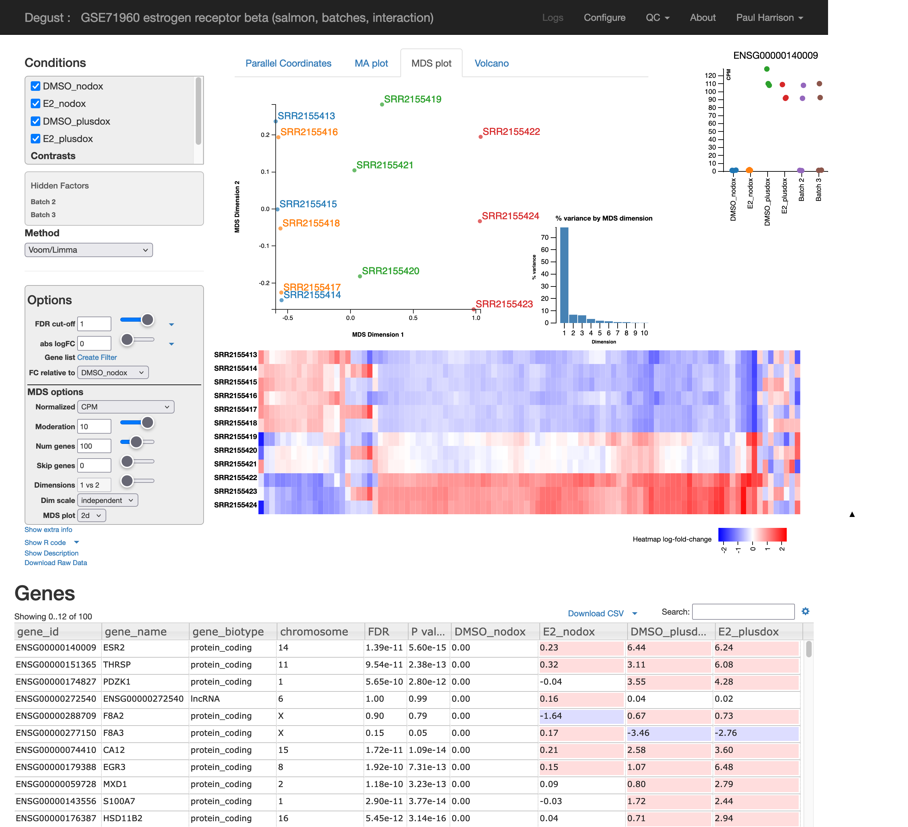
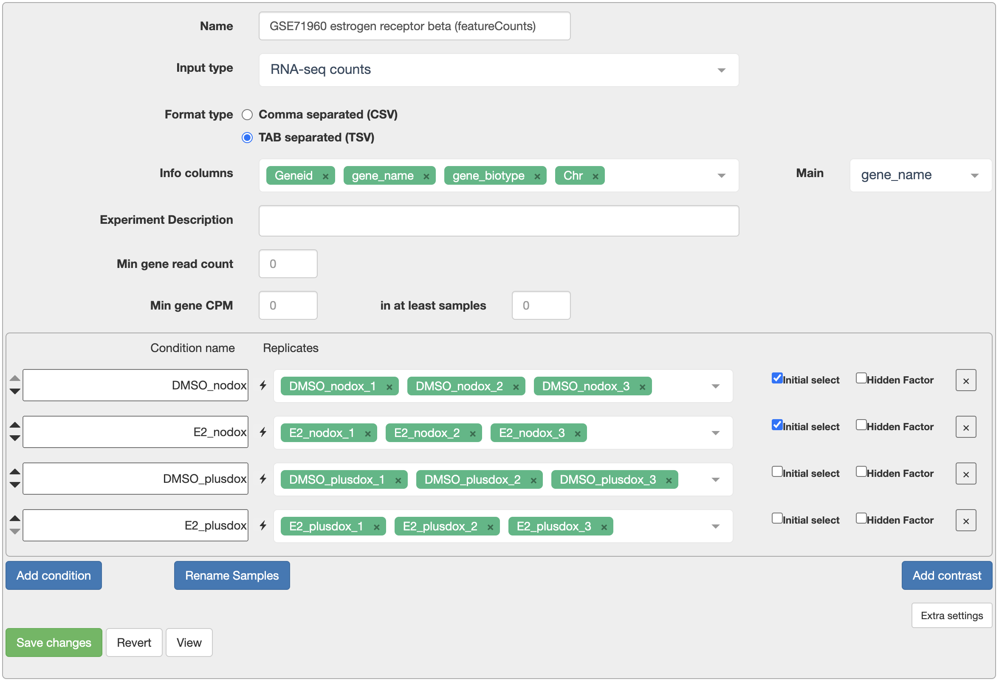
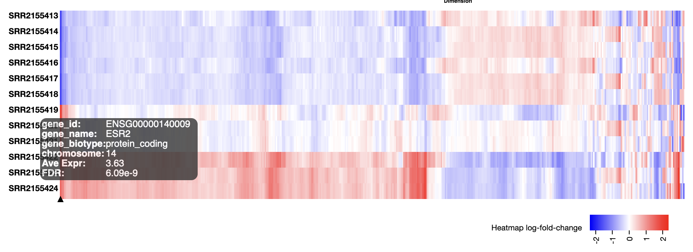
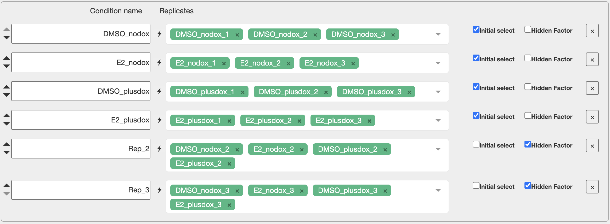
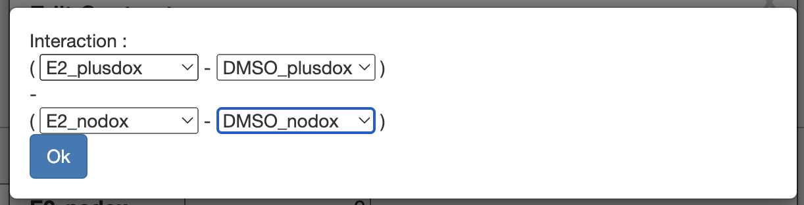

# Differential Expression

## Degust

{width="100%"}

We will now use a web application called [Degust](https://degust.erc.monash.edu/) for statistical analysis of our data. Degust is developed by David Powell at Monash University. It provides an richly interactive interface to widely used R packages for statistical analysis of RNA-Seq data, primarily [limma](https://www.bioconductor.org/packages/release/bioc/html/limma.html) and [edgeR](https://www.bioconductor.org/packages/release/bioc/html/edgeR.html) which are developed at the Walter and Eliza Hall Institute.

## Re-introducing the example dataset

We will be looking at data from the project [SRP062287](https://www.ncbi.nlm.nih.gov/Traces/study/?acc=SRP062287) in the Sequence Read Archive (SRA). Read counts can be found in [GSE71960](https://www.ncbi.nlm.nih.gov/geo/query/acc.cgi?acc=GSE71960) in Gene Expression Omnibus (GEO), but in this workshop we have produced our own read counts. The data is associated with [this publication](https://doi.org/10.1210/me.2013-1164).

Triple-negative breast cancer cell line MDA-MB-468 has been engineered to have an inducible ERβ estrogen receptor. This gene is expressed when treated with doxycycline ("plusdox"). Some samples are also be treated with estrogen E2. We expect interesting changes to happen when both this particular estrogen receptor and estrogen are present.

There are 12 samples in 4 conditions. "DMSO_nodox" is our control condition, and we have three further conditions with doxycycline, E2, and both. Samples were produced in three replications of the experiment.

|Sample |Condition |Replicate |
|:--|:--|:--|
|SRR2155413 |DMSO_nodox   |   1|
|SRR2155414 |DMSO_nodox   |   2|
|SRR2155415 |DMSO_nodox   |   3|
|SRR2155416 |E2_nodox     |   1|
|SRR2155417 |E2_nodox     |   2|
|SRR2155418 |E2_nodox     |   3|
|SRR2155419 |DMSO_plusdox |   1|
|SRR2155420 |DMSO_plusdox |   2|
|SRR2155421 |DMSO_plusdox |   3|
|SRR2155422 |E2_plusdox   |   1|
|SRR2155423 |E2_plusdox   |   2|
|SRR2155424 |E2_plusdox   |   3|

## A first look

These 12 read sets have been run through the nf-core/rnaseq pipeline using the [laxy.io](https://laxy.io) website.

&rarr; [laxy.io output](https://laxy.io/#/job/3pLfQoLEuWeAnWh4H3Vvbv/?access_token=e0124ee9-c8ad-4164-b59f-ca2ae0ce4d2a)

We will use `counts.star_featureCounts.tsv`. Download this file from Laxy (or save this [alternative download](https://raw.githubusercontent.com/MonashBioinformaticsPlatform/RNAseq_workshop_2024/refs/heads/main/files/counts.star_featureCounts.tsv)). 

Now go to [Degust](https://degust.erc.monash.edu/) and press the "Upload your counts file..." to upload the file. You should end up on a configuration screen.

* In "Info columns" add at least "Geneid" and "gene_name". 
* For "Main", select "gene_name".
* Give your samples meaningful names using the "Rename Samples" button.
* Using the "Add condition" button, add four conditions. Add samples to each condition as in the table above.
* Press "Save changes".

{width="100%"}

## Gene expression filter

{width="50%"}

Degust warns us there is no gene expression filter. This is important!

* Testing many genes increases the size of the FDR correction for multiple testing. Since there is no hope of detecting differential expression in lowly expressed genes, we prefer to remove these before testing. 
* The "Empirical Bayes" part of the statistical test goes wonky if genes with very low expression are included.

Click on "QC" in the top right and then "Library sizes". This shows the total count for each sample. This experiment has a variety of library sizes, with a typical library size around 20 million.

If few samples have a count of more than around 10, we can safely discard them. So that we treat each sample in the same way, we will set a threshold on "Counts Per Million" (CPM) rather than the raw counts. We have a library size of around 20 million in each sample so we will require a CPM of 0.5.

* Press "Configure" in the top right to return to the configuration screen.
* Set "Min gene CPM" to 0.5 and "in at least samples" to 2.
* Press "Save changes".

<!-- &rarr; [Degust page set up as described](https://degust.erc.monash.edu/degust/compare.html?code=d4453d6c1cbf8f7c0c876732a4bc0ba5#/) -->
<!-- &rarr; [Degust page set up as described](https://degust.erc.monash.edu/degust/compare.html?code=e48b17563f95769c842c7c33d6b73de2#/) -->
<!-- &rarr; [Degust page set up as described (salmon)](https://degust.erc.monash.edu/degust/compare.html?code=af18f703bd969885c267a74dbadc08b9#/) -->
&rarr; [Degust page set up as described](https://degust.erc.monash.edu/degust/compare.html?code=fd2473ef35acac14637b28640b3047e4#/)

### Our filtering rules of thumb {- .rationale}

"Min gene CPM" (Count Per Million) setting:

* So as to require an underlying count of about 10 (check the library size QC plot).
* The author of Degust says 0.5 CPM or 1 CPM are usual choices.

"In at least samples" setting:

* Should not be larger than the smallest group, or we will certainly miss genes that are only expressed in this group.
* The author of Degust recommends around 2/3 of the smallest group size.

For human or mouse data, typically around 15,000-20,000 genes will pass filtering.

You could try relaxing either of these settings to see if more differentially expressed genes are found, especially if you have many samples in each group.

See also: [the defaults used in edgeR::filterByExpr](https://rdrr.io/bioc/edgeR/man/filterByExpr.html).

## Differential Expression analysis

We'll concentrate on the default "voom/limma" method. Essentailly, for each gene this performs a t-test on the log2 CPM values, or if more than two groups are selected, it performs an F-test as in a One-Way ANOVA. However it uses a series of refinements to this basic idea:

* 0.5 is added to each count before calculating the log2 CPM, to avoid taking log of zero.
* Testing is actually performed by fitting linear models. This method of testing includes conventional t-tests and One-Way ANOVA F-tests as special cases, but can also model more complicated experimental designs.
* Residual variance is calculated from all groups, not just the groups being compared, to improve statistical power (much like post-hoc comparisons in an ANOVA). Note that this means low quality or unusual samples can mess up all comparisons, not just the comparisons they are involved in -- perhaps do tests involving such samples in a separate Degust page!
* Residual variance is observed to be similar between genes, so some information about the residual variance is shared between genes (using a method called "Empirical Bayes"). This improves statistical power, and allows for smaller numbers of replicates per group, so we can practically do, say, 3-vs-3 comparisons, or even 2-vs-2 if you must.
* Smaller counts are are noisier than large counts after log transformation. The "voom" method takes this into account using "precision weights". This acts as an adjustment to the residual variance of each observation.
* Since we are testing a great many genes at once, we need to adjust for multiple testing. This is done with a "False Discovery Rate" (FDR) p-value adjustment.

### Why adjust p-values? {- .rationale}

Suppose we perform a test on each of 20,000 genes, with a p-value cutoff of 0.05. Then purely by chance we will call about `20000 * 0.05 = 1000` genes differentially expressed, even if there is no differential expression. **So p-value adjustment is not optional!**

The False Discovery Rate adjustment controls the proportion of false discoveries you make amongst all discoveries. So if you set an FDR cutoff of 0.05, and found 100 differentially expressed genes, then about `100 * 0.05 = 5` of these would be false discoveries.

FDR adjustment is a bit strange: the more discoveries you make, the more false discoveries you are willing to tolerate amongst them, and the higher the corresponding p-value threshold. This is in contrast to an earlier method of p-value adjustment which controlled the Family-Wise Error Rate (FWER), i.e. controlling the chance of making *any* false discoveries, which would correspond to a very small p-value threshold no matter how many discoveries you are making.

### Choosing conditions to compare and filtering results

{width="50%"}

Let's initially look for differential expression (DE) between all conditions. This is similar to the F test in a One-Way ANOVA.

* Set the "FDR cutoff" to 0.05. This ensures that of the genes we discover at most 5% will be false discoveries.

We discover a larger number of DE genes. We can try to focus on biologically interesting genes by also setting a log2 fold change cutoff.

* Set the "abs logFC" (absolute log2 fold change) cutoff to 1. 

We now only see genes with at least a 2-fold difference between the conditions with minimum and maximum expression.

### Your turn: Compare pairs of conditions {- .challenge}

Configure a Degust page as we have demonstrated above.

Usually we willl be interested in comparing pairs of conditions. Try comparing:

* E2_nodox vs DMSO_nodox
* E2_plusdox vs DMSO_plusdox

Try adjusting the cutoffs for FDR and log2 fold change.

Have a look at the "Volcano" plot as you adjust these cutoffs.

What other comparisons could you perform? What do the different comparisons tell you?

### Volcano plot

A volcano plot shows the effects of these thresholds.

* x-axis = log2 fold change
* y-axis = -log10 FDR adjusted p-value

We might like a nice V-shaped volcano plot, where larger fold changes are always associated with smaller p-values. This sometimes happens, but not with this data. The reason is that the log fold change for each gene may be estimated more or less accurately, due to differing levels of biological or technical variation.

There may be many false negative results, and if the experiment were repeated a quite different set of genes might be discovered! Statistical testing protects us from false discoveries but not false negatives. False negatives can be reduced with more replicates and better experimental design.

### MA plot

An MA plot (sometimes also called an MD plot) helps show our ability to discover DE at different average expression levels.

* x-axis = average log2 CPM expression
* y-axis = log2 fold change

With smaller counts, the log fold change estimates are noisier. This accounts for the &gt; shape of this plot. This is a form of technical variation. So it is harder to detect significant differential expression in lowly expressed genes.

### Parallel coordinates plot

The parallel coordinates plot helps show patterns of differential expression with more than two conditions. You can interactively subset genes by dragging ranges on the axes of this plot. The columns can also be dragged to put them in a different order.

* y-axes = log2 fold change relative to baseline condition

## QC of results

We've done things a bit out of order here. Before DE analysis, we should have done some more QC!

### Library size

The library size is the total count in each sample. We used this earlier to pick a reasonable level of filtering. A small library size may also indicate a problem with the quality of a sample.

* x-axis = sample
* y-axis = total count

### RLE plot

For each gene, we calculate the log2 fold difference to the median. A box plot of these values is shown for each sample. This should highlight any poor quality samples, or systematic quality differences between groups of samples.

* x-axis = sample
* y-axis = log2 fold difference from median

### p-value histogram

If a gene is not DE the p-value should be uniformly random between 0 and 1.
 
* x-axis = p-value
* y-axis = number of genes

So a flat histogram indicates likely no differential expression in any genes.

If the histogram leans left, there probably is some real differential expression, even if no significant DE genes were found!

If the histogram leans right, something weird is going on because this shouldn't happen.

Here, the "E2_plusdox vs DMSO_plusdox" comparison leans strongly left as we would expect. The "E2_nodox vs DMSO_nodox" comparisons leans right. That is, hmm, actually not ideal.

### MDS plot 

Multi-Dimensional Scaling (MDS) provides a 2D layout of your samples, attempting to preserve "distances" between the samples. MDS is very similar to Principal Components Analysis (PCA). In fact in Degust it is exactly PCA.

(We call it an MDS plot rather than a PCA plot because it's based on the `plotMDS` function in the limma package. The limma version uses a slightly different distance calculation method by default.)

Ideally the MDS layout will separate your samples into experimental groups. If your samples have a batch effect, this may also separate the samples along a different direction. If your samples are all jumbled together you will be sad, as you are unlikely to find many differentially expressed genes. You might also notice one or two outlier samples. You could consider excluding these samples from the analysis, ideally with additional justification based on the raw-read and alignment level QC explored earlier.

The PCA is calculated on log2(CPM+moderation), where "moderation" is a constant you can adjust. The moderation reduces the amount of noise in genes with low counts. Also the PCA can be calculated on only the most variable genes ("Num genes"). Adjusting these parameters might clean up your MDS layout a little.

(You can roughly interpret distances between samples in the MDS plot as typical log2 fold changes of the genes being used (root-mean-square log2 fold change). This will especially make sense for a smallish value of "Num genes" (the limma default is 500), such that all the genes being considered have some differential expression.)

### Heatmap

{width="100%"}

Heatmaps can have many uses. Genes can be selected in many different ways, and the genes and possibly also the samples can be seriated -- given a nice ordering to reveal patterns such as clusters. The heatmap Degust shows alongside the MDS plot is particularly useful as an *exploratory* view of the data. 

* Select the MDS plot tab.
* If you haven't already, right click on the heatmap and select "show replicates".
* Set "num genes" to, say, 500.

The "num genes" filter picks the top n most highly variable genes. This affects both the MDS plot and the heatmap.

The heatmap shows differences from the average expression level. Each gene may have a very different average expression level, hover over a gene to see this (in log2 CPM).

The MDS plot indicated a batch effect. Can you see some of the genes affected by this in the heatmap?

## Adjusting for batch effects

Replicates seem to be a source of variation. If we can include this in our model of the data, possibly allowing us to discover more differentially expressed genes.

Under the hood, the R packages Degust uses fit a "linear models" for each gene. Linear models give us a great deal of flexibility analysing different experimental design. However if you configure Degust wrongly, such as including a sample in multiple conditions, Degust will go ahead and fit the corresponding linear model, but the results may not make sense and there may not be an error. See the end of this section for links to learn more about linear models.

**To adjust for a nuisance factor with n levels, the rule is that we include n-1 of the levels as "hidden factors" in Degust.** The choice of which n-1 levels should not make a difference.

Here our nuisance factor is "replicate". Add hidden factors for replicate 2 and replicate 3. Do you discover more differentially expressed genes?

{width="100%"}

## Interactions

So far we've concentrated on comparing pairs of experimental conditions. We noticed more DE genes comparing "E2_plusdox vs DMSO_plusdox" than when comparing "E2_nodox vs DMSO_nodox". This is actually an interaction effect between the two factors in this experiment (presence of estrogen, and presence of the estrogen receptor gene).

It is possible to directly test for an interaction between two factors in the experiment. Go to the configuration screen, select "Add contrast" and then "Create interaction". This lets us set up a "difference of differences" that will be zero if the effects of the two factors simply add together, but non-zero if there is an interaction between the two factors.

We want: (E2_plusdox - DMSO_plusdox) - (E2_nodox - DMSO_nodox)

{width="75%"}

This asks "is the effect of adding estrogen different when the estrogen gene is induced?"

Once this is configured, you can choose it to test in the top-left box of the main page.

<!-- &rarr; [Degust page with batches and interaction configured (salmon)](https://degust.erc.monash.edu/degust/compare.html?code=25377977832e85d06680cb283638574d#/) -->

&rarr; [Degust page with batches and interaction configured](https://degust.erc.monash.edu/degust/compare.html?code=b11daaf71778e469e121e8cf38bcefd8#/)

## Working with the gene table and downloading results

You can download your results by clicking on "Download results" above the gene table. This will include some further information not shown in the table:

* AveExpr is average expression in log2 CPM. Use this if you want to make your own MD-plot.
* Raw count data for each sample.
* Counts Per Million normalized expression levels for each sample.

Also for the gene table:

* Click on a column to sort by that column. Click again to reverse the order.
* Click on the gear icon in the top right for some configuration options.
* Search for your favourite gene in the search box.

### Your turn: Catch up and explore Degust {- .challenge}

Configure your Degust page to account for the batch effect and add the interaction contrast.

Explore the features we have demonstrated. Do you have observations or questions? Post interesting screenshots on the Slack channel.

## Going deeper

### Units and normalisation

Different numbers of reads are obtained from different samples. Our assumption is that most genes are not differentially expressed, so the total "library size" of a sample can serve as a reference level against which to compare each gene. Counts Per Million (CPM) is therefore a convenient unit to compare the expression of a gene across different samples. You may also see CPM referred to as RPM (Reads Per Million). (Technical note: If a highly expressed gene increases in expression, it will look like all of the other genes decreased a little in terms of CPM. It is common to make adjustments to library sizes to account for this. Degust uses an adjustment called "TMM".)

If you want to compare the expression levels of different genes there is a further concern. Some RNA-Seq protocols produce reads along the full length of each transcript, and more reads are obtained from longer transcripts. Accounting for transcript lengths, another unit called Transcripts Per Million (TPM) is sometimes used. You may also see mention of an earlier unit called FPKM or RPKM (Fragments/Reads Per Kilobase per Million).

Other RNA-Seq protocols only produce reads at the 3' ends of RNA transcripts. In this case CPM and TPM are the same.

These units are only for visualizing and reporting results. For differential expression analysis, the input is always raw counts. CPMs or TPMs are not raw counts and results will be meaningless if they are used with Degust.

To find TPMs in the Laxy output, in the output pane you would navigate to `output/results/star_salmon` and download `salmon.merged.gene_tpm.tsv` or `salmon.merged.transcript_tpm.tsv`.

**Absolute expression enthusiast says:** TPM is great! TPM is the right unit to describe absolute RNA expression levels.

**Differential expression ethusiats says:** I don't care about absolute expression levels, just fold changes. Raw counts are what I need for statistical analysis. TPMs are not raw counts, get them outtahere!

### UMIs and counting

Modern RNA-Seq protocol tag fragments with a Unique Molecular Identifier (UMI) before PCR amplification. This allows each original RNA fragment to be counted once, even if it is seen in multiple reads (or read pairs).

**Absolute expression enthusiast says:** I like UMI counting because my TPMs are not biassed due to PCR biasses.

**Differential expression ethusiast says:** PCR bias doesn't worry me. Each gene has the same bias in each sample, so it cancels out when I look at fold change. What I do like is that UMI counting removes an extra source of noise.

### What to count? How to count?

* Genes?
* Transcripts/isoforms?
* Exons?

Software such as Salmon can estimate transcript/isoform abundances. Since genes have multiple overlapping transcripts, estimating transcript abundance is a difficult inference task. Estimated abundances might hinge on just a few reads, creating an extra source of variation. There is also software such as featureCounts which does something much simpler, counting reads aligning to genes. Output from both of these software packages is included in the Laxy pipeline output. featureCounts output was used in this workshop. It is also possible to use featureCounts to produce counts at the exon level.

Even at the gene level, it is sometimes ambiguous where a read belongs. Salmon can fractionally assign reads to multiple transcripts, which might come from different genes. Gene-level counts are obtained from Salmon by summing the transcript-level counts. Again, Salmon is attempting a difficult inference task where the gene assignment for many reads might hinge on just a few of those reads. On the other hand featureCounts output as produced by Laxy will exclude ambiguous reads ("multi-mapping" or "multi-overlapping" reads). The total count for featureCounts will be less than for Salmon, but there is also less to go wrong!

**Absolute expression enthusiast says:** Different transcripts of a gene can have different biological effects, so they are important. Thinking about the different lengths of transcripts also helps me give accurate TPMs at the gene level. It's all about accurately measuring the biology!

**Differential expression enthusiast says:** Genes are easiest to work with. Trying to estimate differential transcript-level counts is a hard inference task, I really have to know what I'm doing and I'll need deeper sequencing too. I do worry a little that differential transcript usage might look like differential gene expression if the transcripts of a gene have different lengths, but it hasn't been a problem in practice.

### Other methods

Besides the default voom/limma method, Degust offers a drop-down box of further methods. When might these be used?

#### Voom/limma with sample weights

With the default voom/limma method, all samples are assumed to have the same quality. Recall that the residual variance is estimated from all samples, even if we are only comparing two conditions. Poor quality samples can therefore harm *all* of the comparisons we do.

The voom with sample weights allows that there might be some samples with lower quality. It assigns each sample a weight, i.e. it allows that some samples may have more variation than others. If your data contains poor quality samples, but you don't want to exclude them, this method might be used.

Exercise: Which of the QC plots can show us if there are poor quality samples?

#### edgeR quasi-likelihood

The edgeR quasi-likelihood method is another well respected method of detecting differential expression.

Recall that the voom/limma method uses a linear model with prevision weights derived from examining the data. In contrast the edgeR quasi-likelihood method:

* Uses a Generalized Linear Model: the model itself is on a log scale, but the data is fitted on a linear scale.
* Noise is assumed to follow a negative-binomial distribution, which is thought to be appropriate for count data which also has biological variation.
* The quasi-likelihood method allows that variation may be greater than expected with the proper negative-bionmial distribution, and also that this may vary from gene to gene.

The edgeR quasi-likelihood is built on a strong theoretical foundation, whereas the voom/limma method is more about flexibly adapting to the data. We do not have any strong reason to prefer one method over the other.

#### Topconfects

Topconfects is a bolt-on to the end of the voom/limma method. We could call this method voom/limma/topconfects. It tries to provide a useful ranking of genes without the need to fine-tune cutoffs. 

A small FDR just tells us the log fold change is probably not zero, but it might not be a biologically important size of fold change. Even if we also filter by the *estimated* log fold change this does not guarantee a large *real* log fold change. Which genes confidently have a large log fold change? The "topconfects" method, developed at Monash, answers this question. For a chosen FDR (0.05 should be fine), topconfects ranks genes from large to small confident log fold change. Topconfects is built on a method called TREAT ("t-tests relative to a threshold"), and choosing a certain cutoff "confect" will produce an identical set of gene to TREAT for that particular log fold change threshold.

* x-axis = log2 fold change, line is confidence bound ("confect"), dot is estimated log2 fold change
* dot-size = average log2 expression

Check the top genes found by this method.

#### Removing Unwanted Variation (RUV)

In this example we could account for the batch effect because the batches were known. What if there is variation, but we didn't know which samples it would apply to ahead of time? RUV refers to a collection of methods for estimating and adjusting for hidden factors like this. RUV estimates the hidden factors from a known set of "housekeeping" genes that should not be affected by the experimental condition.

Degust supports using RUV with an "empirical" set of housekeeping genes derived from your data, which is mildly cheating. The hidden factors it finds can be seen in "Show extra info/design". To supply your own housekeeping genes you would need to use an R package such as RUVSeq. The scMerge package has housekeeping gene lists for human and mouse derived from single-cell data.

### Complex experimental designs

Degust provides a convenient interface for analysing RNA-Seq data, but some large or complex designs may be beyond it. Some examples are:

* Experiments involving hundreds or thousands of samples.
* Numerical covariates.
* Long time series.
* A mixture of biological and technical replication.
* Sources of unwanted variation that are not fully known.

Experiments with these features can be analysed in R. Monash offers some introductory courses to R through the [Data Fluency](https://www.monash.edu/data-fluency/toolkit/r) program. To better understand the fundamentals of linear models, see in particular this Data Fluency workshop:

* ["Linear models in R"](https://monashdatafluency.github.io/r-linear/)

Then for specifics of RNA-Seq analysis, there are excellent vignettes written by the authors of limma and edgeR:

* ["RNA-seq analysis is easy as 1-2-3 with limma, Glimma and edgeR"](https://bioconductor.org/packages/release/workflows/vignettes/RNAseq123/inst/doc/limmaWorkflow.html)

* ["A guide to creating design matrices for gene expression experiments"](https://bioconductor.org/packages/release/workflows/vignettes/RNAseq123/inst/doc/designmatrices.html)
