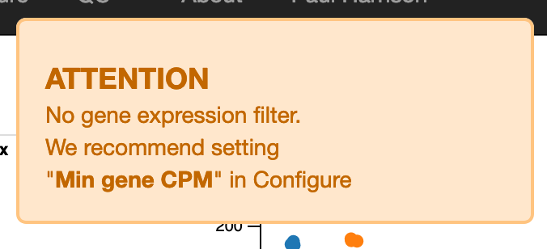
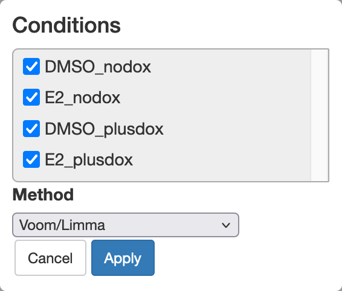

# Differential Expression

We will be looking at data from the project [SRP062287](https://www.ncbi.nlm.nih.gov/Traces/study/?acc=SRP062287) in the Sequence Read Archive (SRA). Read counts can be found in [GSE71960](https://www.ncbi.nlm.nih.gov/geo/query/acc.cgi?acc=GSE71960) in Gene Expression Omnibus (GEO), but in this workshop we have produced our own read counts. The data is associated with [this publication](https://doi.org/10.1210/me.2013-1164).

Triple-negative breast cancer cell line MDA-MB-468 has been engineered to have an inducible ERβ estrogen receptor. This gene is expressed when treated with doxycycline (plusdox). Some samples are also be treated with estrogen E2. We expect interesting things to happen when both the estrogen receptor and the estrogen are present.

There are 12 samples in 4 conditions:

|Sample |Condition |Replicate |
|:--|:--|:--|
|SRR2155413 |DMSO_nodox   |   1|
|SRR2155414 |DMSO_nodox   |   2|
|SRR2155415 |DMSO_nodox   |   3|
|SRR2155416 |E2_nodox     |   1|
|SRR2155417 |E2_nodox     |   2|
|SRR2155418 |E2_nodox     |   3|
|SRR2155419 |DMSO_plusdox |   1|
|SRR2155420 |DMSO_plusdox |   2|
|SRR2155421 |DMSO_plusdox |   3|
|SRR2155422 |E2_plusdox   |   1|
|SRR2155423 |E2_plusdox   |   2|
|SRR2155424 |E2_plusdox   |   3|

## A first look

These 12 read sets have been run through the nf-core/rnaseq pipeline using the [laxy.io](https://laxy.io) website.

&rarr; [laxy.io output](https://laxy.io/#/job/3pLfQoLEuWeAnWh4H3Vvbv/?access_token=e0124ee9-c8ad-4164-b59f-ca2ae0ce4d2a)

<!--We will use the file `counts.star_featureCounts.tsv`, which counts reads unambiguously aligned to genes in a straightforward way. See later for a discussion of different ways of counting. -->

We will use `salmon.merged.gene_counts.biotypes.tsv`. You can find it in the Laxy output in the `output/results/star_salmon/` folder. Download this file and then upload it to [Degust](https://degust.erc.monash.edu/). We now need to configure Degust:

* In "Info columns" add at least "gene_id" and "gene_name".
* Using the "Add condition" button, add four conditions. Add samples to each condition as in the table above.
* Press "Save changes".

## Gene expression filter

{width="50%"}

Degust warns us there is no gene expression filter. This is important!

* Testing many genes increases the size of the FDR correction for multiple testing. Since there is no hope of detecting differential expression in lowly expressed genes, we prefer to remove these before testing. 
* The "Empirical Bayes" part of the statistical test goes wonky if genes with very low expression are included.

Click on "QC" in the top right and then "Library sizes". This shows the total count for each sample. This experiment has a variety of library sizes, with a typical library size around 20 million.

If few samples have a count of more than around 10, we can safely discard them. So that we treat each sample in the same way, we will set a threshold on "Counts Per Million" (CPM) rather than the raw counts. We have a library size of around 20 million in each sample so we will require a CPM of 0.5.

* Press "Configure" in the top right to return to the configuration screen.
* Set "Min gene CPM" to 0.5 and "in at least samples" to 2.
* Press "Save changes".

<!-- &rarr; [Degust page set up as described](https://degust.erc.monash.edu/degust/compare.html?code=d4453d6c1cbf8f7c0c876732a4bc0ba5#/) -->

&rarr; [Degust page set up as described](https://degust.erc.monash.edu/degust/compare.html?code=e48b17563f95769c842c7c33d6b73de2#/)

### Our filtering rules of thumb {- .rationale}

"Min gene CPM" (Count Per Million) setting:

* So as to require an underlying count of about 10 (check the library size QC plot).
* The author of Degust says 0.5 CPM or 1 CPM are usual choices.

"In at least samples" setting:

* Should not be larger than the smallest group, or we will certainly miss genes that are only expressed in this group.
* The author of Degust recommends around 2/3 of the smallest group size.

For human or mouse data, typically around 15,000-20,000 genes will pass filtering.

You could try relaxing either of these settings to see if more differentially expressed genes are found, especially if you have many samples in each group.

See also: [the defaults used in edgeR::filterByExpr](https://rdrr.io/bioc/edgeR/man/filterByExpr.html).

## Differential Expression analysis

We'll concentrate on the default "voom/limma" method. Essentailly, for each gene this performs a t-test on the log2 CPM values, or if more than two groups are selected, it performs an F-test as in a One-Way ANOVA. However it uses a series of refinements to this basic idea:

* 0.5 is added to each count before calculating the log2 CPM, to avoid taking log of zero.
* Testing is actually performed by fitting linear models. This method of testing includes conventional t-tests and One-Way ANOVA F-tests as special cases, but can also model more complicated experimental designs.
* Residual variance is calculated from all groups, not just the groups being compared, to improve statistical power (much like post-hoc comparisons in an ANOVA). Note that this means low quality or unusual samples can mess up all comparisons, not just the comparisons they are involved in -- perhaps do tests involving such samples in a separate Degust page!
* Residual variance is observed to be similar between genes, so some information about the residual variance is shared between genes ("Empirical Bayes"), to improve statistical power. This allows for smaller numbers of replicates per group, so we can practically do, say, 3-vs-3 comparisons, or even 2-vs-2 if you must.
* Smaller counts are are noisier than large counts after log transformation. The "voom" method takes this into account using "precision weights". This acts as an adjustment to the residual variance of each observation.
* Since we are testing a great many genes at once, we need to adjust for multiple testing. This is done with a "False Discovery Rate" (FDR) p-value adjustment.

### Choosing conditions to compare and filtering results

Let's initially look for differential expression between all conditions. This is similar to the F test in a One-way ANOVA.

{width="50%"}

* Set the "FDR cutoff" to 0.05. This ensures that of the genes we discover at most 5% will be false discoveries.

We discover a larger number of DE genes. We can try to focus on biologically interesting genes by also setting a log2 fold change cutoff.

* Set the "abs logFC" (absolute log2 fold change) cutoff to 1. 

We now only see genes with at least a 2-fold change between any two conditions.

### Your turn: Compare pairs of conditions {- .challenge}

Usually we willl be interested in comparing pairs of conditions. Try comparing:

* E2_nodox vs DMSO_nodox
* E2_plusdox vs DMSO_plusdox

Try adjusting the cutoffs for FDR and log2 fold change.

Have a look at the "Volcano" plot as you adjust these cutoffs.

### Volcano plot

A volcano plot shows the effects of these thresholds.

* x-axis = log2 fold change
* y-axis = -log10 FDR adjusted p-value

We might like a nice V-shaped volcano plot, where larger fold changes are always associated with smaller p-values. This sometimes happens, but not with this data. The reason is that the log fold change for each gene may be estimated more or less accurately, due to differing levels of biological or technical variation.

There may be many false negative results, and if the experiment were repeated a quite different set of genes might be discovered! Statistical testing protects us from false discoveries but not false negatives. False negatives can be reduced with more replicates and better experimental design.

### MA plot

An MA plot (sometimes also called an MD plot) helps show our ability to discover DE at different average expression levels.

* x-axis = average log2 CPM expression
* y-axis = log2 fold change

With smaller counts, the log fold change estimates are noisier. This accounts for the &gt; shape of this plot. This is a form of technical variation. So it is harder to detect significant differential expression in lowly expressed genes.

### Parallel coordinates plot

The parallel coordinates plot helps show patterns of differential expression with more than two conditions. You can interactively subset genes by dragging ranges on the axes of this plot. The columns can also be dragged to put them in a different order.

* y-axes = log2 fold change relative to baseline condition

### Topconfects

A small FDR just tells us the log fold change is probably not zero, but it might not be a biologically important size of fold change. Even if we also filter by the *estimated* log fold change this does not guarantee a large *real* log fold change. Which genes confidently have a large log fold change? The "topconfects" method, developed at Monash, answers this question. For a chosen FDR (0.05 should be fine), topconfects ranks genes from large to small confident log fold change. Topconfects is built on a method called TREAT, and choosing a certain cutoff "confect" will produce an identical set of gene to TREAT for that particular log fold change threshold.

* x-axis = log2 fold change, line is confidence bound, dot is estimated log2 fold change
* dot-size = average log2 expression

Check the top genes found by this method.

## QC of results

We've done things a bit out of order here. Before DE analysis, we should have done some more QC!

### Library size

* y-axis = Total count in each sample.

### RLE plot

For each gene, we calculate the log2 fold difference to the median. A box plot of these values is shown for each sample.

* y-axis = log2 fold difference from median
* x-axis = Sample

This should highlight any poor quality samples, or systematic quality differences between groups of samples.

### p-value histogram

If a gene is not DE the p-value should be uniformly random between 0 and 1.
 
* x-axis = p-value

So a flat histogram indicates likely no differential expression in any genes.

If the histogram leans left, there probably is some real differential expression, even if no significant DE genes were found!

If the histogram leans right, something weird is going on because this shouldn't happen.

Here, the "E2_plusdox vs DMSO_plusdox" comparison leans strongly left as we would expect. The "E2_nodox vs DMSO_nodox" comparisons leans right. That is, hmm, actually not ideal.

### MDS plot 

Multi-Dimensional Scaling (MDS) provides a 2D layout of your samples, attempting to preserve "distances" between the samples. MDS is very similar to Principal Components Analysis (PCA). In fact in Degust it is exactly PCA.

(We call it an MDS plot rather than a PCA plot because it's based on the plotMDS function in the limma package. The limma version uses a slightly different distance calculation method by default.)

Ideally the MDS layout will separate your samples into experimental groups. If your samples have a batch effect, this may also separate the samples along a different direction. If your samples are all jumbled together you will be sad, as you are unlikely to find many differentially expressed genes. You might also notice one or two outlier samples. You could consider excluding these samples from the analysis.

The PCA is calculated on log2(CPM+moderation), where "moderation" is a constant you can adjust. The moderation reduces the amount of noise in genes with low counts. Also the PCA can be calculated on only the most variable genes ("Num genes"). Adjusting these parameters might clean up your MDS layout a little.

(You can roughly interpret distances between samples in the MDS plot as typical log2 fold changes of the genes being used (root-mean-square log2 fold change). This will especially make sense for a smallish value of "Num genes" (the limma default is 500), such that all the genes being considered have some differential expression.)

### Heatmap

Heatmaps can have many uses. Genes can be selected in many different ways, and the genes and possibly also the samples can be seriated -- given a nice ordering to reveal patterns such as clusters. The heatmap Degust shows alongside the MDS plot is particularly useful as an *exploratory* view of the data. 

* Select the MDS plot tab.
* If you haven't already, right click on the heatmap and select "show replicates".
* Set "num genes" to, say, 500.

The "num genes" filter picks the top n most highly variable genes. This affects both the MDS plot and the heatmap.

* color = log2 CPM relative to the average, for each gene. The log2 transformation has an adjustment to reduce variability with low counts, adjusted by the "moderation" control. (See the edgeR cpm function for details.)

Here, the MDS plot indicated a batch effect, and the heatmap shows some of the genes involved.

## Adjusting for batch effects

Replicates seem to be a source of variation. If we can include this in our model of the data, possibly allowing us to discover more differentially expressed genes.

Under the hood, the packages Degust uses are fitting a "linear models" for each gene. Linear models give us a great deal of flexibility analysing different experimental design (TODO: SEE HERE AND HERE). However they have some odd quirks and will give you wrong answers if you use them wrongly, often without any errors!

**To adjust for a nuisance factor with n levels, the rule is that we include n-1 of the levels as "hidden factors" in Degust.** The choice of which n-1 levels should not make a difference.

Here our nuisance factor is "replicate". Add hidden factors for replicate 2 and replicate 3. Do you discover more differentially expressed genes?

### RUV

We could account for the batch effect because the batches were known. What if there is variation, but we didn't know which samples it would apply to ahead of time? RUV refers to a collection of methods for estimating and/or adjusting for hidden factors like this. Ideally, RUV estimates the hidden factors from a known set of "housekeeping" genes that should not be affected by the experimental condition. 

Degust has basic support for RUV. It uses an "empirical" set of housekeeping genes derived from your data which is, to put it bluntly, cheating. You can give it a try, but examine the results carefully to decide if you believe them.

## Interactions

So far we've concentrated on comparing pairs of experimental conditions. We noticed more DE genes comparing "E2_plusdox vs DMSO_plusdox" than when comparing "E2_nodox vs DMSO_nodox". This is actually an interaction effect between the two factors in this experiment (presence of estrogen, and presence of the estrogen receptor gene).

It is possible to directly test for an interaction between two factors in the experiment. Go to the configuration screen, select "Add contrast" and then "Create interaction". This lets us set up a "difference of differences" that will be zero if the effects of the two factors simply add together, but non-zero if there is an interaction between the two factors.

We want: (E2_plusdox - DMSO_plusdox) - (E2_nodox - DMSO_nodox)

This asks "is the effect of adding estrogen different when the estrogen gene is induced?"

Once this is configured, you can choose it to test in the top-left box of the main page.

## Going deeper: UMIs and counting

UMIs vs reads vs read-pairs vs fragments.

## Going deeper: units and normalisation

Our assumption is that most genes are not differentially expressed, so the total "library size" of a sample can serve as a reference level against which to compare each gene. (However if a highly expressed gene increases in expression, it will look like all of the other genes decreased a little in terms of CPM. It is common to make adjustments to library sizes to account for this. Degust uses an adjustment called "TMM".)

Counts Per Million (CPM) (sometimes RPM, Reads Per Million) is therefore a convenient unit to compare the expression of a gene across different samples.

If you want to compare the expression levels of different genes there is a further concern. Some RNA-Seq protocols produce reads along the full length of each transcript, and more reads are obtained from longer transcripts. Accounting for transcript lengths, another unit called Transcripts Per Million (TPM) is sometimes used. You may also see mention of an earlier unit called FPKM or RPKM (Fragments/Reads Per Kilobase per Million).

Other RNA-Seq protocols only produce reads, for example, at the 3' ends of reads. In this case CPM and TPM are the same.

**These units are only for visualizing and reporting results. For Differential Expression analysis, the input is always raw counts.** CPMs or TPMs are not raw counts and results will be meaningless if they are used with Degust.

## Going deeper: which counts file to use?

What are you counting?

* Genes?
* Transcripts? May need higher quality data: greater depth, paired-end. TODO: REFERENCE
* Exons?

How should you count?

What about transcript level counts or differential exon usage?